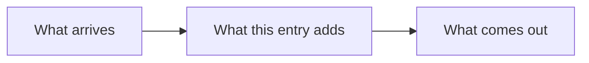

# Enhancement {Enhancement Id}: {Enhancement Title}

{Three or four short sentences, 60 words at most: what is wrong today, and what this entry adds. Write for a developer who knows Kubernetes but not OPM. Plain words only. No decision numbers, no dates, no file paths, and define every OPM term the first time you use it.}

All entries: [INDEX.md](../INDEX.md). How this one relates to others: [GRAPH.md](../GRAPH.md). Metadata: [config.yaml](config.yaml).

## Summary

{Four to six paragraphs, 200 words at most in total. One per decision that matters, each a bold one-line claim then two short sentences. One idea per sentence. Every decision reference carries its gist inline, so the reader never has to open another file to parse a sentence: "the registration is a cluster-scoped CR (D3)". A reference to another entry's decision is qualified and glossed the same way: "the one-provider rule from entry 0010 (0010:D37)". A single requirement is cited the same way: "a second provider is refused naming the first (0010:D37:R1)".}

<!--
Do NOT add an implementation-status block here. Whether this design has been
delivered is DERIVED from this entry's `delivery.yaml` log: run `task delivery ID=NNNN`. A
status block written here is a snapshot that goes stale the moment another change
lands, which is exactly the drift the implementation axis was removed to stop.
-->

## How it works

{Two to four sentences saying what to take from the diagram. Replace the block above with one diagram of this entry's own mechanism: 6 to 14 nodes, quoted labels, actors and artifacts as nodes and never a file path or a function. Load the `enhancement-diagrams` skill first; it carries the syntax traps that break a render.}

## Documents

1. [01-problem.md](01-problem.md): {one line}
1. [02-design.md](02-design.md): {one line}
1. [03-decisions.md](03-decisions.md): the decision log
1. [04-graduation.md](04-graduation.md): what must hold before `draft` becomes `accepted`
1. [05-risks.md](05-risks.md): risks, drawbacks, alternatives not taken
1. [06-operational.md](06-operational.md): rollout, versioning, rollback, cross-repo ordering
1. [07-questions.md](07-questions.md): the open-questions register

{One sentence naming any of `schemas/`, `contracts/`, `experiments/` and `research/` this entry carries, and what is in it. Delete the sentence when it carries none. Compilable CUE lives in those directories as real files, never as fenced blocks in markdown.}

## Scope

### In scope

- {Bulleted boundary of what this enhancement covers. Keep each bullet under 25 words; group them under bold labels once there are more than five.}

### Out of scope

- {Items deliberately deferred, owned by other enhancements, or out of scope by intent.}

## Deviations from Design

None at this stage. Update this section when implementation lands and any
deliberate divergences from the design need to be documented.

## Cross-References

| Document | Purpose |
| -------- | ------- |
| {path} | {why a reader of this entry would open it} |

<!--
## Agent Instructions

To create a new enhancement, run `task new` rather than copying this directory by
hand; it picks the next id, fills `config.yaml`, substitutes the title and seeds
the out-of-scope boundary from your `NOT=` answer.

Then:

1. Overwrite every `{Capitalised}` placeholder across this README and the seven
   split documents. `task vet` fails while one remains.
2. Keep the README in plain English. Say "where it came from" not "provenance",
   "the fields a user sees" not "the surface", "turned into" not "projected".
   Keep the OPM nouns (Module, Component, Resource, Trait, Blueprint, Platform,
   Transformer, Catalog) and define each on first use.
3. Write `01-problem.md` and `02-design.md` first, in full prose. Decisions
   accrete in `03-decisions.md` as choices get settled; `05-risks.md` and
   `06-operational.md` mature alongside them.
4. Replace the `## How it works` diagram with this entry's own mechanism. Load
   the `enhancement-diagrams` skill before drawing it.
5. If the enhancement adds or changes `opmodel.dev/core` definitions
   (`config.yaml.core_schema: true`), sketch the delta in `schemas/target.cue`;
   `examples.cue` and `spec.md` are required before `draft → accepted`.
   Otherwise there is no `schemas/`, and non-core compilable CUE goes in
   `contracts/` via `task new:contracts ID=NNNN`.
6. Do not strip these HTML-comment Agent Instructions when copying. They are the
   in-template guidance for the next author.

The workflow protocol lives in the `enhancements` skill, not here: status
lifecycle, decision-body mutability, compaction, experiments, research and the
delivery log are all documented there and in `CLAUDE.md`. This template holds
only the shape of an entry README.
-->
