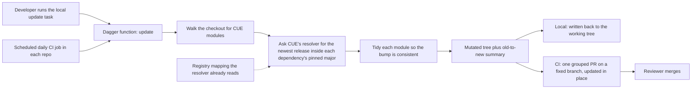

# Automated CUE Dependency Updates via Dagger (0004)

Every OPM repo pins its CUE dependencies in a module file. Those pins move only when a maintainer runs a workspace task by hand. Nothing watches for new releases, so a repo can sit on a stale pin. This entry replaces that task with one Dagger function that bumps every CUE module it finds, and runs it daily in CI.

All entries: [INDEX.md](../INDEX.md). How this one relates to others: [GRAPH.md](../GRAPH.md). Metadata: [config.yaml](config.yaml).

## Summary

**One Dagger function, not a hosted bot (D7).** It bumps through CUE's own resolver, then tidies each module, so the result is a consistent module and not a bare version edit. It reads the registry mapping rather than copying it, so nothing can drift. D7 replaced the Renovate design of D1 and D2.

**A major version is never crossed (D8).** Every dependency key already names its major, so CUE's resolver only returns releases inside it. Crossing a major changes import paths, so it stays a human job.

**Local and scheduled runs are the same code (D9).** The workspace update task becomes a thin wrapper over the function CI calls.

**One pull request per repo per run (D10).** CI opens it on a fixed branch and refreshes it daily, updating that PR instead of stacking duplicates.

**Everything gets bumped, and shared parts live once (D11, D12).** Test fixtures too: stale fixtures cost more than PR churn (D11). The function lives in the organisation's daggerverse repo, the callable CI workflow in its `.github` repo (D12).

## How it works

The function takes a directory, the registry mapping and a token for private modules. It returns the changed tree plus an old-to-new summary. It knows nothing about who called it, which is what lets one call serve both a developer and a CI job. Only what happens to the returned tree differs, and adding a repo configures nothing.

## Documents

1. [01-problem.md](01-problem.md): why the existing workspace task cannot be the automated path
1. [02-design.md](02-design.md): the function, its inputs and outputs, and the CI wiring both callers share
1. [03-decisions.md](03-decisions.md): the decision log, D1 to D13
1. [04-graduation.md](04-graduation.md): what had to hold before `draft` became `accepted`
1. [05-risks.md](05-risks.md): risks, drawbacks, alternatives not taken
1. [06-operational.md](06-operational.md): rollout, versioning, rollback, cross-repo ordering
1. [07-questions.md](07-questions.md): the open-questions register, OQ1 to OQ6, all closed

The entry carries [`contracts/`](contracts/): compilable CUE for the function signature, the registries needing credentials, and the pull-request settings.

## Scope

### In scope

- A directory-driven Dagger function that walks any directory for CUE modules, including the CLI's module templates, and bumps each dependency inside its pinned major.
- The same function invoked locally, behind the workspace update task, and on a daily CI schedule in `core`, `library`, `catalog`, `cli`, `opm-operator` and `modules`.
- A shared CI contract, the Dagger module reference plus a callable workflow, so each repo's short caller opens one grouped, tidied bump PR on a fixed branch.

### Out of scope

- Other ecosystems: Go modules, GitHub Action pins and Dockerfiles. CUE modules only (D6, reaffirmed by D13); a unified bot would be a separate later entry.
- Bumping the CUE language and tool version itself; a possible follow-on.
- Auto-merging the pull requests, and migrations from one major to the next.

## Deviations from Design

None at this stage. Update this section when implementation lands and any deliberate divergences from the design need to be documented.

## Cross-References

| Document | Purpose |
| -------- | ------- |
| `/Taskfile.yml` (`deps:update`, `deps:update:modules`, `deps:update:templates`) | The bash logic the function replaces; the task becomes a wrapper over it (D9) |
| `/CLAUDE.md` (Environment Variables, "Never manually edit version pins") | Where the registry mapping the function passes to CUE is defined |
| `open-platform-model/daggerverse//cue-deps` Dagger module (to be created, D12) | Where the shared function lives, versioned by subpath-prefixed tags |
| `open-platform-model/.github/.github/workflows/cue-deps.yml` reusable workflow (to be created, D12) | The shared CI contract: it invokes the function and opens the grouped PR |
| `<each-repo>/.github/workflows/cue-deps.yml` (to be created) | The per-repo caller: a daily schedule that calls the shared workflow |
| `enhancements/0002` | Prior art on module identity against registry import-path resolution |
