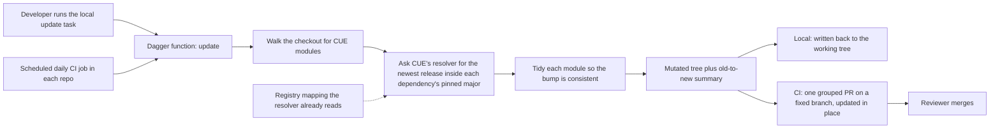

# Automated CUE Dependency Updates via Dagger (0004)

Every OPM repo pins its CUE dependencies in a module file, and those pins move only when a maintainer runs a workspace task by hand from a full checkout of every repo. Nothing watches for a new upstream release, so a repo can sit on a stale pin until someone remembers. This entry replaces that task with one Dagger function, a containerized build step callable from a laptop or from CI, that walks a directory and bumps every CUE module it finds. Each bump stays inside the major version already pinned, and a daily CI run turns the changed files into one reviewable pull request.

All entries: [INDEX.md](../INDEX.md). How this one relates to others: [GRAPH.md](../GRAPH.md). Metadata: [config.yaml](config.yaml).

## Summary

- The mechanism is one path-driven Dagger function, not a hosted dependency bot (D7, which replaced the self-hosted Renovate design of D1 and D2). It bumps through CUE's own resolver, then tidies each module so the dependency list is recomputed and the result is a consistent module, not a bare version-string edit. Nothing mirrors the mapping that says which OCI registry serves each module host, so nothing can drift from it.
- A major version is never crossed automatically, and nothing extra enforces that. Every dependency key already names its major, so asking CUE's resolver for that key returns only releases inside it (D8, which retired the explicit guard of D3). Crossing a major changes import paths, so it stays a human act.
- The local sweep and the scheduled job are one implementation. The workspace-root update task becomes a thin wrapper over the same function CI calls (D9, replacing D4, where a manual task and a bot were to coexist).
- CI opens one grouped pull request per repo per run on a fixed branch, refreshed daily (D10). A later run updates that open PR in place instead of stacking duplicates, and closes it if the bumps revert.
- Every CUE module found is bumped, test fixtures included, because keeping fixtures current avoids bit-rot and costs only some PR churn (D11). The shared pieces live once (D12): the function in the organisation's daggerverse repo under its own subpath and version tags, and the callable CI workflow in the organisation's `.github` repo.

## How it works

The function takes a directory, the registry mapping and a token for the private modules, and returns the changed tree plus an old-to-new summary. Being context-free is what lets one call serve both a developer and a CI job: only what happens to the returned tree differs, and adding a repo configures nothing.

## Documents

1. [01-problem.md](01-problem.md): why the existing workspace task cannot be the automated path
1. [02-design.md](02-design.md): the function, its inputs and outputs, and the CI wiring both callers share
1. [03-decisions.md](03-decisions.md): the decision log, D1 to D13
1. [04-graduation.md](04-graduation.md): what had to hold before `draft` became `accepted`
1. [05-risks.md](05-risks.md): risks, drawbacks, alternatives not taken
1. [06-operational.md](06-operational.md): rollout, versioning, rollback, cross-repo ordering
1. [07-questions.md](07-questions.md): the open-questions register, OQ1 to OQ6, all closed

The entry carries [`contracts/`](contracts/): compilable CUE for the function signature, the registries needing credentials, and the pull-request settings.

## Scope

### In scope

- A path-driven Dagger function that walks any directory for CUE modules, including the CLI's module templates, and bumps each dependency inside its pinned major.
- The same function invoked locally, behind the workspace update task, and on a daily CI schedule in `core`, `library`, `catalog`, `cli`, `opm-operator` and `modules`.
- A shared CI contract, the Dagger module reference plus a callable workflow, so each repo's short caller opens one grouped, tidied bump PR on a fixed branch.

### Out of scope

- Other ecosystems: Go modules, GitHub Action pins and Dockerfiles. CUE modules only (D6, reaffirmed by D13); a unified bot would be a separate later entry.
- Bumping the CUE language and tool version itself; a possible follow-on.
- Auto-merging the pull requests, and migrations from one major to the next.

## Deviations from Design

None at this stage. Update this section when implementation lands and any deliberate divergences from the design need to be documented.

## Cross-References

| Document | Purpose |
| -------- | ------- |
| `/Taskfile.yml` (`deps:update`, `deps:update:modules`, `deps:update:templates`) | The bash logic the function replaces; the task becomes a wrapper over it (D9) |
| `/CLAUDE.md` (Environment Variables, "Never manually edit version pins") | Where the registry mapping the function passes to CUE is defined |
| `open-platform-model/daggerverse//cue-deps` Dagger module (to be created, D12) | Where the shared function lives, versioned by subpath-prefixed tags |
| `open-platform-model/.github/.github/workflows/cue-deps.yml` reusable workflow (to be created, D12) | The shared CI contract: it invokes the function and opens the grouped PR |
| `<each-repo>/.github/workflows/cue-deps.yml` (to be created) | The per-repo caller: a daily schedule that calls the shared workflow |
| `enhancements/0002` | Prior art on module identity against registry import-path resolution |
