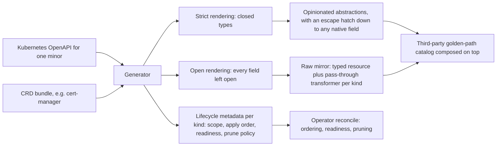

# Enhancement 0005: Kubernetes-Native Refocus: Generated Mirror and Composed Abstractions

OPM ships two catalogs, libraries of building blocks a Module draws on. One hides Kubernetes detail behind blueprints; the other passes native objects through unchanged. Both hand-maintain their own copy of the Kubernetes type schemas, and the copies drift. This entry generates both from the Kubernetes OpenAPI, and stamps each kind with the lifecycle facts the operator needs.

All entries: [INDEX.md](../INDEX.md). How this one relates to others: [GRAPH.md](../GRAPH.md). Metadata: [config.yaml](config.yaml).

## Summary

**The Kubernetes OpenAPI is the one source of Kubernetes types (D1).** Both catalogs consume generated output instead of schemas they maintain themselves. Point the generator at a set of custom resource definitions and it emits a typed catalog for that operator too.

**One source, two renderings.** The strict one closes the types and backs the opinionated catalog. The open one leaves every field open, so the mirror accepts any valid native field.

**An abstraction keeps an escape hatch.** Because the full generated type sits behind it, you can always set a native field the shorthand hides.

**Each generated kind carries lifecycle metadata.** Scope, apply phase, how to tell it is ready, how it is pruned. Today's hardcoded apply-order list becomes data the operator reads.

**Composition is allowed, never required (D2).** One catalog can build abstractions on another's resources in pure CUE. It is for golden-path catalogs layered on top.

**Nothing in core changes (D3).** The transformation model stays single-pass. Multi-phase lowering becomes its own entry only if a real case shows pure CUE cannot express it.

## How it works

A pass-through transformer is uniform across kinds, which is what makes the mirror generatable rather than hand-authored: only the group, version, kind and scope differ. Readiness is the one piece the OpenAPI does not carry, because it encodes status conventions, so it is curated per kind with a generic fallback. The rightmost node is the point: a provider layers a golden path on either catalog without changing either.

## Documents

1. [01-problem.md](01-problem.md): two catalogs encoding Kubernetes from divergent hand-maintained sources that drift and do not scale
1. [02-design.md](02-design.md): the generator, the two renderings, the lifecycle stamp, and optional composition
1. [03-decisions.md](03-decisions.md): the decision log, D1 to D3
1. [04-graduation.md](04-graduation.md): what must hold before `draft` becomes `accepted`
1. [05-risks.md](05-risks.md): risks, drawbacks, alternatives not taken
1. [06-operational.md](06-operational.md): rollout, versioning, rollback, cross-repo ordering
1. [07-questions.md](07-questions.md): the open-questions register, OQ1 to OQ6

The entry carries [`contracts/`](contracts/): compilable CUE sketching the generation manifest, the lifecycle metadata block and the override field.

## Scope

### In scope

- Generation tooling that ingests the Kubernetes OpenAPI and CRD schemas and emits CUE types, resources, pass-through transformers, catalog manifests and lifecycle metadata.
- Two renderings from the one source: strict for the opinionated catalog, open for the mirror.
- Regenerating the mirror catalog as generated output; re-pointing the opinionated catalog at the shared strict types and adding the escape hatch.
- Per-resource lifecycle metadata, plus the library and operator changes that consume it.
- Documentation of the generation workflow and of the provider golden-path composition pattern.

### Out of scope

- Any change to core (D3, which keeps the transformation model single-pass).
- Multi-phase lowering, where transformer outputs go back through matching. It is staged as a separate evidence-gated core entry, and OQ6 asks what case would trigger it.
- Non-Kubernetes platforms: Nomad, Docker Compose, Swarm.
- A runtime reconcile engine. This entry produces the lifecycle metadata; consuming it is operator work.

## Deviations from Design

None at this stage. Update this section when implementation lands and any deliberate divergences from the design need to be documented.

## Cross-References

| Document | Purpose |
| -------- | ------- |
| `catalog_kubernetes/CLAUDE.md` | The pass-through mirror, which becomes the open rendering's generation target |
| `catalog_opm/CLAUDE.md` | The opinionated catalog, which consumes the strict rendering and hosts the escape hatch |
| `catalog_opm/src/blueprints/workload/stateless_workload.cue` | The existing pure-CUE composition that this builds on |
| `catalog_kubernetes/src/transformers/deployment_transformer.cue` | The pass-through transformer shape the generator templates |
| `core/src/transformer.cue` | The transformer contract, unchanged here, kept friendly to typed outputs later |
| `library/` (`pkg/resourceorder`) | Today's hardcoded apply order, to be generalized onto the generated metadata |
| `opm-operator/CLAUDE.md` | The reconcile loop that consumes the generated lifecycle metadata |
