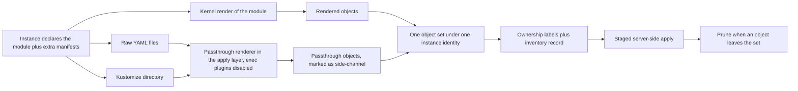

# Manifest Passthrough: Side-Channel Raw and Kustomize Manifests

A team adopting OPM usually already has plain YAML or a Kustomize directory, and OPM has nowhere to put it. Applied by hand, those objects are invisible: nothing marks them as owned, nothing records them, nothing deletes them later. This entry lets a deployment declare extra manifests, and OPM then treats them exactly like the ones it rendered.

All entries: [INDEX.md](../INDEX.md). How this one relates to others: [GRAPH.md](../GRAPH.md). Metadata: [config.yaml](config.yaml).

## Summary

**It lives in the apply layer only (D1).** That is the CLI and operator code talking to the cluster. Core's schema and the kernel are untouched, because the kernel may not read files or run anything, and Kustomize does both.

**Kustomize runs as an embedded Go library, never a shell-out (D2).** The version is pinned in the build, the CLI and operator behave identically, and exec plugins are disabled in code.

**Passed-through objects join the rendered ones before anything else happens (D3).** Labelling, inventory, staged apply and pruning all see one set, so side objects get drift detection and pruning for free. A marker records only where each object came from.

**The declaration is an explicit side field on the deployment (D5).** It is not woven into the component model, which keeps the typed path and the untyped escape hatch clearly apart.

**The CLI and the operator use the same renderer (D4).** A deployment behaves the same from a laptop or from a controller.

## How it works

Everything downstream of the merge already exists and is untouched. The inventory is the list of objects an instance owns. Staged apply sends custom resource definitions and namespaces first, and prune deletes what the inventory lists but the new set no longer holds. The passthrough renderer is the only new code that touches a filesystem, and where its paths are rooted differs by driver.

## Documents

1. [01-problem.md](01-problem.md): why out-of-band apply leaks and drifts, and what teams do today instead
1. [02-design.md](02-design.md): declaration, rendering and folding into the existing apply path
1. [03-decisions.md](03-decisions.md): the decision log, D1 to D5
1. [04-graduation.md](04-graduation.md): what must hold before `draft` becomes `accepted`
1. [05-risks.md](05-risks.md): risks, drawbacks, alternatives not taken
1. [06-operational.md](06-operational.md): rollout, versioning, rollback, cross-repo ordering
1. [07-questions.md](07-questions.md): the open-questions register, OQ1 to OQ7

The entry carries [`contracts/`](contracts/): compilable CUE for the declared source shape and the origin marker, modelling the custom resource surface rather than core.

## Scope

### In scope

- A side-channel field on the operator's `ModuleInstance` and `ModulePackage` specs, and an equivalent CLI input, declaring raw YAML or Kustomize sources.
- A shared passthrough renderer embedding the Kustomize Go API, with a hardened default option set for operator use.
- Folding passthrough output into the existing apply path, so side objects are labelled, inventoried, staged, drift-detected and pruned like rendered output.
- Identical semantics across the CLI build and apply commands and the operator.

### Out of scope

- Any change to core or the library kernel (D1, which keeps passthrough at the apply layer).
- Typing arbitrary Kubernetes objects inside the CUE pipeline: that is enhancement [0005](../0005/README.md)'s untyped-object redesign, and OQ2 tracks the relationship.
- A general external-renderer plugin system for Helm, jsonnet or cdk8s. Kustomize and raw YAML only in this pass.
- Interpolating an instance's values into side manifests; passthrough is verbatim, and OQ4 holds the possible follow-up.

## Deviations from Design

None at this stage. Update this section when implementation lands and any deliberate divergences from the design need to be documented.

## Cross-References

| Document | Purpose |
| -------- | ------- |
| `library/CONSTITUTION.md` | Kernel purity, the constraint that forces passthrough to the apply layer (D1) |
| `opm-operator/api/v1alpha1/modulerelease_types.go` | Where the side-channel field is added |
| `opm-operator/api/v1alpha1/release_types.go` | The same field on the package type |
| `opm-operator/api/v1alpha1/common_types.go` | The inventory entry side objects record in |
| `opm-operator/internal/render/` | Where passthrough output joins the rendered list |
| `opm-operator/pkg/core/labels.go` | The ownership labels and the passthrough marker |
| `opm-operator/internal/apply/apply.go` | Staged apply, where passed-through CRDs and namespaces must stage correctly |
| `opm-operator/internal/apply/prune.go` | Inventory-based prune, where side objects must prune under the ownership guard |
| `opm-operator/internal/inventory/` | Where passthrough objects record and diff like rendered ones |
| `opm-operator/internal/source/fetch.go` | The extracted artifact tree rooting a package's source paths |
| `opm-operator/config/crd` | The regenerated custom resource definitions |
| `cli/internal/cmd/release/build.go` | Where the CLI accepts the extra manifests |
| `cli/internal/cmd/release/apply.go` | Where the CLI applies them in the same set |
| `cli/internal/cmdutil/manifest_output.go` | Where passthrough objects serialize with rendered output |
| `enhancements/0005/README.md` | The in-pipeline untyped-object redesign, related through OQ2 |
