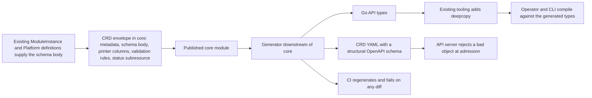

# Enhancement 0008: CUE-Native CRD Schemas as Single Source of Truth

OPM's Kubernetes custom resources are described three times: as CUE in the core schema, as hand-written Go structs in the operator, and as the CRD YAML generated from those structs. Nothing keeps the three in agreement. This entry makes the CUE the only hand-written one and generates the other two from it. A bad object is then rejected at submission.

All entries: [INDEX.md](../INDEX.md). How this one relates to others: [GRAPH.md](../GRAPH.md). Metadata: [config.yaml](config.yaml).

## Summary

**The types are authored once in CUE in core (D1).** The operator's Go structs and the CRD YAML become generated output. The generator runs downstream and imports the published core module, so core stays pure CUE (D2).

**The schema comes out of CUE's OpenAPI encoder with references expanded (D3).** That is the structural form a CRD requires. Scope, short names, the status subresource and the `kubectl get` columns are Go marker comments today; they become CUE data spliced in at assembly (D4).

**Deepcopy stays with controller-gen (D5).** How the Go structs get emitted is an implementation detail the design refuses to depend on (D8).

**CEL rules are carried as opaque strings (D6).** The API server evaluates them against an incoming object. No translation is attempted in either direction; the research found it unbounded.

**CI regenerates and fails on any diff (D7).** That gate is what makes the single source actually single.

The entry sits on [0006](../archive/0006/), which made the operator's `ModuleInstance` types a contract the CLI consumes (0006:D13). This entry changes only where those definitions come from.

## How it works

The envelope is small on purpose: it wraps definitions that already exist with the CRD's own metadata and the marker-borne facets, and invents no new schema. Everything right of the published module is derived, so the CUE is the only file a human edits.

## Documents

1. [01-problem.md](01-problem.md): why defining the types twice is a live drift hazard
1. [02-design.md](02-design.md): the envelope, the generator's three transforms, and what stays with existing tooling
1. [03-decisions.md](03-decisions.md): the decision log, D1 to D8
1. [04-graduation.md](04-graduation.md): what must hold before `draft` becomes `accepted`
1. [05-risks.md](05-risks.md): risks, drawbacks, and the alternatives not taken
1. [06-operational.md](06-operational.md): rollout, versioning, rollback, cross-repo ordering
1. [07-questions.md](07-questions.md): the open-questions register

The core-schema delta lives under [`schemas/`](schemas/): [`target.cue`](schemas/target.cue) proposes the definitions, [`examples.cue`](schemas/examples.cue) carries worked instances, and [`spec.md`](schemas/spec.md) is the core specification delta. [`research/`](research/) holds the dated dossier on what the CUE toolchain can and cannot do.

## Scope

### In scope

- A CUE-native way to declare a CRD in core: group, kind, names, scope, per-version served and storage flags, the spec and status schema, subresources, printer columns, short names and CEL rules.
- Re-expressing the three existing custom resources, `ModuleInstance`, `ModulePackage` and the cluster-singleton `Platform`, reusing the domain definitions as their bodies.
- A generation pipeline that consumes the published core module and emits the CRD YAML and the operator's Go API types.
- Retaining controller-gen for deepcopy over the generated structs, which works because the root types carry its marker.
- Carrying CEL rules, today only the `Platform` singleton-name rule, as verbatim strings injected into the assembled CRD.
- A drift gate: CI fails if regenerating from core differs from the committed YAML or Go types.

### Out of scope

- **Translating CEL to or from CUE.** Rules pass through as opaque strings, and new validation logic that could be CEL stays authored as CEL.
- **Replacing controller-gen wholesale.** This entry writes no deepcopy generator.
- **Generating controllers, RBAC or webhook wiring from CUE.** Reconcilers and controller-borne markers stay hand-authored.
- **The next API version bump or conversion webhooks.** This changes how the current version is authored, not the versioning story.
- **Schema redesign.** Field shapes are preserved; a field-level change rides a separate entry.
- **Non-CRD Go types**, such as inventory entries and internal structs.

## Deviations from Design

None at this stage. Update this section when implementation lands and any deliberate divergences from the design need to be documented.

## Cross-References

| Document | Purpose |
| -------- | ------- |
| `/CLAUDE.md` (workspace root) | Cross-repo routing and the vocabulary `affects` validates against |
| `core/CLAUDE.md`, `core/CONSTITUTION.md`, `core/SPEC.md` | The pure-CUE rule and specification co-update gate the core slice must honour |
| `core/src/module_instance.cue`, `core/src/platform.cue` | The existing definitions the envelopes reuse as schema bodies |
| `core/src/resource.cue`, `core/src/trait.cue`, `core/src/module.cue` | The OpenAPI-compatibility constraint clean structural emission depends on |
| `opm-operator/CLAUDE.md`, `opm-operator/CONSTITUTION.md` | Repo principles governing the generator and API-type slice |
| `opm-operator/api/v1alpha1/moduleinstance_types.go`, `modulepackage_types.go`, `platform_types.go`, `common_types.go` | The hand-authored Go types generated output replaces |
| `opm-operator/api/v1alpha1/zz_generated.deepcopy.go` | Deepcopy output, still controller-gen's, now over generated structs |
| `opm-operator/config/crd/bases/*.yaml` | The CRD YAML now generated from core, not from Go markers |
| `opm-operator/.tasks/dev.yaml` (`controller-gen … crd` / `object` targets), `Taskfile.yml` | The generation targets the new pipeline slots into |
| `cli/` (imports the operator API types per 0006) | A downstream consumer that must build unchanged |
| `enhancements/0006/` | The CR-sharing design that makes this drift cross-repo |
| `research/findings.md` | The dated dossier behind every decision |
