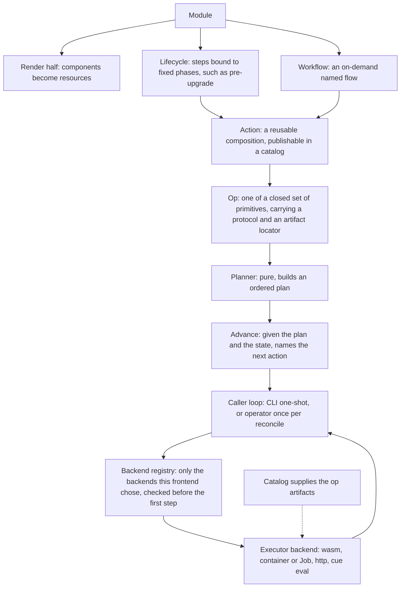

# Enhancement 0009: Operational Primitives: Op, Action, Lifecycle, Workflow

The OPM kernel, the engine that turns a module into Kubernetes objects, only renders. A module has no way to say what should happen around a deployment, such as an upgrade hook, a data migration or an on-demand operation, so those end up in side scripts nobody governs. This entry adds a second half to the kernel that reads the same module and produces an ordered plan of steps instead of resources. The library decides what runs next and the caller runs it, so the plan stays pure data and every side effect belongs to the CLI or the operator.

All entries: [INDEX.md](../INDEX.md). How this one relates to others: [GRAPH.md](../GRAPH.md). Metadata: [config.yaml](config.yaml).

## Summary

- The kernel gains a parallel execution half over the same module, one input and two interpreters, leaving the render half untouched (D1). Four constructs land in core (D2). An `#Op` is one primitive step from a closed set OPM owns, and an `#Action` is a reusable named composition of Ops a catalog can publish. A `#Lifecycle` binds steps to fixed phases of a deployment's life, and a `#Workflow` is an on-demand flow invoked by name.
- The library plans, then advances one step per call: given a plan and a state it returns the next state and the one action the caller is to perform (D3). It runs no loop and performs no side effect, and the caller owns the state, which must survive serialization so a controller can carry it across reconciles.
- Executor backends, the things that actually run a step, ship in the library's opt-in tier, and a frontend registers only the ones it wants (D4). The plan is checked against that registry before the first step, so a plan needing an unregistered backend fails before anything runs: that is how the operator declines ad-hoc container builds.
- Dispatch is by CUE attribute, inert metadata evaluation ignores and the Go SDK reads (D5). It names a protocol, which selects a backend, and a locator for the executable artifact, which is catalog-sourced rather than compiled in and travels the rails transformers already travel (D6).
- The `#Lifecycle` vocabulary is a fixed nine phases, a before, a during and an after for install, upgrade and uninstall, and an absent phase is a no-op (D7). The HTTP Op exposes the full verb set and returns the raw response, leaving shaping to CUE (D8).
- Cancellation belongs to this entry and nothing else wires it until this lands (D9). One step per call means a caller cancels between steps by not calling again, so only cancellation inside a single advance remains, reaching a registry fetch and nothing else.

## How it works

Read the top as authoring and the bottom as execution. One plan behaves differently per frontend without changing the module: a step that runs a local container on the CLI renders a Job and watches it under the operator, purely by swapping the backend.

## Documents

1. [01-problem.md](01-problem.md): OPM renders but cannot execute, and why side scripts are the anti-pattern
1. [02-design.md](02-design.md): the second kernel half, the four constructs, dispatch and the backend tier
1. [03-decisions.md](03-decisions.md): the decision log, D1 to D9
1. [04-graduation.md](04-graduation.md): what must hold before `draft` becomes `accepted`
1. [05-risks.md](05-risks.md): risks, drawbacks, alternatives not taken
1. [06-operational.md](06-operational.md): rollout, versioning, rollback, cross-repo ordering
1. [07-questions.md](07-questions.md): the open-questions register, OQ1 to OQ6

The core-schema delta lives under [`schemas/`](schemas/) as compilable CUE with worked examples and a specification delta; [`research/`](research/) holds a dated note on how durable the CUE attribute mechanism is.

## Scope

### In scope

- The four constructs in core, plus the dispatch-attribute convention and additive op and action maps on the catalog.
- The execution half of the kernel: a pure planner and a one-step-per-call advance (D3), with the opt-in backend layer, its registry and its fail-fast behaviour.
- The initial Op vocabulary, `exec`, full-CRUD `http`, `wait`, `cue.eval` and Kubernetes get and apply, as catalog definitions.
- Frontend wiring: the CLI and operator each composing their own backend set, the operator driving lifecycle phases from its reconcile loop.
- The kernel's cancellation path, designed and wired here and untouched by any other change until it lands (D9). It also introduces the injection surface the planner needs, with its first reader, now that the kernel's write-only logger, tracer and clock slots are gone (revised D9).

### Out of scope

- Any change to the render half. Execution is purely additive.
- A general-purpose scripting language for operations. Composing a closed primitive set is the point.
- The meta-controller toolkit (OQ5): a north star the architecture must allow, not a first deliverable.
- Final production implementations of every executor backend, since the artifact form is still open (OQ1).

## Deviations from Design

None at this stage. Update this section when implementation lands and any deliberate divergences from the design need to be documented.

## Cross-References

| Document | Purpose |
| -------- | ------- |
| `core/CLAUDE.md`, `core/SPEC.md`, `core/.claude/skills/core-schema-edit/SKILL.md` | The schema home for the four constructs and the co-update protocol the core slice follows |
| `core/src/catalog.cue` | The catalog shape the additive op and action maps extend |
| `core/src/transformer.cue` | The transformer and matcher pattern the execution half parallels |
| `library/CLAUDE.md`, `library/CONSTITUTION.md` | Kernel neutrality and the boundary the planner and backend split honours |
| `library/opm/kernel/` | The render half this one parallels |
| `library/opm/helper/` | The opt-in tier the backends would join, and the fence a frontend may skip |
| `library/opm/platform/` | The platform registry that resolves catalogs, the rails op artifacts ride on |
| `library/adr/008-kernel-plans-caller-runs.md` | The library rule D3 records: the kernel decides, the caller loops and acts |
| `catalog_opm/CLAUDE.md`, `catalog_opm/src/catalog.cue` | Where the initial Op and Action definitions are published |
| https://hofstadter.io/getting-started/task-engine/ | Prior art for the attribute-dispatch model adapted here |
