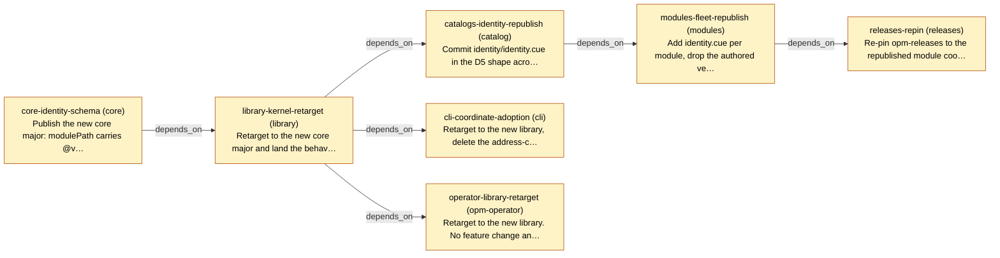

# Slice Plan — Module and Catalog Identity

<!-- Generated by `task plan:graph` — do not edit by hand. -->

| ID | Repo | Status | Depends on | Concern |
| -- | ---- | ------ | ---------- | ------- |
| core-identity-schema | core | planned | - | Publish the new core major: modulePath carries @vN and is the whole address, fqn == modulePath, contract keys split from impl keys (D4), #Subscription takes a scalar version (D14).   |
| library-kernel-retarget | library | planned | core-identity-schema | Retarget to the new core major and land the behaviour every frontend inherits: D11 read-side checks, filter.go deleted (D14), D26 provenance denylist, D27 in the match rung, D28, D32/D37, D36, the D9 stamp.   |
| catalogs-identity-republish | catalog | planned | library-kernel-retarget | Commit identity/identity.cue in the D5 shape across catalog_opm, catalog_kubernetes and catalog_opm_experimental, delete the stamping task, republish.   |
| cli-coordinate-adoption | cli | planned | library-kernel-retarget | Retarget to the new library, delete the address-composition helpers, write the resolved coordinate into spec.module.{path,version}.   |
| operator-library-retarget | opm-operator | planned | library-kernel-retarget | Retarget to the new library. No feature change and no adoption code — D18 rejected an operator-side tolerance window outright.   |
| modules-fleet-republish | modules | planned | catalogs-identity-republish | Add identity.cue per module, drop the authored version, rename hyphenated modules, republish the fleet. The only fleet republish in the 0010/0011 pair (0011 D17).   |
| releases-repin | releases | planned | modules-fleet-republish | Re-pin opm-releases to the republished module coordinates. Sibling repo, not under the workspace root.   |
