# Slice Plan — Module and Catalog Identity

```mermaid
graph LR
  classDef planned     fill:#fef3c7,stroke:#b45309,color:#000
  classDef in_progress fill:#dbeafe,stroke:#1d4ed8,color:#000
  classDef done        fill:#dcfce7,stroke:#15803d,color:#000
  classDef cancelled   fill:#e5e7eb,stroke:#6b7280,color:#6b7280
  classDef other       fill:#fafafa,stroke:#9ca3af,color:#6b7280,stroke-dasharray:3 3

  subgraph PHASE_IMPL["Implementation — schema, code, docs"]
    S_core-identity-shape["core-identity-shape (core)\nModule, instance and catalog identity: #ModulePat…"]:::done
    S_core-primitive-keying["core-primitive-keying (core)\nContract keys split from implementation keys: #Co…"]:::done
    S_core-platform-and-match["core-platform-and-match (core)\nPlatform and match surface: #SubscriptionFilter d…"]:::done
    S_core-alpha-release["core-alpha-release (core)\nSPEC.md coherence pass across the four schema sli…"]:::done
    S_library-core-retarget["library-core-retarget (library)\nImport rewrite to the core v2 line at v2.0.0-alph…"]:::done
    S_library-acquire-and-subscription["library-acquire-and-subscription (library)\nIdentity verified where artifacts are read (modul…"]:::planned
    S_library-matching["library-matching (library)\nThe match rung becomes load-bearing: provenance d…"]:::planned
    S_docs-catalog-contract["docs-catalog-contract (opmodel.dev)\nPublish the catalog-author contract: the additive…"]:::planned
    S_cli-coordinate-adoption["cli-coordinate-adoption (cli)\nRewrite core imports to v2, retarget to the new l…"]:::planned
    S_operator-library-retarget["operator-library-retarget (opm-operator)\nRewrite core imports to v2 and retarget to the ne…"]:::planned
    S_catalogs-identity-authoring["catalogs-identity-authoring (catalog)\nRewrite core imports to v2; commit identity/ident…"]:::planned
    S_modules-identity-authoring["modules-identity-authoring (modules)\nRewrite core imports to v2. Add identity/identity…"]:::planned
  end
  subgraph PHASE_MIGR["Migration — published artifacts"]
    S_catalogs-republish["catalogs-republish (catalog)\nCut releases of catalog_opm, catalog_kubernetes a…"]:::planned
    S_modules-fleet-republish["modules-fleet-republish (modules)\nRepublish the fleet through opm module publish ag…"]:::planned
  end

  S_core-identity-shape -->|depends_on| S_core-primitive-keying
  S_core-identity-shape -->|depends_on| S_core-platform-and-match
  S_core-identity-shape -->|depends_on| S_core-alpha-release
  S_core-primitive-keying -->|depends_on| S_core-alpha-release
  S_core-platform-and-match -->|depends_on| S_core-alpha-release
  X_0011_core-identity-package["0011:core-identity-package"]:::other
  X_0011_core-identity-package -->|depends_on| S_core-alpha-release
  S_core-alpha-release -->|depends_on| S_library-core-retarget
  S_library-core-retarget -->|depends_on| S_library-acquire-and-subscription
  X_0011_library-compat-comparator["0011:library-compat-comparator"]:::other
  X_0011_library-compat-comparator -->|depends_on| S_library-acquire-and-subscription
  S_library-core-retarget -->|depends_on| S_library-matching
  S_core-alpha-release -->|depends_on| S_docs-catalog-contract
  S_library-core-retarget -->|depends_on| S_cli-coordinate-adoption
  S_library-core-retarget -->|depends_on| S_operator-library-retarget
  S_library-acquire-and-subscription -->|depends_on| S_catalogs-identity-authoring
  S_library-matching -->|depends_on| S_catalogs-identity-authoring
  S_catalogs-identity-authoring -->|depends_on| S_modules-identity-authoring
  S_catalogs-identity-authoring -->|depends_on| S_catalogs-republish
  X_0011_catalogs-publish-cutover["0011:catalogs-publish-cutover"]:::other
  X_0011_catalogs-publish-cutover -->|depends_on| S_catalogs-republish
  S_catalogs-republish -->|depends_on| S_modules-fleet-republish
  S_modules-identity-authoring -->|depends_on| S_modules-fleet-republish
  X_0011_modules-publish-cutover["0011:modules-publish-cutover"]:::other
  X_0011_modules-publish-cutover -->|depends_on| S_modules-fleet-republish
```

<!-- Generated by `task plan:graph` — do not edit by hand. -->

| ID | Phase | Repo | Status | Depends on | Concern |
| -- | ----- | ---- | ------ | ---------- | ------- |
| core-identity-shape | implementation | core | done | - | Module, instance and catalog identity: #ModulePathType gains @vN and underscores, #PackagePathType splits off, fqn == modulePath, registryPath, snake name, instance fqn/uuid.   |
| core-primitive-keying | implementation | core | done | core-identity-shape | Contract keys split from implementation keys: #ContractFQNType / #ImplFQNType, #APIVersionType, apiVersion! and catalogVersion! on the primitives, authored fqn, primitive-versus-adapter.   |
| core-platform-and-match | implementation | core | done | core-identity-shape | Platform and match surface: #SubscriptionFilter deleted for a scalar version, matchLabels on the four kinds with #LabelWorkloadType deleted, fulfilment on #Resource and #Trait, and D46's #Trait.optional plus gate.   |
| core-alpha-release | implementation | core | done | core-identity-shape, core-primitive-keying, core-platform-and-match, 0011:core-identity-package | SPEC.md coherence pass across the four schema slices, examples re-vetted, the alpha carrying all four published at v2.0.0-alpha.4. NOT THE SINGLE CUT POINT — the four shipped across alpha.1-alpha.4; see history.   |
| library-core-retarget | implementation | library | done | core-alpha-release | Import rewrite to the core v2 line at v2.0.0-alpha.4 — a MAJOR crossing, not a re-pin, so update-deps cannot do it. Fix compile breakage, regenerate testdata incl. the D42 web_app site; the v0.6.0-pinned site stays. No behaviour change.   |
| library-acquire-and-subscription | implementation | library | planned | library-core-retarget, 0011:library-compat-comparator | Identity verified where artifacts are read (modulePath vs fetched coordinate, version vs tag), and D14 deletes materialize/filter.go — no highestStable, no constraint solving; one major-agreement check survives beside the subscription.   |
| library-matching | implementation | library | planned | library-core-retarget | The match rung becomes load-bearing: provenance denylist, contract-key diagnostics, unresolved demand errors, single-provider guard; matching reads matchLabels at the four measured sites; kube-aware FQN comparator; own-graph test.   |
| docs-catalog-contract | implementation | opmodel.dev | planned | core-alpha-release | Publish the catalog-author contract: the additive-only rule keyed to level, that OPM verifies it only for catalogs published through `opm catalog publish`, and the three version-shaped values.   |
| cli-coordinate-adoption | implementation | cli | planned | library-core-retarget | Rewrite core imports to v2, retarget to the new library, delete the address-composition helpers, write the resolved coordinate into spec.module.{path,version}. Plus D19's local-module.cue warning and the two D42 test import sites.   |
| operator-library-retarget | implementation | opm-operator | planned | library-core-retarget | Rewrite core imports to v2 and retarget to the new library. No feature code, no adoption code — D18 rejected an operator-side tolerance window. Three D42 blueprint import sites in test/fixtures/modules move with it.   |
| catalogs-identity-authoring | implementation | catalog | planned | library-acquire-and-subscription, library-matching | Rewrite core imports to v2; commit identity/identity.cue (D5) across the three catalogs, re-key every leaf (apiVersion, catalogVersion, fqn), flatten blueprints, move matching to matchLabels, drop the stamping task. Source only.   |
| modules-identity-authoring | implementation | modules | planned | catalogs-identity-authoring | Rewrite core imports to v2. Add identity/identity.cue per module and the metadata wiring, plus the twelve D42 blueprint import moves. No hyphen renames — none exist, measured 2026-08-05. Source only.   |
| catalogs-republish | migration | catalog | planned | catalogs-identity-authoring, 0011:catalogs-publish-cutover | Cut releases of catalog_opm, catalog_kubernetes and catalog_opm_experimental through `opm catalog publish`. The first act that changes a published artifact.   |
| modules-fleet-republish | migration | modules | planned | catalogs-republish, modules-identity-authoring, 0011:modules-publish-cutover | Republish the fleet through `opm module publish` against the released catalogs. The only fleet republish in the 0010/0011 pair.   |
