# Slice Plan — Module and Catalog Identity

```mermaid
graph LR
  classDef planned     fill:#fef3c7,stroke:#b45309,color:#000
  classDef in_progress fill:#dbeafe,stroke:#1d4ed8,color:#000
  classDef done        fill:#dcfce7,stroke:#15803d,color:#000
  classDef cancelled   fill:#e5e7eb,stroke:#6b7280,color:#6b7280
  classDef other       fill:#fafafa,stroke:#9ca3af,color:#6b7280,stroke-dasharray:3 3

  subgraph PHASE_IMPL["Implementation — schema, code, docs"]
    S_core-identity-shape["core-identity-shape (core)\nModule, instance and catalog identity: #ModulePat…"]:::planned
    S_core-primitive-keying["core-primitive-keying (core)\nContract keys split from implementation keys: #Co…"]:::planned
    S_core-platform-and-match["core-platform-and-match (core)\nPlatform and match surface: #SubscriptionFilter d…"]:::planned
    S_core-alpha-release["core-alpha-release (core)\nThe single cut point. SPEC.md coherence pass acro…"]:::planned
    S_library-core-retarget["library-core-retarget (library)\nRe-pin to v1.0.0-alpha.4 and fix the compile brea…"]:::planned
    S_library-identity-read-checks["library-identity-read-checks (library)\nIdentity verified where artifacts are read: modul…"]:::planned
    S_library-subscription-collapse["library-subscription-collapse (library)\nD14 deletes materialize/filter.go — no highestS…"]:::planned
    S_library-contract-match["library-contract-match (library)\nThe match rung becomes load-bearing: provenance d…"]:::planned
    S_cli-coordinate-adoption["cli-coordinate-adoption (cli)\nRetarget to the new library, delete the address-c…"]:::planned
    S_operator-library-retarget["operator-library-retarget (opm-operator)\nRetarget to the new library. No feature change an…"]:::planned
    S_catalogs-identity-authoring["catalogs-identity-authoring (catalog)\nCommit identity/identity.cue in the D5 shape acro…"]:::planned
    S_modules-identity-authoring["modules-identity-authoring (modules)\nAdd identity/identity.cue per module and the D12 …"]:::planned
  end
  subgraph PHASE_MIGR["Migration — catalogs, modules, releases"]
    S_catalogs-republish["catalogs-republish (catalog)\nCut releases of catalog_opm, catalog_kubernetes a…"]:::planned
    S_modules-fleet-republish["modules-fleet-republish (modules)\nRepublish the fleet through opm module publish ag…"]:::planned
    S_releases-repin["releases-repin (releases)\nRe-pin opm-releases to the republished module coo…"]:::cancelled
  end

  S_core-identity-shape -->|depends_on| S_core-primitive-keying
  S_core-identity-shape -->|depends_on| S_core-platform-and-match
  S_core-identity-shape -->|depends_on| S_core-alpha-release
  S_core-primitive-keying -->|depends_on| S_core-alpha-release
  S_core-platform-and-match -->|depends_on| S_core-alpha-release
  X_0011_core-identity-package["0011:core-identity-package"]:::other
  X_0011_core-identity-package -->|depends_on| S_core-alpha-release
  S_core-alpha-release -->|depends_on| S_library-core-retarget
  S_library-core-retarget -->|depends_on| S_library-identity-read-checks
  S_library-core-retarget -->|depends_on| S_library-subscription-collapse
  X_0011_library-compat-comparator["0011:library-compat-comparator"]:::other
  X_0011_library-compat-comparator -->|depends_on| S_library-subscription-collapse
  S_library-core-retarget -->|depends_on| S_library-contract-match
  S_library-core-retarget -->|depends_on| S_cli-coordinate-adoption
  S_library-core-retarget -->|depends_on| S_operator-library-retarget
  S_library-subscription-collapse -->|depends_on| S_catalogs-identity-authoring
  S_library-contract-match -->|depends_on| S_catalogs-identity-authoring
  S_catalogs-identity-authoring -->|depends_on| S_modules-identity-authoring
  S_catalogs-identity-authoring -->|depends_on| S_catalogs-republish
  X_0011_catalogs-publish-cutover["0011:catalogs-publish-cutover"]:::other
  X_0011_catalogs-publish-cutover -->|depends_on| S_catalogs-republish
  S_catalogs-republish -->|depends_on| S_modules-fleet-republish
  S_modules-identity-authoring -->|depends_on| S_modules-fleet-republish
  X_0011_modules-publish-cutover["0011:modules-publish-cutover"]:::other
  X_0011_modules-publish-cutover -->|depends_on| S_modules-fleet-republish
  S_modules-fleet-republish -->|depends_on| S_releases-repin
```

<!-- Generated by `task plan:graph` — do not edit by hand. -->

| ID | Phase | Repo | Status | Depends on | Concern |
| -- | ----- | ---- | ------ | ---------- | ------- |
| core-identity-shape | implementation | core | planned | - | Module, instance and catalog identity: #ModulePathType gains @vN and underscores, #PackagePathType splits off, fqn == modulePath, registryPath, snake name, instance fqn/uuid (D1, D6, D8, D38, D40, D41, D43).   |
| core-primitive-keying | implementation | core | planned | core-identity-shape | Contract keys split from implementation keys: #ContractFQNType / #ImplFQNType, #APIVersionType, apiVersion! and catalogVersion! on the primitives, authored fqn, primitive-versus-adapter (D4, D21, D25, D33, D34, D44).   |
| core-platform-and-match | implementation | core | planned | core-identity-shape | Platform and match surface: #SubscriptionFilter deleted for a scalar version (D14), matchLabels on the four kinds with #LabelWorkloadType deleted (D36), fulfilment on #Resource and #Trait (D37).   |
| core-alpha-release | implementation | core | planned | core-identity-shape, core-primitive-keying, core-platform-and-match, 0011:core-identity-package | The single cut point. SPEC.md coherence pass across the three schema slices, schemas/examples.cue re-vetted, v1.0.0-alpha.4 published. No major bump — the module path does not move.   |
| library-core-retarget | implementation | library | planned | core-alpha-release | Re-pin to v1.0.0-alpha.4 and fix the compile breakage. No behaviour change and no new check — this slice exists so the three behaviour slices below start from a building tree.   |
| library-identity-read-checks | implementation | library | planned | library-core-retarget | Identity verified where artifacts are read: modulePath against the fetched coordinate and version against the tag on the acquire path, plus materialize and subscription (D11, D9, D41's instance FQN).   |
| library-subscription-collapse | implementation | library | planned | library-core-retarget, 0011:library-compat-comparator | D14 deletes materialize/filter.go — no highestStable default, no constraint solving, no prerelease inference. What survives is one major-agreement check beside the subscription.   |
| library-contract-match | implementation | library | planned | library-core-retarget | The match rung becomes load-bearing: provenance denylist before unification (D26/D30), contract-key diagnostics (D4), unresolved demand is an error (D28), single-provider guard at materialize (D32/D37).   |
| cli-coordinate-adoption | implementation | cli | planned | library-core-retarget | Retarget to the new library, delete the address-composition helpers, write the resolved coordinate into spec.module.{path,version}.   |
| operator-library-retarget | implementation | opm-operator | planned | library-core-retarget | Retarget to the new library. No feature change and no adoption code — D18 rejected an operator-side tolerance window outright.   |
| catalogs-identity-authoring | implementation | catalog | planned | library-subscription-collapse, library-contract-match | Commit identity/identity.cue in the D5 shape across the three catalogs, re-key every leaf (apiVersion, catalogVersion, authored fqn), flatten the blueprints (D42), move matching to matchLabels, delete the stamping task. Source only.   |
| modules-identity-authoring | implementation | modules | planned | catalogs-identity-authoring | Add identity/identity.cue per module and the D12 metadata derivation, validated against local catalog checkouts. No hyphen renames — measured 2026-08-05, none exist on either branch. Source only, nothing published.   |
| catalogs-republish | migration | catalog | planned | catalogs-identity-authoring, 0011:catalogs-publish-cutover | Cut releases of catalog_opm, catalog_kubernetes and catalog_opm_experimental through `opm catalog publish`. The first act that changes a published artifact.   |
| modules-fleet-republish | migration | modules | planned | catalogs-republish, modules-identity-authoring, 0011:modules-publish-cutover | Republish the fleet through `opm module publish` against the released catalogs. The only fleet republish in the 0010/0011 pair (0011 D17).   |
| releases-repin | migration | releases | cancelled | modules-fleet-republish | Re-pin opm-releases to the republished module coordinates. Sibling repo, not under the workspace root.   |
