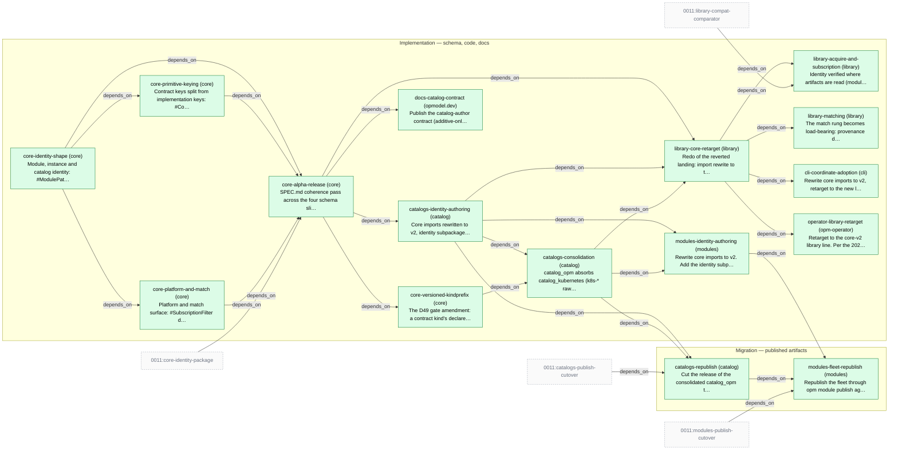

# Slice Plan — Module and Catalog Identity

<!-- Generated by `task plan:graph` — do not edit by hand. -->

| ID | Phase | Repo | Status | Depends on | Concern |
| -- | ----- | ---- | ------ | ---------- | ------- |
| core-identity-shape | implementation | core | done | - | Module, instance and catalog identity: #ModulePathType gains @vN and underscores, #PackagePathType splits off, fqn == modulePath, registryPath, snake name, instance fqn/uuid.   |
| core-primitive-keying | implementation | core | done | core-identity-shape | Contract keys split from implementation keys: #ContractFQNType / #ImplFQNType, #APIVersionType, apiVersion! and catalogVersion! on the primitives, authored fqn, primitive-versus-adapter.   |
| core-platform-and-match | implementation | core | done | core-identity-shape | Platform and match surface: #SubscriptionFilter deleted for a scalar version, matchLabels on the four kinds with #LabelWorkloadType deleted, fulfilment on #Resource and #Trait, and D28's #Trait.optional plus gate.   |
| core-alpha-release | implementation | core | done | core-identity-shape, core-primitive-keying, core-platform-and-match, 0011:core-identity-package | SPEC.md coherence pass across the four schema slices, examples re-vetted, the alpha carrying all four published at v2.0.0-alpha.4. NOT THE SINGLE CUT POINT — the four shipped across alpha.1-alpha.4; see history.   |
| core-versioned-kindprefix | implementation | core | done | core-alpha-release | The D49 gate amendment: a contract kind's declaredModulePath becomes kindPrefix[kind] + "/" + apiVersion, transformers unchanged, FQN construction untouched; the must-fail filing pin splits in two. SPEC.md co-update.   |
| library-core-retarget | implementation | library | done | core-alpha-release, catalogs-identity-authoring, catalogs-consolidation | Redo of the reverted landing: import rewrite to the core v2 major, fixtures re-landed against the consolidated catalog_opm with D49 versioned imports; keeps the seam adaptations and major-aware writers, drops the fixture catalog.   |
| library-acquire-and-subscription | implementation | library | done | library-core-retarget, 0011:library-compat-comparator | Identity verified where artifacts are read (modulePath vs fetched coordinate, version vs tag), and D14 deletes materialize/filter.go — no highestStable, no constraint solving; one major-agreement check survives beside the subscription.   |
| library-matching | implementation | library | done | library-core-retarget | The match rung becomes load-bearing: provenance denylist, contract-key diagnostics, unresolved demand errors, single-provider guard; matching reads matchLabels at the four measured sites; kube-aware FQN comparator; own-graph test.   |
| docs-catalog-contract | implementation | opmodel.dev | done | core-alpha-release | Publish the catalog-author contract (additive-only rule keyed to level, verified only via `opm catalog publish`, three version-shaped values) plus the registry-namespaces reference: owned prefixes, enforcement points, decisions.   |
| cli-coordinate-adoption | implementation | cli | done | library-core-retarget | Rewrite core imports to v2, retarget to the new library, delete address-composition, write the resolved coordinate into spec.module.{path,version}; D19 warning, two test imports move to D49 versioned paths, retired-catalog template refs.   |
| operator-library-retarget | implementation | opm-operator | done | library-core-retarget | Retarget to the core-v2 library line. Per the 2026-08-12 deviation the D14 filter->version CRD reshape rides this slice; otherwise no feature or adoption code (D18). Two OpenSpec changes; release waits for both.   |
| catalogs-identity-authoring | implementation | catalog | done | core-alpha-release | Core imports rewritten to v2, identity subpackages committed, every leaf re-keyed, matching moved to matchLabels — landed across all three repos. Deviations: stamping task kept for 0011 to retire, releases via release-please.   |
| catalogs-consolidation | implementation | catalog | done | catalogs-identity-authoring, core-versioned-kindprefix | catalog_opm absorbs catalog_kubernetes (k8s-* raw family, upstream-mirrored apiVersions) and catalog_opm_experimental (v1alpha1 members); version-segment filing, one schema tree, no-downward-dependency vet check, tombstones.   |
| modules-identity-authoring | implementation | modules | done | catalogs-identity-authoring, catalogs-consolidation | Rewrite core imports to v2. Add the identity subpackage per module and metadata wiring; blueprint imports move to D49 versioned paths; re-pin absorbed-catalog subscriptions to catalogs/opm, rename raw-member spec keys. Source only.   |
| catalogs-republish | migration | catalog | done | catalogs-identity-authoring, catalogs-consolidation, 0011:catalogs-publish-cutover | Cut the release of the consolidated catalog_opm through `opm catalog publish`. The first act that changes a published artifact. (Was three catalogs until D47.)   |
| modules-fleet-republish | migration | modules | done | catalogs-republish, modules-identity-authoring, 0011:modules-publish-cutover | Republish the fleet through `opm module publish` against the released catalogs. The only fleet republish in the 0010/0011 pair.   |
