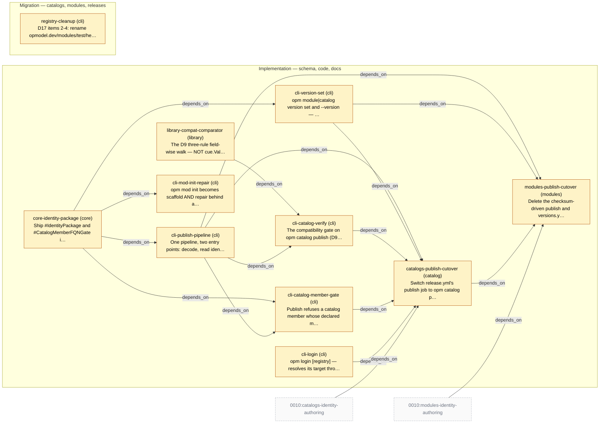

# Slice Plan — Module and Catalog Publishing

<!-- Generated by `task plan:graph` — do not edit by hand. -->

| ID | Phase | Repo | Status | Depends on | Concern |
| -- | ----- | ---- | ------ | ---------- | ------- |
| core-identity-package | implementation | core | planned | - | Ship #IdentityPackage and #CatalogMemberFQNGate in core so publish validates identity and every catalog member by unification and CUE produces the diagnostic (D21, D22), not a hand-rolled comparison.   |
| library-compat-comparator | implementation | library | planned | - | The D9 three-rule field-wise walk — NOT cue.Value.Subsume, measured 10/14 and 8/14 on disjoint sets — plus predecessor selection moved out of filter.go before 0010 D14 deletes it. Level-aware per 0010 D34.   |
| cli-login | implementation | cli | planned | - | `opm login [registry]` — resolves its target through the existing ResolveRegistry precedence and writes to the credential store CUE itself reads, because CUE performs the push (D11). Independent of everything else here.   |
| cli-publish-pipeline | implementation | cli | planned | core-identity-package | One pipeline, two entry points: decode, read identity, derive coordinates, run the gates, push, with the dry-run plan output. Refusals 1-8 and 10 (D1, D2, D4, D6, D12, D15, D16, D18, D21), plus the D16/D18 checks in `opm module vet`.   |
| cli-version-set | implementation | cli | planned | core-identity-package | `opm module|catalog version set` and `--version` — the surgical AST rewrite that preserves the & chain, located by schema path rather than by a marker (D3, D8, D12). Measured in experiments/01.   |
| cli-catalog-verify | implementation | cli | planned | library-compat-comparator, cli-publish-pipeline | The compatibility gate on `opm catalog publish` (D9) plus `opm catalog registry check [--compat]` (D7), whose help text must call it an aid rather than a gate (0010 D35). Both over the library comparator.   |
| cli-catalog-member-gate | implementation | cli | planned | core-identity-package, cli-publish-pipeline | Publish refuses a catalog member whose declared modulePath or fqn does not equal #CatalogMemberFQNGate's derivation (0010 D17, D21, D25, D42), unified against the core-shipped gate with CUE's error surfaced (D22).   |
| cli-mod-init-repair | implementation | cli | planned | core-identity-package | `opm mod init` becomes scaffold AND repair behind a second confirmation naming every file and value change, and never invents identity (D20). What makes D16's refusal actionable.   |
| catalogs-publish-cutover | implementation | catalog | planned | cli-publish-pipeline, cli-version-set, cli-catalog-verify, cli-catalog-member-gate, cli-login, 0010:catalogs-identity-authoring | Switch release.yml's publish job to `opm catalog publish` and delete the copy-and-stamp task. Catalogs go first because modules build against them.   |
| modules-publish-cutover | implementation | modules | planned | cli-publish-pipeline, cli-version-set, catalogs-publish-cutover, 0010:modules-identity-authoring | Delete the checksum-driven publish and versions.yml, cut over to `opm module publish`. The identity file itself is 0010's modules-identity-authoring (D17); coordinates do not change (D13).   |
| registry-cleanup | migration | cli | planned | - | D17 items 2-4: rename opmodel.dev/modules/test/hello-web to hello_web, relocate modules/test/* and its -e2e tags to testing.opmodel.dev, delete test/cleanmod. Legacy v1alpha1 waits on the v0 -> v1 fleet migration.   |
