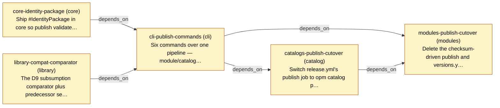

# Slice Plan — Module and Catalog Publishing

<!-- Generated by `task plan:graph` — do not edit by hand. -->

| ID | Repo | Status | Depends on | Concern |
| -- | ---- | ------ | ---------- | ------- |
| core-identity-package | core | planned | - | Ship #IdentityPackage in core so publish validates identity/identity.cue by unification and CUE produces the diagnostic (D21), rather than a hand-rolled expected-versus-found comparison.   |
| library-compat-comparator | library | planned | - | The D9 subsumption comparator plus predecessor selection, in the kernel so publish, `catalog registry check --compat` and CI share one implementation. Reuses enumerateVersions and highestStable.   |
| cli-publish-commands | cli | planned | core-identity-package, library-compat-comparator | Six commands over one pipeline — module/catalog publish, version set, --version, catalog registry check, mod init repair (D20), login (D11) — with all ten refusal paths rehearsed against a non-production registry.   |
| catalogs-publish-cutover | catalog | planned | cli-publish-commands | Switch release.yml's publish job to `opm catalog publish` and delete the copy-and-stamp task. Catalogs go first because modules build against them.   |
| modules-publish-cutover | modules | planned | cli-publish-commands, catalogs-publish-cutover | Delete the checksum-driven publish and versions.yml, add each module's identity/identity.cue and the D12 metadata wiring, republish. Coordinates do not change (D13).   |
