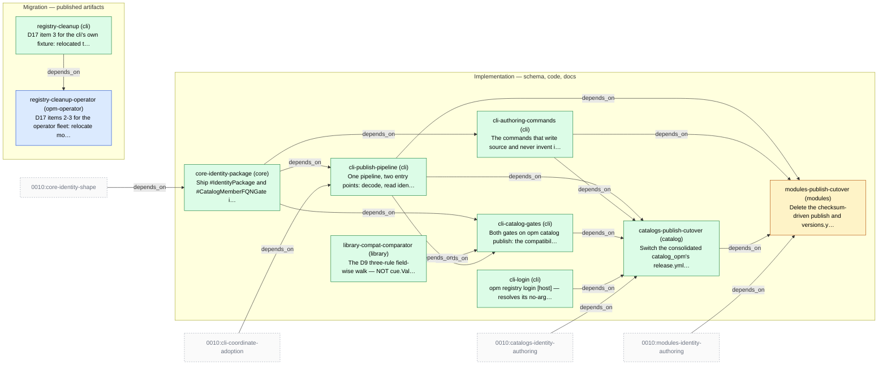

# Slice Plan — Module and Catalog Publishing

<!-- Generated by `task plan:graph` — do not edit by hand. -->

| ID | Phase | Repo | Status | Depends on | Concern |
| -- | ----- | ---- | ------ | ---------- | ------- |
| core-identity-package | implementation | core | done | 0010:core-identity-shape | Ship #IdentityPackage and #CatalogMemberFQNGate in core so publish validates identity and every catalog member by unification and CUE produces the diagnostic, not a hand-rolled comparison.   |
| library-compat-comparator | implementation | library | done | - | The D9 three-rule field-wise walk — NOT cue.Value.Subsume, measured 10/14 and 8/14 on disjoint sets — plus predecessor selection moved out of filter.go before 0010 D14 deletes it. Level-aware per 0010 D34.   |
| cli-login | implementation | cli | done | - | `opm registry login [host]` — resolves its no-arg target through the existing ResolveRegistry precedence and writes to the credential store CUE itself reads, because CUE performs the push. Independent of everything else here.   |
| cli-publish-pipeline | implementation | cli | done | core-identity-package, 0010:cli-coordinate-adoption | One pipeline, two entry points: decode, read identity, derive coordinates, run the gates, push, with the dry-run plan output. Refusals 1-8 and 10, plus the D16/D18 checks in `opm module vet`.   |
| cli-authoring-commands | implementation | cli | done | core-identity-package | The commands that write source and never invent identity: `opm module|catalog version set` / `--version` — the surgical AST rewrite measured in experiments/01 — and `opm mod init` as scaffold AND repair behind a second confirmation.   |
| cli-catalog-gates | implementation | cli | done | core-identity-package, library-compat-comparator, cli-publish-pipeline | Both gates on `opm catalog publish`: the compatibility gate plus `opm catalog registry check [--compat]` as an aid; members refused against #CatalogMemberFQNGate per version subdir, traits with unstated or pinned optional. -c required.   |
| catalogs-publish-cutover | implementation | catalog | done | cli-publish-pipeline, cli-authoring-commands, cli-catalog-gates, cli-login, 0010:catalogs-identity-authoring | Switch the consolidated catalog_opm's release.yml to `opm catalog publish`, delete the copy-and-stamp task — one catalog repo since the consolidation. Catalogs go first because modules build against them.   |
| modules-publish-cutover | implementation | modules | planned | cli-publish-pipeline, cli-authoring-commands, catalogs-publish-cutover, 0010:modules-identity-authoring | Delete the checksum-driven publish and versions.yml, cut over to `opm module publish`. The identity file itself is 0010's modules-identity- authoring; coordinates do not change.   |
| registry-cleanup | migration | cli | done | - | D17 item 3 for the cli's own fixture: relocated to testing.opmodel.dev/modules/cli/* and published to GHCR through the gated publish pipeline. The operator fleet is registry-cleanup-operator.   |
| registry-cleanup-operator | migration | opm-operator | in-progress | registry-cleanup | D17 items 2-3 for the operator fleet: relocate modules/test/* to testing.opmodel.dev/modules/operator/* with identity packages and gated publishing. Deletion of the old packages and their -e2e tags follows.   |
