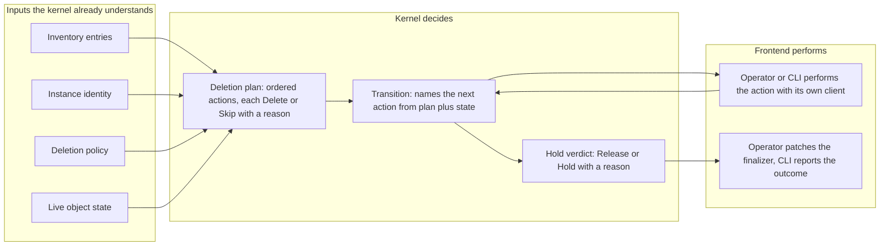

# Enhancement 0012: Kubernetes as a First-Class Kernel Platform

The OPM kernel renders and then stops. Both frontends, the operator and the CLI, embed it and each decides what happens to a rendered object in a cluster. So the same Kubernetes decisions exist twice, and the two copies have already drifted in ways that decide whether a resource gets deleted. This entry moves those decisions into the kernel.

All entries: [INDEX.md](../INDEX.md). How this one relates to others: [GRAPH.md](../GRAPH.md). Metadata: [config.yaml](config.yaml).

## Summary

**Two decisions set the direction (D1, D2).** The Kubernetes runtime code belongs in the kernel, and both frontends use it instead of private copies. The kernel targets Kubernetes directly, so `k8s.io/apimachinery` becomes a kernel dependency while `client-go`, `controller-runtime` and Flux stay out.

**Share every decision; share the steps only where they carry no framework opinion.** Deletion qualifies: ordering, fetching, guarding and deleting are plain Kubernetes steps. Apply does not, so the kernel gives the per-object verdict and each frontend keeps its own engine.

**The duplication is measured, not assumed.** As of 2026-09-14 the two repos' object-conversion code is byte-identical, their label and resource helpers differ only in comments, and the render-digest function still exists twice with a comment telling maintainers to sync it by hand. The operator deleted its copy of the resource-order weights on 2026-09-13, so that table now lives only in the CLI and the operator orders through Flux instead. Where the copies decide rather than copy fields, they have diverged:

- The CLI deletes CustomResourceDefinitions; the operator refuses to.
- The operator checks live ownership before deleting; the CLI does not.
- The CLI refuses to apply over a foreign object; the operator does not.

Neither side holds both guards.

**It corrects two earlier findings.** Entry 0010 asked how ownership survives deletion (0010:OQ10). `ModuleInstance` does have a finalizer with a tested cleanup path; what 0010:OQ10 got right is that nothing stamps `ownerReferences`. It missed three things: prune defaults to false, so the finalizer orphans by default; a CLI-owned instance carries no hold at all, so deleting its record orphans every workload; and an `ownerReference` garbage-collects whatever prune says, so 0010:OQ10's additive-references idea contradicts `prune: false` rather than speeding it up. Entry 0006 first put this shared logic in the kernel (0006:D13.1), then removed it (0006:D31). 0006:D31's safety analysis stands; two of the three facts behind its conclusion have changed, one being the module dependency edge it refused to pay for, added 19 days later by 0006's own later work, and its two deferred questions, a shared stale-set comparator (0006:OQ15) and an apply-time collision guard (0006:OQ16), land here.

## How it works

Deletion becomes a kernel-owned protocol over four inputs the kernel already understands. It computes an ordered plan whose actions are each a Delete or a Skip with a typed reason. It then names the next action from the plan and what has happened so far, and finally returns a verdict on whether the hold may be released. Each frontend performs the actions with its own client and keeps credentials, the reconcile loop and the finalizer patch. It cannot skip a guard, because asking for the next action is the only way to make progress.

## Documents

1. [01-problem.md](01-problem.md): the verified duplication, the measured divergence, and the deletion gaps 0010's question did not identify
1. [02-design.md](02-design.md): a Kubernetes tier in the kernel, and the rule that shares every decision but only framework-free execution
1. [03-decisions.md](03-decisions.md): the decision log, D1 and D2
1. [04-graduation.md](04-graduation.md): what must hold before draft becomes accepted
1. [05-risks.md](05-risks.md): risks, drawbacks, alternatives not taken
1. [06-operational.md](06-operational.md): rollout, versioning, rollback, cross-repo ordering
1. [07-questions.md](07-questions.md): the open-questions register

Compilable CUE lives in [`contracts/contracts.cue`](contracts/contracts.cue): the ownership vocabulary, the inventory wire shape, the deletion policy, the plan verdicts, the owner-reference eligibility predicate and the conformance property. It compiles, so a wrong shape is a build failure rather than a documentation bug.

## Scope

### In scope

**What the kernel decides**

- The deletion protocol as a kernel contract: the hold, the ordered plan with typed skip reasons, and the verdict releasing the hold. Every branch the operator takes today becomes a kernel case; the operator keeps the finalizer patch and the impersonation setup.
- Whether OPM stamps `ownerReferences` at all, resolved against the prune contradiction and the cluster-scope limitation together rather than either alone. The eligibility predicate is specified either way.
- Both ownership guards: the delete-time managed-by and instance-UUID check the CLI lacks, and the apply-time refusal over a foreign or terminating object the operator lacks, which is 0006's deferred collision guard (0006:OQ16).
- A conformance property asserting an implementor cannot execute a delete the plan marked as a skip. That mechanism is what separates this entry from documented conventions.

**What moves into the kernel, one definition each**

- The duplicated Kubernetes code: label vocabulary, terminal object type, resource-order weights, inventory entry construction, stale-set computation and the three digests, with both frontends' copies deleted rather than aliased.
- One stale-set base comparator across implementors, 0006's other deferred question (0006:OQ15).

**Kernel bounds**

- The dependency and constitutional bounds: `k8s.io/apimachinery` enters the library, `client-go`, `controller-runtime` and Flux do not. The library constitution's package list and runtime-concerns clause are amended, with an ADR recording the bound.

### Out of scope

**Stays with the frontends**

- A kernel apply engine. The operator keeps Flux server-side apply, the CLI keeps its own, and the kernel supplies apply verdicts only. A kernel apply executor should be refused if proposed during implementation.
- The reconcile loop. Watches, requeues, backoff, conditions, events and metrics stay in the operator; command shape, output formatting and exit codes stay in the CLI.
- Credentials. Kubeconfig resolution, REST config construction and ServiceAccount impersonation are the frontends'.

**Belongs to another entry**

- The CRD Go types. Whether the library becomes their home is entangled with entry [0008](../0008/) and is an open question here, not a deliverable.
- Identity. Fully-qualified names, module paths, instance-UUID derivation and the identity migration belong to [0010](../archive/0010/). This entry consumes whatever identity 0010 landed and compares label values without parsing them.
- The kernel's execution half, the operational primitives and their flow package, which belong to [0009](../0009/). The two overlap on the planner-and-execution boundary convention, tracked as an open question rather than absorbed.

**Not touched by this entry**

- The render half. Rendering is untouched; everything here is additive below the render line.
- Re-deciding 0006's data-flow analysis. Only its placement conclusion is superseded.

## Deviations from Design

None at this stage. This entry is `draft`; deviations are recorded here when implementation lands.

## Cross-References

| Document | Purpose |
| -------- | ------- |
| `/CLAUDE.md` (workspace root) | Cross-repo routing for a multi-repo entry |
| `library/CONSTITUTION.md` | The neutrality principles this entry amends |
| `library/CLAUDE.md` | The helper-versus-kernel boundary the new packages sit across |
| `library/opm/core/resource.go` | The platform-neutral contract with no implementation |
| `library/opm/core/compiled.go` | The kernel's current terminal output |
| `library/opm/kernel` | Where the Kubernetes-shaped render result comes out today |
| `library/go.mod` | The version floor every embedder inherits |
| `library/MIGRATIONS.md` | The repo's per-breaking-change migration contract |
| `opm-operator/internal/reconcile/moduleinstance.go` | The finalizer and the deletion branches that become kernel cases |
| `opm-operator/internal/apply/prune.go` | The delete-time ownership guard the CLI lacks |
| `opm-operator/internal/apply/apply.go` | The Flux staged apply that is kept, and why |
| `opm-operator/internal/inventory/` | Entry construction, stale set and digest: what the kernel replaces |
| `opm-operator/pkg/core/`, `opm-operator/pkg/resourceorder/` | The operator half of the byte-identical duplication |
| `opm-operator/internal/render/module.go` | Inventory-entry construction, which becomes a kernel call |
| `opm-operator/api/v1alpha1/moduleinstance_types.go` | Where prune, owner and the inventory status fields are declared |
| `cli/internal/inventory/stale.go` | The narrow exclusion list that lets the CLI delete more |
| `cli/internal/inventory/digest.go` | The digest function and the parity comment this entry deletes |
| `cli/pkg/inventory/entry.go` | The CLI's component-aware stale-set relation |
| `cli/pkg/core/`, `cli/pkg/resourceorder/` | The CLI half of the byte-identical duplication |
| `cli/internal/kubernetes/delete.go` | The delete walk that becomes a kernel plan |
| `cli/internal/cmd/instance/delete.go` | The ownership branch and the prune warning a user sees |
| `cli/go.mod`, `opm-operator/go.mod` | Evidence both frontends already pin the same library version |
| `core/src/transformer.cue` | Where labels are composed and the runtime name is filled |
| `core/src/module_instance.cue` | The instance UUID the ownership guard compares |
| `catalog_opm/src/resources/crd.cue`, `role.cue` | Cluster-scoped renderables a namespaced owner cannot cover |
| `enhancements/0006/03-decisions.md` | The decision superseded and the two questions absorbed |
| `enhancements/0010/03-decisions.md` | The question that surfaced this entry, corrected in `01-problem.md` |
| `enhancements/0008/` | CRD types from CUE, entangled on where the type vocabulary lives |
| `enhancements/0009/` | The kernel's execution half, tangled up at the planner boundary |
