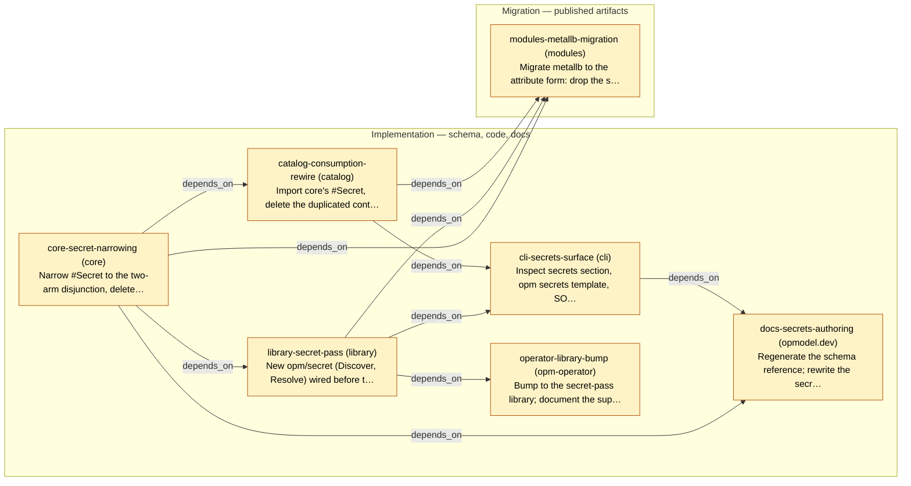

# Slice Plan — Attribute-Declared Secret Fields

<!-- Generated by `task plan:graph` — do not edit by hand. -->

| ID | Phase | Repo | Status | Depends on | Concern |
| -- | ----- | ---- | ------ | ---------- | ------- |
| core-secret-narrowing | implementation | core | planned | - | Narrow #Secret to the two-arm disjunction, delete the dead secret machinery, correct SPEC.md §1, regenerate INDEX; publishes the core v2 alpha every other slice consumes. Load core-schema-edit first.  |
| library-secret-pass | implementation | library | planned | core-secret-narrowing | New opm/secret (Discover, Resolve) wired before the component build: fail-closed discovery, resolve-in-place via decode-splice-encode, one graph build, synthesized secrets component with platform-supplied FQN, .value diagnostic in compile.  |
| catalog-consumption-rewire | implementation | catalog | planned | core-secret-narrowing | Import core's #Secret, delete the duplicated contract and discovery pyramid, rewrite both consumption sites to read .ref/.key, strip all name computation from secret_transformer.  |
| cli-secrets-surface | implementation | cli | planned | library-secret-pass, catalog-consumption-rewire | Inspect secrets section, opm secrets template, SOPS values-file decrypt, secrets-aware vet messaging; port the secrets-module fixture and retire the superseded auto-secrets-injection spec.  |
| operator-library-bump | implementation | opm-operator | planned | library-secret-pass | Bump to the secret-pass library; document the supplied-arm plaintext-in-CR posture with the referenced arm as production guidance (no valuesFrom mechanism).  |
| docs-secrets-authoring | implementation | opmodel.dev | planned | core-secret-narrowing, cli-secrets-surface | Regenerate the schema reference; rewrite the secrets authoring docs around the routing/fulfilment split and the SOPS template workflow.  |
| modules-metallb-migration | migration | modules | planned | core-secret-narrowing, library-secret-pass, catalog-consumption-rewire | Migrate metallb to the attribute form: drop the spec.secrets map, move RBAC resourceNames to the new object name, re-render and diff against the live cluster (values unchanged); rewrite DESIGN_PATTERNS' secret section.  |
