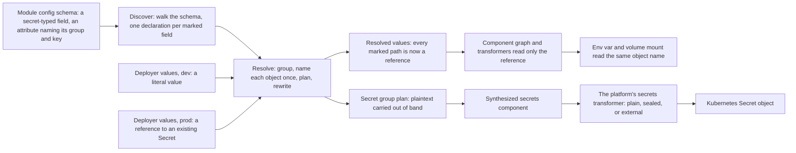

# Enhancement 0013: Attribute-Declared Secret Fields

> **Mechanism removed 2026-08-22.** This entry was written before decisions carried a `**Kind:**` line, and it recorded construction detail alongside its contracts: file names, directory spellings, internal identifiers, per-repo worklists. That detail has been removed from `03-decisions.md`, `02-design.md`, `06-operational.md` and this file; `## Integration Points` is now `## Affected Surfaces`, stated at the intent level. **Nothing was reversed and no decision changed its answer.** Measured evidence, `Source:` citations and *Alternatives considered* were kept in full, including their file references: those are provenance, not instructions. The removed text is in git history; construction detail belongs to the implementing repo's own change record.

Today a sensitive field carries its own routing inside the value, naming the Secret object and key it belongs in, and every module then repeats that routing by hand where the value is consumed. The two copies disagree in practice, and the plaintext stays visible all the way through the render. This entry moves the routing onto a CUE attribute, inert metadata on the declaring field that evaluation ignores. The field's type then carries only what the deployer supplies: a literal value, or a reference to a Secret that already exists. The kernel rewrites every marked field to a reference before anything downstream sees it.

All entries: [INDEX.md](../INDEX.md). How this one relates to others: [GRAPH.md](../GRAPH.md). Metadata: [config.yaml](config.yaml).

## Summary

The design rests on one split. The attribute carries routing, which Kubernetes object a key belongs in: author metadata, identical in every environment (D10, which replaced D1's contract struct, in the existing attribute namespace of D2). The type carries fulfilment, the data or where it already lives: deployer data, per environment, checked by CUE.

```cue
// author, once, in the published module
#config: db: password: #Secret @opm(secret, group=db-creds, key=password)

// deployer, per environment
values: db: password: {value: "hunter2"}                           // supplied
values: db: password: {ref: "existing-db-creds", key: "password"}  // referenced
```

- Two fulfilment arms ship, supplied and referenced (D7), and `#Secret` narrows to exactly those two. It is six lines in core, their only home (D12), replacing 455 dead lines there, 439 duplicated in the catalog and a 240-line hand-unrolled discovery comprehension, all deleted rather than deprecated (D9).
- The kernel discovers marked fields from the config schema, not the deployer's values (D3), so it works with no values present, has no depth ceiling, and covers lists and pattern-constrained maps. It keys on type as well as marker and fails closed: a secret-typed field without the attribute gets default routing, a marked field of another type is an error (D13).
- It then resolves in place: group the declarations, name each object exactly once, send the plaintext out of band, and rewrite every marked path to a reference (D11). Only the kernel may name an object (D5), and it names one per instance and group rather than per component (D6). A literal becomes a reference to the object the kernel just decided to create; a deployer-written reference passes through unchanged.
- After the rewrite the arms are indistinguishable, so a transformer reads one branch: no variant dispatch, no name computation, no side lookup. One string holds the object name and every consumer reads it, so today's environment-variable-versus-volume mismatch becomes unrepresentable. The reference arm has no value field, so plaintext's absence from the render is structural.
- Materialisation, as a plain Secret, a sealed one or an external-secrets object, is a platform choice resolved through catalog subscription, never an author decision (D8). That also answers enhancement [0010](../archive/0010/)'s open question about where the secrets resource name comes from: the platform supplies it.
- SOPS lands at the file seams only, decrypting values on input, never an arm, a backend or kernel code (D14). A literal in a custom resource is plaintext in etcd: accepted and documented, with the referenced arm as the production posture and no indirection field added (D15).

Two properties fall out that the first draft lacked. Instance files do not change at all for supplied secrets, and a secret interpolated into a rendered config file now fails plain validation at authoring time.

## How it works



The plaintext and the graph take separate paths and meet again only inside the object the platform's transformer produces, so switching environments changes the value, never the module. The rewrite is a decode, splice and encode over evaluated data, 12 to 39 times faster than grafting onto the build (D17). It is done as omission at build assembly, measured on the real kernel path and needing no new seam (D16).

## Documents

1. [01-problem.md](01-problem.md): routing stated twice with nothing checking it, three disagreeing name derivations, and plaintext in the render
1. [02-design.md](02-design.md): routing in the attribute, fulfilment in the type, and a kernel resolving both arms in place
1. [03-decisions.md](03-decisions.md): the decision log, D1 to D17; D10 supersedes D1, D11 supersedes D4, D16 resolves OQ2
1. [04-graduation.md](04-graduation.md): what had to hold before `draft` became `accepted`
1. [05-risks.md](05-risks.md): risks, drawbacks, alternatives not taken
1. [06-operational.md](06-operational.md): rollout, versioning, rollback, cross-repo ordering
1. [07-questions.md](07-questions.md): the open-questions register, OQ1 and OQ2, both resolved

Pure-CUE definitions live in [`schemas/`](schemas/): the contract in [`target.cue`](schemas/target.cue), and in [`examples.cue`](schemas/examples.cue) worked values covering the marker grammar and a before and after of the one affected fleet module. Both compile, and the examples pin derived values with assertion fields, so a wrong example is a build failure. [`experiments/`](experiments/) holds the four concluded proofs the decisions cite, including the one that settled OQ2 on the real kernel path.

## Scope

### In scope

**Core contract:**

- The secret marker grammar and its parsed contract.
- Narrowing `#Secret` to the two arms, and making core its only definition.

**Kernel pass:**

- The kernel's secret pass, discover and resolve, with discovery keying on type as well as marker and failing closed (D13).
- Resolve-in-place: rewriting every marked path to a reference before the component graph is built.
- Kernel-owned Secret object naming, delivered inside the resolved value.
- Two fulfilment arms: supplied and referenced.
- The extension mechanism by which a catalog supplies another materialisation backend.

**Cleanup and migration:**

- Deleting the old routing vocabulary and the discovery pyramid, and its catalog duplicate; correcting the core specification's claim that `#Secret` is a primitive.
- Migrating the one fleet module carrying a secret, including its RBAC scoping by resource name.

**CLI and SOPS surface:**

- A secrets section in the module inspect output.
- SOPS support at the CLI input seam (D14): encrypted values files, a skeleton generator, and secrets-aware messaging for unfulfilled secrets.

### Out of scope

**Explicitly deferred:**

- **Implementing cryptography.** SOPS calls the upstream library; OPM ships no cipher code, and key management is deployer configuration. Encrypting rendered Secret manifests on export rides enhancement [0014](../0014/)'s surface.
- **Shipping an external-secrets, Vault, sealed-secrets or CSI backend.** The mechanism is in scope; backends are follow-on catalogs.
- **Secret rotation, leasing or dynamic secrets.** A secret is resolved once per render.

**Someone else's concern:**

- **Protecting supplied values inside a custom resource.** Accepted and documented, the referenced arm being the production posture on the operator path (D15).
- **Retiring the hand-authored secret-schema path.** A module that computes a whole file and stores it as Secret data keeps writing it by hand.
- **A general-purpose marker framework.** This entry defines the secret marker in the existing namespace; whether enhancement [0009](../0009/)'s operational marker folds into it is 0009's question.
- **Redacting secrets from logs generally.** The design removes plaintext from the render; log hygiene elsewhere is separate.

## Deviations from Design

Divergences between the accepted design and what shipped, recorded as each slice lands. The catalog slice, archived 2026-08-30, deviates three ways:

- **Order: the catalog removal landed before core's slice, not after.** The design sequenced core first, publishing the new `#Secret` for catalogs to import. The catalog removed its legacy block (D9, D12) while core still ships the identical mechanism and no release carries the new type. The interim catalog major has no environment-secret path at all, and the replacement is gated on a core release.
- **Release mechanics: a major crossing, not a beta cascade.** Removing one field and narrowing another break two beta members. Moving them would have dragged along the five blueprints and two traits that embed the affected container schema. Instead the catalog crossed to the next major with the members corrected in place; the previous major is frozen and member names are unchanged.
- **Fleet: removed now, reintroduced under this entry, not migrated.** The seven fleet modules using the old vocabulary are stripped of it rather than rewritten onto an unpublished replacement. The CLI's secrets fixture is deleted. Both return when the kernel-resolved type ships.

## Cross-References

| Document | Purpose |
| -------- | ------- |
| `core/openspec/config.yaml`, `library/CONSTITUTION.md`, `cli/CONSTITUTION.md` | The principles governing changes in the touched repos |
| `core/.claude/skills/core-schema-edit/SKILL.md` | The binding protocol for the core slice, which also carries a stale helper list this entry corrects |
| `core/SPEC.md` | Misdescribes `#Secret` as a primitive, and records the synthesis removal |
| `cli/docs/rfc/0002-sensitive-data-model.md` | The original sensitive-data proposal whose redaction goal this design delivers |
| Enhancement [0009](../0009/) | Evidence that depending on CUE attributes is safe |
| Enhancement [0010](../archive/0010/) | The open question whose candidate answer D8 supplies |
| Enhancement [0011](../archive/0011/) | The attribute precedent D2 follows |
