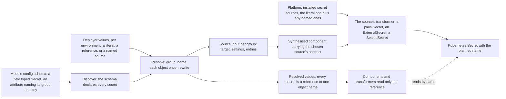

# Enhancement 0013: Attribute-Declared Secret Fields

> **Mechanism removed 2026-08-22.** This entry was written before decisions carried a `**Kind:**` line, and it recorded construction detail alongside its contracts: file names, directory spellings, internal identifiers, per-repo worklists. That detail has been removed from `03-decisions.md`, `02-design.md`, `06-operational.md` and this file; `## Integration Points` is now `## Affected Surfaces`, stated at the intent level. **Nothing was reversed and no decision changed its answer.** Measured evidence, `Source:` citations and *Alternatives considered* were kept in full, including their file references: those are provenance, not instructions. The removed text is in git history; construction detail belongs to the implementing repo's own change record.

Today a secret travels in plain text through the whole render, and core's `#Secret` puts its routing inside the value. This entry moves the routing onto a CUE attribute, lets the deployer choose how each secret is supplied, and has the kernel rewrite every secret to a reference before render, so plaintext reaches only the object that stores it.

All entries: [INDEX.md](../INDEX.md). How this one relates to others: [GRAPH.md](../GRAPH.md). Metadata: [config.yaml](config.yaml).

## Summary

**The attribute says where, the type says how (D10, D18).** The author marks the field once; the deployer fills it per environment.

```cue
// author, once, in the published module
#config: db: password: #Secret @opm(secret, group=db-creds, key=password)

// deployer, per environment
values: db: password: {value: "hunter2"}                           // a literal
values: db: password: {ref: "existing-db-creds", key: "password"}  // an existing Secret
values: db: password: {source: "<contract FQN>", spec: {...}}      // a named source (wave 2)
```

**Secret methods are catalog sources, and the deployer picks one per value (D18, D19, D29).** A source is a resource a catalog defines and the platform installs, several side by side. A literal is sugar for the platform's one literal source (D30); a named source is chosen by exact contract FQN. Core adds the arms and one input envelope once, and never grows with new methods.

**The schema declares secrets, and the kernel rewrites each to a reference before render (D11, D13, D33).** Every core arm carries a hidden tag, so discovery fails closed. The kernel names each object once per instance and group (D5, D6); the plaintext travels only in the source's input, never in the component graph.

**Mistakes fail loudly (D34, D35, D28).** A malformed value fails plain `cue vet`; an unfulfilled secret fails every render; diagnostics never carry a secret value.

**Two waves (06-operational).** Wave 1 ships the literal and the reference; named sources follow in wave 2 without changing what wave 1 shipped.

**SOPS works at the file edge only (D14, D26).** A literal in a custom resource is plaintext at rest, documented, on the operator and CLI paths alike (D15, D27); an authored instance package refuses one (D25).

## How it works


```mermaid
flowchart LR
    schema["Module config schema: a field typed Secret, an attribute naming its group and key"] --> disc
    vals["Deployer values, per environment: a literal, a reference, or a named source"] --> res
    disc["Discover: the schema declares every secret"] --> res
    res["Resolve: group, name each object once, rewrite"] --> refs["Resolved values: every secret is a reference to one object name"]
    refs --> comps["Components and transformers read only the reference"]
    res --> input["Source input per group: target, settings, entries"]
    input --> synth["Synthesised component carrying the chosen source's contract"]
    plat["Platform: installed secret sources, the literal one plus any named ones"] --> tfm
    synth --> tfm["The source's transformer: a plain Secret, an ExternalSecret, a SealedSecret"]
    tfm --> k8s["Kubernetes Secret with the planned name"]
    comps -.->|reads by name| k8s
```

The plaintext and the component graph take separate paths and meet again only inside the object a source produces, so switching environment or method changes the values, never the module. Whichever arm the deployer wrote, consumers read the same reference, so an environment variable and a volume can never disagree about the name. The rewrite is a decode, splice and encode over evaluated data (D17), assembled so the original values never enter the render build (D16).

## Documents

1. [01-problem.md](01-problem.md): routing stated twice with nothing checking it, three disagreeing name derivations, and plaintext in the render
1. [02-design.md](02-design.md): routing in the attribute, the value in the type, and a kernel resolving both forms in place (written before D18; the decision log is current)
1. [03-decisions.md](03-decisions.md): the decision log, D1 to D36; D10 supersedes D1, D11 supersedes D4, D18 and D19 supersede D7 and D8, D16 resolves OQ2
1. [04-graduation.md](04-graduation.md): what had to hold before `draft` became `accepted`
1. [05-risks.md](05-risks.md): risks, drawbacks, alternatives not taken
1. [06-operational.md](06-operational.md): rollout, versioning, rollback, cross-repo ordering
1. [07-questions.md](07-questions.md): the open-questions register, OQ1 to OQ8 resolved, OQ9 open

Pure-CUE definitions live in [`schemas/`](schemas/): the contract in [`target.cue`](schemas/target.cue), with the wave-2 surface marked, and in [`examples.cue`](schemas/examples.cue) worked values covering the marker grammar, the synthesised component, a fleet module's migration and why wave 2 is additive. Both compile, and the examples pin derived values with assertion fields, so a wrong example is a build failure. [`experiments/`](experiments/) holds the four concluded proofs the early decisions cite; [`research/`](research/) records the six probes that settled OQ3 to OQ8.

## Scope

### In scope

**Core contract:**

- The secret marker grammar and its parsed contract.
- `#Secret` as tagged arms (literal and reference in wave 1, a named source in wave 2), with core its only definition, the source input envelope, and the named key and object types.
- The instance's values check, and the reserved annotation prefix kernel features read.

**Kernel pass:**

- The kernel's secret pass, discover and resolve, with the schema declaring secrets and discovery failing closed (D13, D33).
- Resolve-in-place: rewriting every declared path to a reference before the component graph is built.
- Kernel-owned Secret object naming, delivered inside the resolved value.
- One synthesised component per group, held to the checks an authored component passes, with redacted diagnostics.
- Secret sources as catalog resources the deployer chooses per value, and a platform's settings for them.

**Cleanup and migration:**

- Deleting the old routing vocabulary and the discovery pyramid, and its catalog duplicate; correcting the core specification's secret text.
- catalog_opm's literal source.
- Migrating the fleet modules that carry secrets as plain strings, including RBAC scoping by resource name.

**CLI and SOPS:**

- SOPS support where the CLI reads files (D14): encrypted values files, a skeleton generator, and secrets-aware messaging for unfulfilled secrets.
- Encrypting the literal values of an exported instance (D26, wave 2).

### Out of scope

**Explicitly deferred:**

- **Implementing cryptography.** SOPS calls the upstream library; OPM ships no cipher code, and key management is deployer configuration. Export rides enhancement [0014](../0014/)'s surface.
- **Shipping an external-secrets, Vault, sealed-secrets or CSI source.** The mechanism is in scope; named sources are follow-on catalogs.
- **Secret rotation, leasing or dynamic secrets.** A secret is resolved once per render.

**Someone else's concern:**

- **Protecting supplied values inside a custom resource.** Accepted and documented on the operator and CLI paths, a reference or a named source being the production recommendation (D15, D27).
- **Retiring the hand-authored secret-schema path.** A module that computes a whole file and stores it as Secret data keeps writing it by hand.
- **A general-purpose marker framework.** This entry defines the secret marker in the existing namespace; whether enhancement [0009](../0009/)'s operational marker folds into it is 0009's question.
- **Redacting secrets from logs generally.** The design removes plaintext from the render; log hygiene elsewhere is separate.

## Deviations from Design

Divergences between the accepted design and what shipped, recorded as each slice lands. The catalog slice, archived 2026-08-30, deviates three ways:

- **Order: the catalog removal landed before core's slice, not after.** The design sequenced core first, publishing the new `#Secret` for catalogs to import. The catalog removed its legacy block (D9, D12) while core still ships the identical mechanism and no release carries the new type. The interim catalog major has no environment-secret path at all, and the replacement is gated on a core release.
- **Release mechanics: a major crossing, not a beta cascade.** Removing one field and narrowing another break two beta members. Moving them would have dragged along the five blueprints and two traits that embed the affected container schema. Instead the catalog crossed to the next major with the members corrected in place; the previous major is frozen and member names are unchanged.
- **Fleet: removed now, reintroduced under this entry, not migrated.** The seven fleet modules using the old vocabulary are stripped of it rather than rewritten onto an unpublished replacement. The CLI's secrets fixture is deleted. Both return when the kernel-resolved type ships.

## Cross-References

| Document | Purpose |
| -------- | ------- |
| `core/openspec/config.yaml`, `library/CONSTITUTION.md`, `cli/CONSTITUTION.md` | The principles governing changes in the touched repos |
| `core/.claude/skills/core-schema-edit/SKILL.md` | The binding protocol for the core slice, which also carries a stale helper list this entry corrects |
| `core/SPEC.md` | Its §1 and §3.5 secret text, which this entry changes |
| `cli/docs/rfc/0002-sensitive-data-model.md` | The original sensitive-data proposal whose redaction goal this design delivers |
| Enhancement [0009](../0009/) | Evidence that depending on CUE attributes is safe |
| Enhancement [0010](../archive/0010/) | The original `@opm(identity, …)` marker shape D2 follows, and the secrets-resource question the superseded D8 answered |
| Enhancement [0011](../archive/0011/) | Preserved the identity marker on write (background to D2) |
| Enhancement [0014](../0014/) | The instance export whose literal values D26 encrypts |
