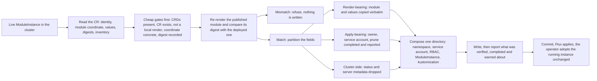

# Enhancement 0014: Export a Deployed Instance as GitOps Manifests

OPM can already hand a CLI-deployed application over to its in-cluster operator without disturbing a workload. That moves the manager, not the definition: afterwards the only complete record of the deployment is a live object in the cluster. A team that now wants git to be the source of truth hand-transcribes that object into several YAML documents, and the transcription is quietly wrong in ways that change who applies the instance. This entry adds a command that reads the live record, proves the published module still reproduces what is running, and writes a directory you can commit.

All entries: [INDEX.md](../INDEX.md). How this one relates to others: [GRAPH.md](../GRAPH.md). Metadata: [config.yaml](config.yaml).

## Summary

The exported unit is one directory per instance holding the whole apply envelope, not a bare custom resource (D1). That means the `ModuleInstance` object plus the namespace, the `ServiceAccount` that applies it, that account's RBAC, and a `kustomization.yaml` listing them. Repo-level Flux wiring is deliberately absent, because a repository has one of those and not one per instance. `--all` repeats the same unit across a namespace or a cluster and merges nothing between directories.

Nothing is written unless the published module still reproduces the deployed render (D2). Export reuses the existing handoff command's precondition chain: the cluster gates, the record's existence, a concrete module coordinate, a recorded render digest, and a strict-registry re-render whose digest must equal it. One more arm is inherited, the refusal when the deployment was rendered from local bytes rather than from the registry (0006:D38, the local-provenance refusal of the archived handoff entry 0006). A failure aborts with nothing on disk, and `--force` bypasses the digest comparison alone.

A dump of the live object is not merely untidy, it is wrong. The CLI's single spec writer records the module coordinate, the owner and the values and nothing else, so every CLI-written record is missing its service account name and its prune setting. A document without them applies under the controller's own identity and orphans its workloads on delete. One partition resolves that against the gate above. Render-bearing fields, the module coordinate and the values, decide what the operator produces and are copied verbatim because the digest proves them right. Apply-bearing fields, which decide who applies and what happens on delete, sit outside the render digest and are completed, with every completion named in the output. Cluster-side fields, status and server-set metadata, are dropped.

Values are copied byte for byte with an unconditional warning that OPM cannot yet identify which of them are secret (D3). There is no redaction mode: a redacted document no longer renders to the deployed digest, so redaction would trade a verified artifact for a partial one. The live record is the sole input (D4), because the guarantee is a statement about what is running and only the cluster can answer that.

This is the third step of the path the archived entry [0006](../archive/0006/) built. That entry moved the inventory into the `ModuleInstance` record (0006:D1) and then moved the manager to the operator (0006:D7 and 0006:D40); this one moves the definition into a repository. It reuses 0006's success criterion too, an inventory-stable reconcile in which the owned set is identical and nothing is pruned (0006:D40). Here that criterion is restated for a GitOps applier instead of the operator's first reconcile after a handoff. The open risk sits at the seam 0006 never had to cross: a GitOps apply introduces a third field manager, Flux's kustomize-controller, onto fields the CLI and the operator already own. That question is answered by a runnable experiment rather than by argument.

## How it works

The cheap gates run first and the expensive one last, so a doomed export costs nothing. The digest comparison is the guarantee, and its failure message reports the same finding handoff reports: the cluster is running something the registry no longer describes. Only after it passes does anything reach the filesystem, and the report then names everything the export completed rather than copied.

## Documents

1. [01-problem.md](01-problem.md): handoff moves the manager and not the definition, and why a dump of the live object changes apply identity and deletion behaviour
1. [02-design.md](02-design.md): read the live record, run the gate chain, complete the apply-bearing fields, compose a per-instance directory
1. [03-decisions.md](03-decisions.md): the decision log, D1 to D4
1. [04-graduation.md](04-graduation.md): what must hold before draft becomes accepted
1. [05-risks.md](05-risks.md): risks, drawbacks, alternatives not taken
1. [06-operational.md](06-operational.md): observability, versioning, deprecation, rollback, cross-repo coordination
1. [07-questions.md](07-questions.md): the open-questions register

Compilable CUE lives in [`contracts/contracts.cue`](contracts/contracts.cue): the request shapes, the ordered gate chain, the three-way field partition, the exported document set with its report, and the adoption property. The partition is enforced by the schema, so a policy that copies a cluster-side field fails `cue vet` rather than review.

## Scope

### In scope

**Command.**

- `opm instance export <name> -n <ns>` reads the live `ModuleInstance` and writes a per-instance directory of YAML documents (D1). `--all` repeats that unit across a namespace or the cluster, merging nothing between directories.

**What gets written.**

- The record plus its apply envelope: `Namespace`, `ServiceAccount`, RBAC, and a `kustomization.yaml` listing them (D1). It is the shape the demo bundle has today, generated instead of typed.
- Completion of the apply-bearing fields the CLI never writes, the service account name and the prune setting, with every completion named in the output. What to fill in is still an open question.
- Values copied verbatim, with an unconditional warning that OPM cannot yet identify which are secret (D3).

**Verification gate.**

- Nothing is written unless the published module reproduces the recorded render digest (D2), reusing handoff's precondition chain and its verification render. `--force` bypasses the digest comparison only.

**Inputs and internals.**

- The live record is the sole input (D4): no local instance file, no values overlay.
- One read-only field added to the CLI's internal record type, and the verification render lifted into a package both handoff and export call.

### Out of scope

**Deferred, not rejected.**

- Repo-level Flux wiring. The source and the Flux kustomization are one per repository, so emitting them per export would produce conflicting copies of a singleton. Bootstrapping a GitOps repository is a candidate follow-on.
- A CUE-native export. Reconstructing an instance package plus a `ModulePackage` record targets a different operator path and waits as a possible second output mode.
- Secret detection, redaction, and any SOPS or External Secrets integration. It depends on entry [0013](../0013/); until that lands, the warning is the honest surface.

**Hard boundaries of this entry.**

- The import direction. Nothing reads a repository and applies it, and nothing compares git against the cluster. After the commit, Flux is the applier and Flux reports drift.
- `ModulePackage` export. `ModuleInstance` only, matching 0006's boundary.
- Any change to `core`, `library` or `opm-operator`. The export reads an existing record through an existing read path and writes files.

## Deviations from Design

None at this stage. Update when implementation lands.

## Cross-References

| Document | Purpose |
| -------- | ------- |
| `/CLAUDE.md` (workspace root) | Cross-repo routing and the vocabulary the metadata validates against |
| `cli/CLAUDE.md`, `cli/CONSTITUTION.md` | The CLI principles every slice obeys |
| `cli/internal/cmd/instance/instance.go` | The command group the new subcommand registers on |
| `cli/internal/cmd/instance/handoff.go` | The closest command surface, whose flags this one mirrors |
| `cli/internal/workflow/handoff/handoff.go` | The precondition chain reused, minus the ownership arm |
| `cli/internal/workflow/handoff/verify.go` | The verification render both callers will share |
| `cli/internal/inventory/record.go` | The read-side view that gains the service account name |
| `cli/internal/inventory/cr.go` | The unstructured read path behind that record |
| `cli/internal/inventory/store.go` | The single spec writer, and so the reason two fields are missing |
| `cli/internal/inventory/discover.go` | Instance listing, which is what `--all` walks |
| `cli/internal/output/` | Where the report and the values warning are rendered |
| `cli/tests/e2e/` | Home of the case asserting the adoption property end to end |
| `opm-operator/api/v1alpha1/moduleinstance_types.go` | The spec the exported record must satisfy |
| `opm-operator/cmd/main.go` | The identity an empty service account field falls back to |
| `opm-kind-demo/jellyfin/moduleinstance.yaml` | The hand-written reference this export generates the equivalent of |
| `opm-kind-demo/bootstrap/flux/` | The repo-level wiring deliberately left out |
| `enhancements/0006/` | Handoff, the record-based inventory, and the criteria this entry reuses |
| `enhancements/0013/` | What would make the values warning unnecessary |
