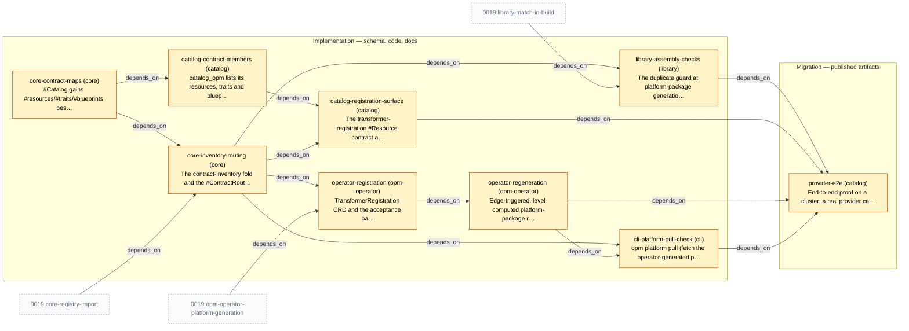

# Slice Plan — Catalog Contracts and Transformer Registration

<!-- Generated by `task plan:graph` — do not edit by hand. -->

| ID | Phase | Repo | Status | Depends on | Concern |
| -- | ----- | ---- | ------ | ---------- | ------- |
| core-contract-maps | implementation | core | planned | - | #Catalog gains #resources/#traits/#blueprints beside #transformers, each stamping modulePath and catalogVersion; SPEC.md §3.6 co-update under the core-schema-edit protocol.   |
| core-inventory-routing | implementation | core | planned | core-contract-maps, 0019:core-registry-import | The contract-inventory fold and the #ContractRouting assertion derived on #Platform beside #composedTransformers (unfulfilled/overSubscribed reports, D37's exactly-one kept); SPEC.md §3.4 and §4.1 co-updates.   |
| library-assembly-checks | implementation | library | planned | core-inventory-routing, 0019:library-match-in-build | The duplicate guard at platform-package generation (detection per OQ9's deferral), the unimplemented-vs-unknown missed-demand split, and the one-registration-per-module refusal.   |
| catalog-contract-members | implementation | catalog | planned | core-contract-maps | catalog_opm lists its resources, traits and blueprints in the new member maps; values already exist and are imported by the transformers that demand them.   |
| catalog-registration-surface | implementation | catalog | planned | catalog-contract-members, core-inventory-routing | The transformer-registration #Resource contract and its rendering transformer in catalog_opm: pre-bound spec derivation, stamped providerRef, instance-derived CR name.   |
| operator-registration | implementation | opm-operator | planned | core-inventory-routing, 0019:opm-operator-platform-generation | TransformerRegistration CRD and the acceptance battery (artifact gate, provides equality, build compatibility, already-provided), readiness exclusion, finalizer, Platform.status.registry.   |
| operator-regeneration | implementation | opm-operator | planned | operator-registration | Edge-triggered, level-computed platform-package regeneration from the (Platform spec, active claims) tuple, stamped with the generation-plus-active-claims identity.   |
| cli-platform-pull-check | implementation | cli | planned | core-inventory-routing, operator-regeneration | opm platform pull (fetch the operator-generated platform package as a build-local module) and opm platform check (unfulfilled and over-subscribed contract pre-flight).   |
| provider-e2e | migration | catalog | planned | library-assembly-checks, catalog-registration-surface, operator-regeneration, cli-platform-pull-check | End-to-end proof on a cluster: a real provider catalog and module ship the k8up path from 01-problem.md, including health-gated activation, a second registration refused at acceptance, and blocked deletion while instances depend on it.   |
