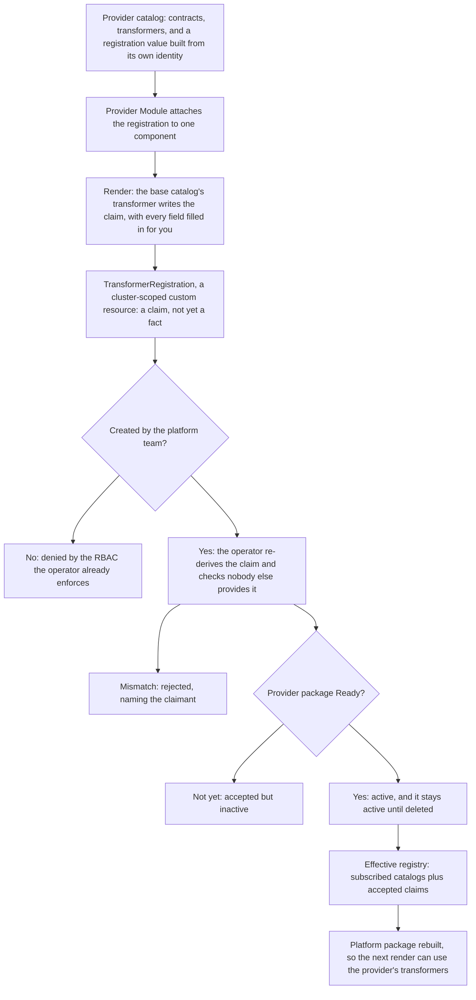

# Enhancement 0015: Catalog Contracts and Transformer Registration

A Catalog ships two things: contracts, the Resources, Traits and Blueprints a Module can use, and transformers, the code that builds Kubernetes objects from them. A Catalog can define a contract it does not implement, like backup. Today that gap is invisible until a render fails. This entry lists contracts in the Catalog, and installing a provider registers its transformers.

All entries: [INDEX.md](../INDEX.md). How this one relates to others: [GRAPH.md](../GRAPH.md). Metadata: [config.yaml](config.yaml).

## Summary

**Catalogs list their contracts (D1).** The Catalog definition gains resource, trait and blueprint maps beside its transformer map. A platform can then report the contracts nobody implements instead of failing on them (D18).

**One provider per contract (D2, D5).** Kept from entry 0010 (0010:D37). Provider classes were adopted on 2026-08-05 and rejected on 2026-08-20, ahead of any real two-engine need; the design waits in D2's alternatives. A second provider is refused by name, at platform assembly and again at acceptance. Two transformers for one catalog-implemented contract whose match rules overlap fail too (D5).

**A Module names a contract, never a provider.** Which provider fills it is the platform's choice, not the Module author's.

**Registration is a cluster-scoped custom resource (D3).** A provider Module ships one, and only the platform team can create it, through RBAC the operator already enforces. The catalog publishes the contract and its transformer, so Module authors write nothing new (D9).

**A claim is checked, then it sticks.** The operator checks that the named artifact is a catalog (D10), re-derives the provided set and refuses a mismatch (D11), refuses a duplicate under the instance-derived name (D12), refuses a contract another provider already covers (D2, D3), and refuses a provider whose core or catalog resolution the platform does not run (D8). It goes active once the provider is Ready and stays until deleted (D3). The registration cannot gate its own readiness (D14), a Module ships at most one (D15), and shrinking the provided set while dependents exist is refused like a deletion (D16). The operator keeps one generated platform package per Platform generation plus active-claim set (D13, D17). No transformer-predicate stability rule ships here: predicate widening on a routine catalog bump is the one silent case, deferred to the publish-gate family (D7).

**Contracts and transformers stay in one CUE module (D4).** A contract's full name contains its catalog path, so splitting later breaks identity again.

The entry is baselined on the archived render-pipeline entry 0019: a platform embeds each subscribed catalog whole (0019:D5), the operator generates the platform package each render consumes (0019:D6), the shared materialized platform is gone (0019:D8), matching runs inside the render build (0019:D10), and the platform holds no reverse index (0019:D17).

## How it works

Everything left of the registration object is ordinary rendering. That is what lets the existing RBAC be the gate. Everything right of it is one operator deciding whether to believe the claim, so a bad registration is rejected by name instead of breaking somebody else's render later. Activation waits for the provider to be Ready, so a transformer never registers before the CRDs it renders against exist. Reproducing a render later is a fetch of the generated platform package, never a write-back (D6, D13).

## Documents

1. [01-problem.md](01-problem.md): the three gaps, measured on 2026-08-05 and restated against 0019's single-build pipeline
1. [02-design.md](02-design.md): the contract maps, the one-provider rule and where it refuses, the registration resource, the packaging decision
1. [03-decisions.md](03-decisions.md): the decision log, D1 to D18
1. [04-graduation.md](04-graduation.md): what had to hold before draft became accepted
1. [05-risks.md](05-risks.md): risks, drawbacks, alternatives not taken
1. [06-operational.md](06-operational.md): rollout, versioning, rollback, cross-repo ordering
1. [07-questions.md](07-questions.md): the open-questions register, OQ1 to OQ12

Four directories carry the shapes and the evidence. [`schemas/`](schemas/) holds the core-schema delta with its examples and spec text. [`contracts/`](contracts/) holds the authoring shape as compilable CUE. [`experiments/`](experiments/) holds two runnable proofs that one backup contract renders through separate engines. [`research/`](research/) holds the backup-engine survey behind the contract's shape.

## Scope

### In scope

Eleven items, grouped by area.

**Contract inventory (D1)**

- The Catalog definition gains resource, trait and blueprint maps, each stamping the catalog's own path onto its members the way the transformer map already does (D1).
- The contract inventory built from them, a plain walk over the platform's embedded catalogs under 0019:D5, and the platform readiness answer it enables.
- The diagnostic telling a contract that is defined but unimplemented apart from an unknown key, which the inventory makes possible.

**Provider uniqueness and refusal (D2, D5)**

- Keeping 0010's exactly-one-provider rule, with better places to refuse: at platform assembly, naming both catalog paths, and at acceptance, naming the claimant (D2, as revised).
- D5's hard guard on overlapping match rules within one catalog-fulfilled group, run when the platform package is built. What counts as overlapping is left to the implementation.

**Registration and authoring (D3, D9 to D12)**

- A cluster-scoped registration resource with claim and accept, activation gated on health, and a deletion finalizer (D3).
- Its authoring shape (D9): a registration contract and rendering transformer in the first-party catalog, with the Module definition unchanged.
- Catalog-only claim coordinates, structural refusal of other artifact kinds, the rule that no code ever rides the object (D10), and the lockstep two-artifact provider release flow.
- Every field of the claim derived or stamped (D11): identity-package interpolation, the provided-set walk, the provider reference and the instance-derived name (D12), checked for exact equality at acceptance.

**What operators see**

- The platform's effective-registry status, and the identity of the platform package the operator rebuilds from it, whose record survived 0019 (D13, D17).
- The pre-flight `opm platform check` command that the inventory makes possible.

### Out of scope

Eight items:

- **Splitting contracts and transformers into separate CUE modules.** Decided against in D4, deliberately and now.
- **Transformers shipped inside module artifacts, or riding the registration object.** Decided against in D10; the additive generalization waits in its alternatives.
- **Provider routing of any kind, classes included.** Adopted on 2026-08-05 and rejected on 2026-08-20 (D2, as revised); the class design waits for a successor entry with a real two-engine case.
- **Refinement or override semantics in the matcher**, meaning a most-specific-rule-wins rule. D5's guard replaces it: overlapping rules refuse, never order.
- **Capability-based routing**, where a Module declares a recovery objective and the platform routes on it. The likely shape of the successor routing entry.
- **Contract promotion between catalogs**, from experimental to stable, and the coordinated rename it implies. Carried as an open question, likely its own entry.
- **What identity is, and how artifacts are published.** This entry adds members to the Catalog definition and reads keys entries 0010 and 0011 define.
- **Namespace-scoped registration.** Rejected in D3's alternatives; revisit only if a genuinely tenant-scoped transformer appears.

## Deviations from Design

None at this stage. Update when implementation lands.

## Cross-References

| Document | Purpose |
| -------- | ------- |
| `enhancements/0010/` | The key split, the one-provider rule kept here, and the owning-catalog limitation |
| `enhancements/0011/` | The publish-side gates a match-rule gate would extend |
| `enhancements/0019/` | The single-build render pipeline this entry is based on |
| `enhancements/0019/experiments/05-match-in-one-build/matchdef/match.cue` | The matcher's measured shape, to check D5's guard does not change it |
| `core/src/catalog.cue` | The single transformer map today, and the constraint D1 copies |
| `core/src/platform.cue` | Where the inventory walk and the routing assertion land |
| `core/SPEC.md` | The normative sections co-updated with the schema change |
| `library/opm/materialize/index.go` | The measured skip that made a contract-only catalog do nothing |
| `library/opm/compile/match.go` | The matcher as measured before 0019 moved it into the build |
| `library/opm/materialize/types.go` | Where the inventory would have landed before 0019 |
| `opm-operator/api/v1alpha1/platform_types.go` | Where the effective registry and readiness condition are added |
| `opm-operator/internal/platform/store.go` | The generated-module record, re-keyed on package identity |
| `opm-operator/internal/controller/platform_controller.go` | Where claim validation and acceptance run |
| `opm-operator/openspec/changes/archive/2026-04-20-default-sa-and-tenancy-guide/design.md` | The shipped per-tenant ServiceAccount model the RBAC gate rests on |
| `catalog_opm/opm/catalog.cue` | The first catalog to list its contracts, and the registration pair's home |
| `CONSTITUTION.md` (per target repo) | The principles governing changes in each repo touched |
