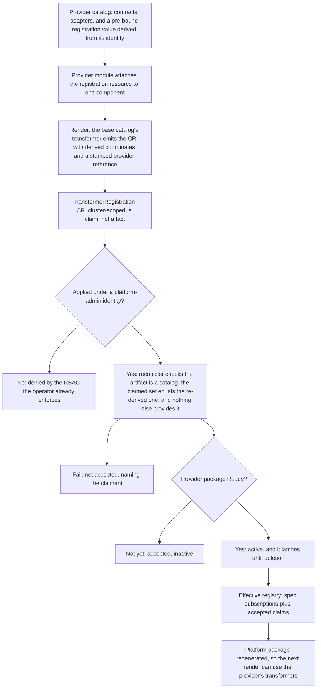

# Enhancement 0015: Catalog Contracts and Transformer Registration

An OPM catalog is a published bundle of two things: contracts, meaning the resources, traits and blueprints a module may declare, and transformers, the adapters that turn a declared contract into Kubernetes objects. A catalog may define a contract it deliberately does not implement, a backup for instance, leaving it to whichever provider a cluster installs. Today that contract is invisible in the published artifact, so a platform, the set of catalogs a cluster renders against, only learns nobody implements it when a module demands it and the render fails. This entry publishes a catalog's contracts as first-class members, and makes installing a provider and registering its transformers one act.

All entries: [INDEX.md](../INDEX.md). How this one relates to others: [GRAPH.md](../GRAPH.md). Metadata: [config.yaml](config.yaml).

## Summary

**A catalog publishes its contracts as members** (D1). The catalog definition gains resource, trait and blueprint maps beside its transformer map, each stamping the catalog's own path onto every member the way the transformer map already does. The gap was measured on 2026-08-05: a contract reaches a build only by being demanded by an adapter. Every derived value still folds over the transformer map alone, a fold being a value computed by walking a CUE map. Membership turns four derivations into lookups: the zero-provider case, a readiness answer needing no module in hand, the diagnostic separating defined-but-unimplemented from unknown, and a primitive's owning catalog. An unfulfilled contract is a report and never a refusal (D18). It surfaces as a non-gating condition on the platform and a warning from the pre-flight command, and only over-subscription refuses to generate the platform package.

**One provider per contract stands; provider classes are rejected here** (D2, as revised on 2026-08-20). The rule comes unamended from the archived identity entry 0010, where a provider-fulfilled contract was given at most one active provider (0010:D37). Provider classes were adopted on 2026-08-05 and rejected fifteen days later on cost and benefit, ahead of any real two-engine requirement; the design waits in D2's alternatives for a successor entry. What this entry keeps is the loud refusal: over-subscription reported at platform assembly naming both catalog paths, and a second registration refused at acceptance naming the claimant. A module never names a provider, it declares a contract and nothing else. D5 adds the sibling rule inside a catalog-fulfilled bucket, where two transformers with comparable predicates, one's required set a subset of the other's, refuse the platform rather than being arbitrated.

**A registration is a cluster-scoped custom resource, gated by RBAC the operator already enforces** (D3). A provider module ships it among its rendered resources, and only a module applied under a platform-team identity can create it, because the operator already impersonates a per-tenant ServiceAccount. Authoring it uses the platform's own machinery (D9): the first-party catalog publishes a registration resource contract plus the transformer that renders it, so the module definition gains no authored field and no second emission path. Every field of the claim is derived or stamped (D10 to D12). It names a published catalog artifact only, refused structurally otherwise, and carries no code and no author-trusted data. The catalog path, version and provided set derive from the provider catalog's identity package through the module's own dependency, while the provider reference and the dot-joined instance name are stamped at render. The one human decision left is the catalog version in the module's dependency file. Providers wanting a single repository publish catalog and module in lockstep, and module-hosted transformers wait in D10's alternatives as an additive generalization.

**Acceptance is a battery, and activation latches.** Before the Platform reconciler believes a claim it checks five things:

- the named artifact really is a catalog (D10);
- the claimed set exactly equals the reconciler's own re-derivation (D11);
- nothing else already provides those contracts (D2 and D3);
- no duplicate exists under the instance-derived name (D12);
- the provider's committed catalog resolution is one the platform runs, refused at admission rather than at an unrelated render (D8).

A claim activates once the provider's package is Ready and then stays active until deletion (D3). The registration is excluded by kind from that package's readiness, so it cannot gate itself (D14). A module ships at most one (D15), and shrinking the provided set while dependents exist is refused exactly like a deletion (D16). Regeneration of the platform package every render consumes is edge-triggered and level-computed from current state. It is keyed by the Platform generation plus the sorted active-claim set (D13), and the operator holds one generated package per that identity (D17). Reproducing a cluster's render is a fetch of that package rather than a write-back (D6). No transformer-predicate stability rule ships here: predicate widening on a routine catalog bump is the one silent case, explicitly not guaranteed against and deferred to the publish-gate family (D7).

**Contracts and adapters stay in one CUE module** (D4), recorded as a decision rather than left undecided, because a contract's fully-qualified name embeds its declaring catalog's path. Splitting now rides 0010's existing identity break nearly free, while splitting later costs a break of its own. With contract maps in place a single catalog can already say it defines these and implements only some of them, which is what the split was wanted for.

The entry is baselined on the archived render-pipeline entry 0019. That entry made a platform embed each subscribed catalog whole (0019:D5) and made the operator generate the platform package each render consumes (0019:D6). It also deleted the shared materialized platform (0019:D8), moved matching into the render build (0019:D10), and removed the reverse index from the platform (0019:D17).

## How it works

Everything left of the custom resource is ordinary rendering, which is what lets the RBAC gate be the one that already exists. Everything right of it is one reconciler deciding whether to believe the claim, which is why a bad registration is refused by name instead of failing later inside somebody else's render. Activation waits for the provider's package to be Ready, so a transformer never registers ahead of the CRDs it renders against, and then latches so a restart does not deactivate it. The effective registry is what the regenerated platform package is built from, which is how an accepted claim reaches the next render.

## Documents

1. [01-problem.md](01-problem.md): the three gaps, measured on 2026-08-05 and restated against 0019's single-build pipeline
1. [02-design.md](02-design.md): the contract member maps, the one-provider rule and its refusal sites, the registration resource, the packaging decision
1. [03-decisions.md](03-decisions.md): the decision log, D1 to D18
1. [04-graduation.md](04-graduation.md): what had to hold before draft became accepted
1. [05-risks.md](05-risks.md): risks, drawbacks, alternatives not taken
1. [06-operational.md](06-operational.md): rollout, versioning, rollback, cross-repo ordering
1. [07-questions.md](07-questions.md): the open-questions register, OQ1 to OQ12

Four directories carry the shapes and the evidence. [`schemas/`](schemas/) holds the core-schema delta with its examples and spec text, and [`contracts/`](contracts/) holds the authoring surface as compilable CUE. [`experiments/`](experiments/) holds two runnable proofs that one backup contract renders through separate engines, and [`research/`](research/) holds the backup-engine survey behind the contract's shape.

## Scope

### In scope

Eleven items, grouped by surface.

**Contract inventory (D1)**

- The catalog definition gains resource, trait and blueprint maps with the same provenance-stamping pattern constraint (D1).
- The contract inventory derived from them, a pure fold over the platform's embedded catalogs under 0019:D5, and the platform readiness answer it enables.
- The missed-demand diagnostic separating a contract defined but unimplemented from an unknown key, closable once the inventory exists.

**Provider uniqueness and refusal (D2, D5)**

- Keeping 0010's exactly-one-provider rule with better refusal sites: over-subscription reported at platform assembly naming both paths, and refused at acceptance naming the claimant (D2, as revised).
- D5's hard guard on comparable predicates within one catalog-fulfilled bucket, running at platform-package generation, with the operational definition of comparable deferred to the implementation slice.

**Registration and authoring (D3, D9 to D12)**

- A cluster-scoped registration resource with claim and accept, health-gated activation, and a deletion finalizer (D3).
- Its authoring surface (D9): a registration contract and rendering transformer in the first-party catalog, with the module definition unchanged.
- Catalog-only claim coordinates, structural refusal of other artifact kinds, the rule that no code ever rides the object (D10), and the lockstep two-artifact provider release flow.
- Full derivation and stamping of the claim (D11): identity-package interpolation, the provided-set fold, the provider reference and the instance-derived name (D12), verified for exact equality at acceptance.

**Operational surfacing**

- The platform's effective-registry status, and the identity of the platform package the operator regenerates from it, whose record survived 0019 (D13, D17).
- The pre-flight `opm platform check` command that the inventory makes possible.

### Out of scope

Eight items:

- **Splitting contracts and adapters into separate CUE modules.** Decided against in D4, deliberately and now.
- **Transformers shipped inside module artifacts, or riding the registration object.** Decided against in D10; the additive generalization waits in its alternatives.
- **Provider routing of any kind, classes included.** Adopted on 2026-08-05 and rejected on 2026-08-20 (D2, as revised); the class design waits for a successor entry with a real two-engine instance.
- **Refinement or override semantics in the matcher**, meaning a most-specific-predicate-wins rule. D5's guard replaces it: comparable predicates refuse, never order.
- **Capability-based routing**, where a module declares a recovery objective and the platform routes on it. The likely shape of the successor routing entry.
- **Contract promotion between catalogs**, from experimental to stable, and the coordinated rename it implies. Carried as an open question, likely its own entry.
- **What identity is, and how artifacts are published.** This entry adds members to the catalog definition and reads keys entries 0010 and 0011 define.
- **Namespace-scoped registration.** Rejected in D3's alternatives; revisit only if a genuinely tenant-scoped adapter appears.

## Deviations from Design

None at this stage. Update when implementation lands.

## Cross-References

| Document | Purpose |
| -------- | ------- |
| `enhancements/0010/` | The key split, the one-provider rule kept here, and the owning-catalog limitation |
| `enhancements/0011/` | The publish-side gates a predicate gate would extend |
| `enhancements/0019/` | The single-build render pipeline this entry is baselined on |
| `enhancements/0019/experiments/05-match-in-one-build/matchdef/match.cue` | The matcher's measured shape, to check D5's guard does not change it |
| `core/src/catalog.cue` | The single transformer map today, and the constraint D1 replicates |
| `core/src/platform.cue` | Where the inventory fold and the routing assertion land |
| `core/SPEC.md` | The normative sections co-updated with the schema change |
| `library/opm/materialize/index.go` | The measured skip that made a contract-only catalog a no-op |
| `library/opm/compile/match.go` | The matcher as measured before 0019 moved it into the build |
| `library/opm/materialize/types.go` | Where the inventory would have landed before 0019 |
| `opm-operator/api/v1alpha1/platform_types.go` | Where the effective registry and readiness condition are added |
| `opm-operator/internal/platform/store.go` | The generated-module record, re-keyed on package identity |
| `opm-operator/internal/controller/platform_controller.go` | Where claim validation and acceptance run |
| `opm-operator/openspec/changes/archive/2026-04-20-default-sa-and-tenancy-guide/design.md` | The shipped per-tenant ServiceAccount model the RBAC gate rests on |
| `catalog_opm/opm/catalog.cue` | The first catalog to list its contracts, and the registration pair's home |
| `CONSTITUTION.md` (per target repo) | The principles governing changes in each repo touched |
