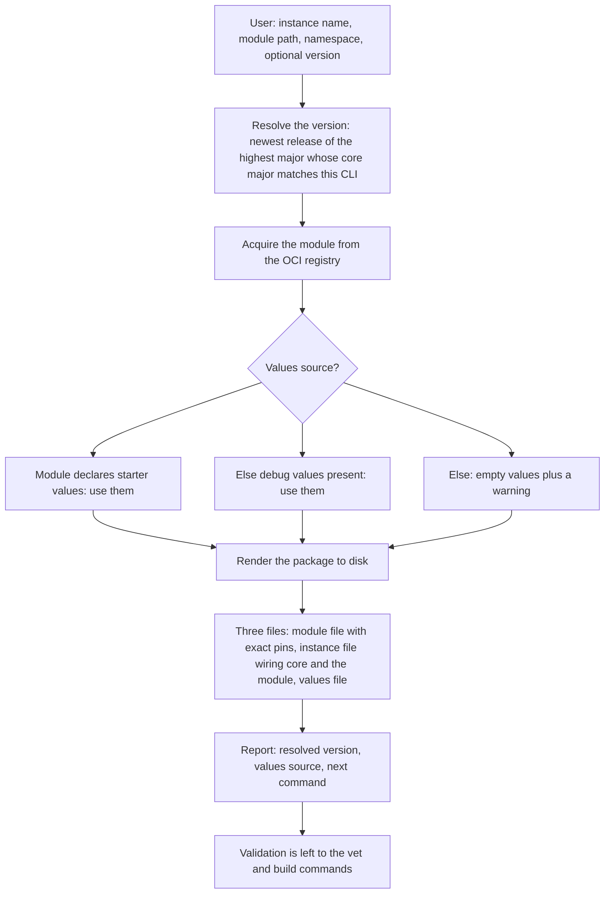

# Enhancement 0016: Initialize a Module Instance Package from a Published Module

Deploying a published OPM module means writing a small CUE package by hand: a module file carrying the right dependency pins, an instance file wiring the module to OPM's core, and a values file. Nothing generates that package today, so deployers copy an example and edit imports and pins until validation stops complaining. This entry adds a command that takes an instance name, a module path and a namespace, fetches the published module from its registry, and writes all three files complete. The result builds before anyone edits it.

All entries: [INDEX.md](../INDEX.md). How this one relates to others: [GRAPH.md](../GRAPH.md). Metadata: [config.yaml](config.yaml).

## Summary

**The command.** `opm instance init` acquires the named module through the existing registry path and writes a standalone three-file package that the existing load path already accepts (D1). The acquired artifact is the module being deployed, never a template, so every pin, import and wiring line is derived from what the module itself declares.

**Version selection mirrors the author-side scaffolder** (D5). The module path is given without a major, and `--version` either floats within a major or pins an exact release. When it is omitted, the command walks majors from highest to lowest and takes the newest release in each. It selects the first major whose declared core dependency matches the core major this CLI build is bound to. The report names the selection and every higher major it skipped, with the reason. A failed run leaves no partial directory, so a retry is never refused by the command's own leftovers.

**The values file comes from the author when the author said so.** The core module definition gains one additive optional field carrying the values a freshly initialized package starts from (D3). It is declared open and optional, with no schema-side assertion that it satisfies the module's config (D4). The command prefers that field, falls back to the module's existing debug values (D2), and otherwise writes an empty values block with a warning (D6), always naming the source it used. Because the field is unasserted, how it renders depends on how the author wrote it. A defaulted field renders as its default, an undefaulted disjunction renders as the choice, and an optional field is omitted.

**What the command does not do.** It does not validate what it wrote (D8). The report ends by naming the vet command, so a non-conforming starting value surfaces at the user's first vet or build. The renderer lives in the CLI beside the author-side scaffolder, and the kernel library ships nothing (D7). The generated module file pins the deployed module to its exact resolved version and takes core at the major the module itself depends on (D9). It carries a complete dependency closure so the package builds offline, and gives the package a local, never-published path.

## How it works

Two choices carry the design and everything else follows. The first is which version to deploy, answered without asking the user, by preferring the newest module line this CLI can actually build. The second is what the values file starts as, answered by a fixed three-step ladder whose result is named in the output, so a scaffold built from debug values is visibly that. Everything downstream is derivation from the acquired artifact rather than typing, which is why the package builds immediately.

## Documents

1. [01-problem.md](01-problem.md): no path from a published module to a runnable instance package, and no home for the author's answer to what a new deployment starts as
1. [02-design.md](02-design.md): resolve and acquire the module, pick a values source, render the standalone three-file package
1. [03-decisions.md](03-decisions.md): the decision log, D1 to D9
1. [04-graduation.md](04-graduation.md): what must hold before draft becomes accepted
1. [05-risks.md](05-risks.md): risks, drawbacks, alternatives not taken
1. [06-operational.md](06-operational.md): observability, versioning, deprecation, rollback, cross-repo coordination
1. [07-questions.md](07-questions.md): the open-questions register, OQ1 to OQ6, all resolved

Three directories carry the shapes and the evidence. [`schemas/target.cue`](schemas/target.cue) holds the core delta, the new optional field beside the existing debug values. [`contracts/contracts.cue`](contracts/contracts.cue) holds the request shape, the values-source ladder, the generated file set and the report. [`experiments/`](experiments/) holds eight runnable proofs, from cross-major enumeration to what a non-concrete starting value renders as.

## Scope

### In scope

**Command.**

- `opm instance init [instance-name] [module-path] --namespace <ns> [--version] [--dir] [--module-path]`, a mirror of the author-side scaffolder. It resolves through standard registry routing, acquires through the existing kernel path, and writes a standalone three-file instance package (D1, D5).
- Version selection: `--version vN` floats within a major and an exact version pins; omitted, it is the newest release of the highest major whose core dependency matches this CLI's core major (D5).

**Values.**

- The precedence ladder: the author's starter values, then the module's debug values, then an empty block with a warning (D2, D3, D6), with the source named in the output.

**Schema.**

- One additive optional field on the core module definition carrying the author-intended starting values (D3, D4), landed under the core schema-edit protocol.

**Generated output.**

- A module file with the module pinned exactly, core at the module's major, a complete dependency closure and a local placeholder path (D9).
- Output that loads through the existing instance load path unchanged, so it is immediately valid input to build, apply and the operator's package path.
- The renderer lives in the CLI beside the author-side scaffolder; the kernel library ships nothing (D7).

### Out of scope

**Not this command's job.**

- Deploying or applying anything. The command writes local files; existing build and apply commands execute them.
- The author-side module scaffolder, which is untouched.
- Operator and module-fleet changes. The operator consumes instance packages through existing paths, and authors adopt the new field at their own pace.

**Deferred to a different entry or command.**

- Exporting a deployed instance to files. That is entry [0014](../0014/), from cluster to git; this entry goes from registry to disk.
- A publish-time check that the starting values satisfy the module's config. If wanted, it is [0011](../archive/0011/)'s decision.
- Validating the generated package at init time. The report names the vet command; running it is the user's next step (D8).

**Unaffected.**

- The contract of the existing debug values, which stays the testing fixture; this entry only additionally reads it as a fallback.
- Anything outside the core v2 line. Older module majors appear here only as lines the version walk skips.

**Candidate follow-ons, not part of this design.**

- Interactive values collection, a skeleton derived from the config schema, registry search, and version-bump ergonomics for existing packages.

## Relationship to adjacent enhancements

- [0002](../archive/0002/) renamed the Release family to Instance vocabulary; this entry is written entirely in that vocabulary.
- [0014](../0014/) covers the opposite direction of the same lifecycle, turning a deployed instance into committable files. Both share the generated-not-hand-assembled stance.
- [0011](../archive/0011/) owns publish-time gates and the author-side scaffolder this command mirrors, so a publish-time conformance check on the new field would land there.
- [0019](../archive/0019/) is the kernel render path the generated package is handed to, and this entry lands after it. The command's contract does not change with 0019, but the user's next command does, so the ordering constraint lives in `06-operational.md`. Three of its decisions bear on the output:
  - Catalog version skew between a module and its platform becomes a kernel-detected signal that warns and renders by default (0019:D7 and 0019:D18). That is the failure experiment 03 met as unresolved demands against a platform on a different catalog pin.
  - The render step becomes one CUE build whose module file is derived by promotion from the inputs (0019:D9 and 0019:D13), the same derivation this entry's D9 performs.
  - The platform reshape (0019:D5 and 0019:D6) defines what the vet and build commands evaluate against.

## Deviations from Design

None at this stage. Update this section when implementation lands and any deliberate divergences from the design need to be documented.

## Cross-References

| Document | Purpose |
| -------- | ------- |
| `core/src/module.cue` | Where the new optional field sits, beside the debug values |
| `core/SPEC.md` | The specification section co-updated with the new field |
| `cli/internal/cmd/instance/instance.go` | The command group the new subcommand joins |
| `cli/internal/cmd/module/init.go` | The sibling command whose surface this one mirrors |
| `cli/internal/scaffold/ref.go` | The reference grammar and version resolution reused |
| `library/opm/materialize/enumerate.go` | Evidence that a major-free path enumerates every published major |
| `library/opm/schema/loader.go` | Where the core major a CLI build is bound to is defined |
| `library/opm/helper/synth/instance.go` | In-memory synthesis, whose debug-values refusal stands unchanged |
| `library/opm/helper/loader/file/instance_test.go` | The load behaviour the generated package must satisfy |
| `modules/cert_manager/module.cue` | The real config and debug-values pair used as the worked example |
| `opm-kind-demo/web_app/instance.cue` | The hand-written package this command generates the equivalent of |
