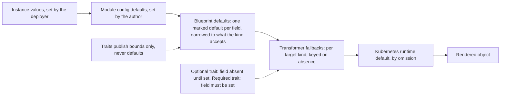

# 0017: Layered Defaults

A field on a component can take its value from four places: the values a deployer supplies, the module author's config schema, the blueprint that composes the component, and the transformer that renders it. None of the four can reliably hold a default today, and two defaults that meet cancel into an unresolved choice. Authors work around that by restating Kubernetes' own defaults by hand. This entry gives each layer exactly one defaulting role, and a fixed precedence that falls out of ordinary CUE unification rather than a new language feature.

All entries: [INDEX.md](../INDEX.md). How this one relates to others: [GRAPH.md](../GRAPH.md). Metadata: [config.yaml](config.yaml).

## Summary

**Each of the four layers fails differently today.** Trait schemas, which publish what a capability accepts without knowing which Kubernetes kind will carry it, are kind-agnostic and so cannot default. Blueprints force every composed field present. A module's config defaults annihilate against any second default they meet. And a transformer's fallback is dead code, because the field it guards on is never absent.

**One role per layer.** Resource and trait schemas publish bounds and never mark a default (D2), a marked default being CUE's starred disjunct. The blueprint is the single catalog-side defaulting layer (D3). It may narrow a composed field to what its target kind accepts, and may mark at most one default per field, always on a leaf and never on a whole struct. The module author defaults in the config schema, and the kernel finalizes those defaults to concrete data before composition (D4), so they arrive as plain values rather than as choices. Transformers keep per-kind fallbacks keyed on absence, and those become reachable because core's component projection now honours a trait's optional posture (D5). An optional trait constrains a field without forcing it present, and a trait that states no posture fails loudly instead of being silently required.

**The precedence is composed, not declared** (D1). Instance values beat config defaults, which beat blueprint defaults, which beat transformer fallbacks. Three ordinary lattice facts produce that ordering: concrete data eliminates a marked disjunct, the finalize step turns config defaults into data before composition, and absence falls through to the transformer's guard. Accepted deliberately as part of D4: a config default becomes a commitment, so one that violates a downstream constraint errors loudly instead of being silently replaced by a surviving disjunct.

**The rules CUE cannot enforce are written down and cited** (D6). The who-writes-what contract is codified in the core specification as rules L1 to L6 that CLI gates can name. One of them is reworded from an author obligation into a kernel guarantee, because D4 makes the collision it warned about unrepresentable. Enforcement is split by layer: catalog publish gates for the primitive and blueprint rules, module vet gates for the config rule, and transformer review for the last.

**Plain CUE stays the floor** (D8). Every valid module and catalog package must still pass stock `cue vet`, and the kernel must never silently produce different values than plain CUE would. Two divergences are accepted and documented, and both are loud. The kernel resolves the config-versus-blueprint default collision that plain export reports as an incomplete value, and it rejects the eliminated-default substitution that plain CUE ships silently. A related cleanup has already landed: twelve unreferenced defaulting definitions left over from the retired trait-defaults idiom were deleted from the first-party catalog (D7).

## How it works

Read the chain left to right as a fall-through: each layer supplies a value only when everything to its left stayed silent. The last stop is Kubernetes' own default, reached by omitting the field entirely. The two dotted edges are the constraints that make the chain work. Traits contribute bounds and never a default, so they cannot collide with the blueprint. And a trait's posture decides whether its field is genuinely absent, which is what lets a transformer's absence-keyed fallback fire at all.

## Documents

1. [01-problem.md](01-problem.md): why no layer can default a component field today, and what that costs
1. [02-design.md](02-design.md): one defaulting role per layer, the precedence chain and its four mechanisms
1. [03-decisions.md](03-decisions.md): the decision log, D1 to D8
1. [04-graduation.md](04-graduation.md): what must hold before this entry moves from draft to accepted
1. [05-risks.md](05-risks.md): risks, drawbacks, alternatives not taken
1. [06-operational.md](06-operational.md): rollout, versioning, rollback, cross-repo ordering
1. [07-questions.md](07-questions.md): the open-questions register

Two directories carry compilable CUE: [`schemas/`](schemas/) holds the core-schema delta with its examples and spec text, and [`contracts/`](contracts/) holds the layer contract as citable rule data plus the catalog-side blueprint idiom it constrains.

## Scope

### In scope

**Contract.**

- The layer contract as core specification rules L1 to L6, including the reword of L5 from an author obligation into a kernel guarantee.

**Per-repo slices.**

- **core:** the optionality-aware component field projection (D5) and its regression fixtures.
- **library:** the kernel's finalize-before-fill of validated config on all three value paths (D4).
- **catalog_opm** on the v2 line: the blueprint narrowing and field-level-default idiom (D3) on the workload blueprints, blueprint-path transformer fixtures, and the retired defaulting definitions removed (D7, landed).
- **cli:** template cleanup and a template render smoke test.
- **modules** on the v2 staging line: deletion of the extracted boilerplate, verified by render diff.

### Out of scope

- The exhaustive per-kind field audit across all blueprints, tracked by catalog_opm issue 40. This entry establishes the mechanism.
- Engineering the CLI gates for L1 to L6, which is a later CLI slice; this entry defines the rules and their identifiers.
- Any change on a v1 line, meaning the core and catalog v1 branches and the v1 and legacy module fleets.
- In-language precedence through CUE's own layering feature, rejected for now in D4's alternatives.

## Deviations from Design

None at this stage. Update this section when implementation lands and any deliberate divergences from the design need to be documented.

## Cross-References

| Document | Purpose |
| -------- | ------- |
| `core/SPEC.md` | The layering contract and its rule identifiers, which landed ahead of this entry, plus the constraint sections the core slice updates |
| `core/src/component.cue` | The field projection D5 changes |
| `core/src/trait.cue` | The optional posture, the single-regular-field gate, and the guard that keeps the projection safe |
| `library/opm/kernel/process.go` | The instance build, where D4's finalize step lands between validation and fill |
| `library/opm/kernel/validate.go` | The layered-sources value path D4 also has to cover |
| `library/opm/kernel/synth.go` | The debug-values path, which fills at the same point |
| `catalog_opm/src/blueprints/v1beta1/stateless_workload.cue` | The first blueprint to carry D3's narrowing and default idiom |
| `catalog_opm/src/traits/v1beta1/update_strategy.cue` | The motivating trait, and the union that has to loosen |
| `catalog_opm/src/transformers/deployment_transformer.cue` | The absence-keyed fallbacks D5 makes reachable |
| `cli/templates/minimal/module.cue` | The template whose render failure motivated the entry |
| `research/cue/concepts/default-precedence.md` | Workspace research on CUE default semantics, the grounding for D1 and D4 |
| catalog_opm issue 40 | The per-kind narrowing audit that runs alongside this entry |
