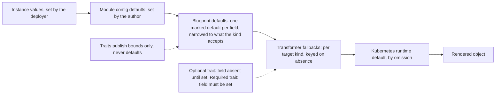

# 0017: Layered Defaults

A field on a component can get its value from four places: the deployer's values, the module author's config schema, the blueprint that composes the component, and the transformer that renders it. None of the four can hold a default reliably today, and two defaults that meet cancel out. This entry gives each layer exactly one job.

All entries: [INDEX.md](../INDEX.md). How this one relates to others: [GRAPH.md](../GRAPH.md). Metadata: [config.yaml](config.yaml).

## Summary

**Each layer fails differently today.** Trait schemas do not know which Kubernetes kind will carry a field, so they cannot default. Blueprints force every composed field present. Config defaults cancel against any second default. A transformer's fallback is dead code, because the field it guards is never absent.

**One job per layer.** Resource and trait schemas publish bounds and never mark a default (D2). The blueprint is the only catalog-side defaulting layer (D3): one marked default per field, always on a leaf. The author defaults in the config schema, and the kernel turns those into plain values before composition (D4). Transformers keep per-kind fallbacks keyed on absence, reachable now that core honours a trait being optional (D5).

**The order falls out of CUE, it is not declared (D1).** Instance values beat config defaults, which beat blueprint defaults, which beat transformer fallbacks. A config default is therefore a commitment: one that breaks a downstream constraint errors loudly.

**What CUE cannot enforce is written down (D6).** The core specification carries rules L1 to L6, enforced by catalog publish gates, module vet gates and transformer review.

**Plain CUE stays the floor (D8).** Every valid module and catalog must still pass stock `cue vet`, and the kernel must never quietly differ from it. Two divergences are accepted and both are loud. Twelve unused defaulting definitions were already deleted from the first-party catalog (D7).

## How it works

Read the chain left to right as a fall-through: each layer supplies a value only when everything to its left stayed silent. The last stop is Kubernetes' own default, reached by omitting the field entirely. The two dotted edges are the constraints that make the chain work. Traits contribute bounds and never a default, so they cannot collide with the blueprint. And a trait's posture decides whether its field is genuinely absent, which is what lets a transformer's absence-keyed fallback fire at all.

## Documents

1. [01-problem.md](01-problem.md): why no layer can default a component field today, and what that costs
1. [02-design.md](02-design.md): one defaulting role per layer, the precedence chain and its four mechanisms
1. [03-decisions.md](03-decisions.md): the decision log, D1 to D8
1. [04-graduation.md](04-graduation.md): what must hold before this entry moves from draft to accepted
1. [05-risks.md](05-risks.md): risks, drawbacks, alternatives not taken
1. [06-operational.md](06-operational.md): rollout, versioning, rollback, cross-repo ordering
1. [07-questions.md](07-questions.md): the open-questions register

Two directories carry compilable CUE: [`schemas/`](schemas/) holds the core-schema delta with its examples and spec text, and [`contracts/`](contracts/) holds the layer contract as citable rule data plus the catalog-side blueprint idiom it constrains.

## Scope

### In scope

**Contract.**

- The layer contract as core specification rules L1 to L6, including the reword of L5 from an author obligation into a kernel guarantee.

**Per-repo slices.**

- **core:** the optionality-aware component field view (D5) and its regression fixtures.
- **library:** the kernel's finalize-before-fill of validated config on all three value paths (D4).
- **catalog_opm** on the v2 line: the blueprint narrowing and field-level-default idiom (D3) on the workload blueprints, blueprint-path transformer fixtures, and the retired defaulting definitions removed (D7, landed).
- **cli:** template cleanup and a template render smoke test.
- **modules** on the v2 staging line: deletion of the extracted boilerplate, verified by render diff.

### Out of scope

- The exhaustive per-kind field audit across all blueprints, tracked by catalog_opm issue 40. This entry establishes the mechanism.
- Engineering the CLI gates for L1 to L6, which is a later CLI slice; this entry defines the rules and their identifiers.
- Any change on a v1 line, meaning the core and catalog v1 branches and the v1 and legacy module fleets.
- In-language precedence through CUE's own layering feature, rejected for now in D4's alternatives.

## Deviations from Design

None at this stage. Update this section when implementation lands and any deliberate divergences from the design need to be documented.

## Cross-References

| Document | Purpose |
| -------- | ------- |
| `core/SPEC.md` | The layering contract and its rule identifiers, which landed ahead of this entry, plus the constraint sections the core slice updates |
| `core/src/component.cue` | The field projection D5 changes |
| `core/src/trait.cue` | The optional posture, the single-regular-field gate, and the guard that keeps the projection safe |
| `library/opm/kernel/process.go` | The instance build, where D4's finalize step lands between validation and fill |
| `library/opm/kernel/validate.go` | The layered-sources value path D4 also has to cover |
| `library/opm/kernel/synth.go` | The debug-values path, which fills at the same point |
| `catalog_opm/src/blueprints/v1beta1/stateless_workload.cue` | The first blueprint to carry D3's narrowing and default idiom |
| `catalog_opm/src/traits/v1beta1/update_strategy.cue` | The motivating trait, and the union that has to loosen |
| `catalog_opm/src/transformers/deployment_transformer.cue` | The absence-keyed fallbacks D5 makes reachable |
| `cli/templates/minimal/module.cue` | The template whose render failure motivated the entry |
| `research/cue/concepts/default-precedence.md` | Workspace research on CUE default semantics, the grounding for D1 and D4 |
| catalog_opm issue 40 | The per-kind narrowing audit that runs alongside this entry |
