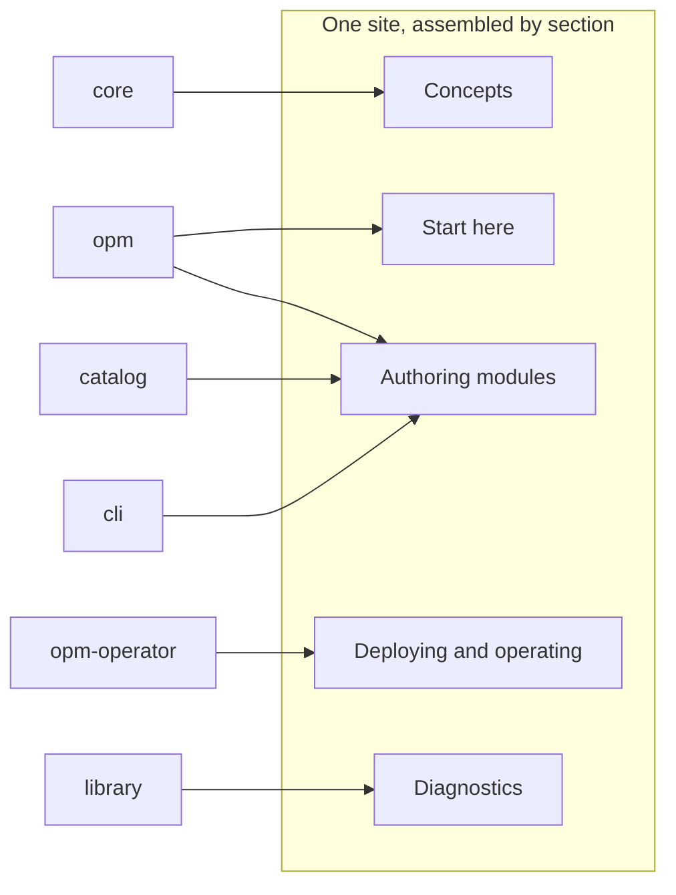

# Design: Documentation Architecture

Eight sections organised by what a reader is holding when they arrive, one declared type and a fixed shape for every page, each page written in the repository that owns what it describes, a hard split between generated facts and authored guidance, and an enforcement badge on every normative statement.

## Design Goals

**Navigation.**

- A reader with a specific artifact in hand (a blank file, a cluster, an error message, a field name) reaches the right page without knowing OPM's internal vocabulary first.
- Explanation is a first-class section rather than an appendix, in proportion to a concept surface that is unusually large relative to the user surface.

**Trustworthiness.**

- Every normative statement answers "what actually stops me" visibly, because OPM enforces across four layers and the gaps between them are where users get hurt.
- Reference content that can be derived from source is derived from source, so that a rename cannot silently invalidate it.
- The documentation states what OPM does today and is explicit about what it does not do, so that nine draft systems do not read as features.

**Family guidance.**

- The abstraction family is the documented default path; the raw passthrough family is reachable and clearly marked as the escape hatch.

## Non-Goals

- Publishing `core/SPEC.md`. It stays contributor-facing (D2).
- Documenting secrets. The current vocabulary has a known expiry and enhancement 0013 owns its replacement, including the documentation (D5).
- Documenting draft systems as features. Lifecycle hooks, workflows, provider classes, export, rollback, a handoff between the CLI and the operator and a model of the platform itself do not exist. An explanation page may describe future work only in a direction note that states its status (D3).
- A migration guide from the v0 line. The v0 fleet is frozen on its own branch and its consumers are internal.
- Site theming, search, or the choice of site generator. Presentation, not architecture.

## High-Level Approach

The organising question is what the reader has in their hands, not what type of page the content is. The type still governs how each page is written: every page is exactly one of the four Diátaxis types, tutorial, how-to guide, explanation or reference (D7). It does not govern the top-level navigation, because OPM's audiences are close to disjoint and a type-first split forces each of them to filter every section.

```
reader arrives with...            section                      page types in the initial inventory
------------------------------------------------------------------------------------------------
nothing, evaluating           1. Start here                tutorial, explanation, reference
a question about why          2. Concepts                  explanation
a blank module file           3. Authoring modules         tutorial, how-to
a cluster                     4. Deploying and operating   tutorial, how-to, explanation
a vocabulary gap              5. Extending OPM             how-to
a Go program                  6. Embedding the kernel      tutorial
a field name                  7. Reference                 reference, mostly generated
an error message              8. Diagnostics               how-to with a fixed shape, reference
```

Two of those placements are deliberate and worth stating.

**Diagnostics is top-level because it is an entry point.** A reader arrives from an error string pasted into a search box, not from navigation. Each entry is a how-to guide with a fixed shape (D9), because that reader is at work fixing something. The kernel's error taxonomy is unusually well structured and maps to genuinely different fixes: an unresolved demand, an unhandled trait, an identity mismatch and a materialize failure are four distinct problems that a reader cannot tell apart from the message text alone. This section also carries the "why does a render now fail that used to succeed" question, whose answer is that the render was under-delivering rather than succeeding.

**Concepts is large, and that is proportionate.** The `core` survey ranked seventeen concepts as subtle enough to need prose. The top four are the four version-shaped axes, `fqn == modulePath` for artifacts, `matchLabels` versus `metadata.labels`, and the component derivation rule. Each of these has a measured failure story behind it in `SPEC.md`'s Rationale, which is the raw material for these pages.

### Generated facts, authored guidance

The split is decided per field, not per page. A page may contain both, with the generated block clearly delimited.

```
GENERATED FROM SOURCE                      AUTHORED BY HAND
-------------------------------------      ---------------------------------------
name, apiVersion, fqn, modulePath          which blueprint to start from, and why
description (metadata.description)         which traits are legal on which blueprint
category label                             cross-member interactions
spec key and schema shape                  the matching story end to end
trait `optional` posture, `appliesTo`      family guidance (abstraction vs raw)
blueprint composed sets, matchLabels       every Concepts page
which transformers serve a member          every Diagnostics entry
worked examples (transformer golden tests)
CLI command reference (cobra)
```

Authored notes about a single member are written in that member's doc comment and rendered on its generated page. Guidance relating members, such as which blueprint to start from, lives in how-to guides and explanations, never repeated on every member entry (D10).

The precondition is smaller than it looks. `metadata.description` is populated on all 70 catalog members; the reason `src/INDEX.md` shows empty descriptions is that its generator is a text scraper reading CUE doc comments rather than an evaluator reading the field. Switching to evaluation yields 70 of 70 one-line descriptions at no authoring cost. Hand-written doc comments then carry only what a one-liner cannot: why `exactName` and `immutable` conflict, why `podMetadata` exists, what `clusterIP: "None"` means.

### Enforcement badges

Every normative statement in Reference and in Concepts carries a badge naming the layer that enforces it:

```
cue         CUE unification refuses it. Fails at `cue vet`, before any OPM tool runs.
kernel      The kernel refuses it at render. Fails at vet, build, plan, apply.
publish     A publish gate refuses it. Fails at `opm module|catalog publish`.
convention  Nothing checks it. Stated because a reader must know it anyway.
```

The badge vocabulary is defined in `contracts/contracts.cue` so that it is a closed set rather than prose. Its value is highest exactly where `SPEC.md` is wrong in both directions: the layering contract's rules are MUSTs with a `convention` badge, and the publish gates moved from unenforced to `publish` when the CLI slices merged.

### The abstraction family leads

Reference splits by family rather than presenting 38 resources as one list. The abstraction family (11 resources, 27 traits, 5 blueprints) gets full pages. The raw `k8s-*` family (27 resources) gets one index page plus a generated table, labelled as the escape hatch, each entry pointing at the abstraction that covers the same ground where one exists. Blueprints lead the authoring track, since a component cannot render without one answering its matching key.

The framing is a fact about the system rather than an editorial preference: no first-party module imports the raw family, and `task vet:layering` in `catalog_opm` fails the build if an abstraction member depends on one.

### Every page: one type, one owner, one shape

**The page contract (D7).** Every page declares a title, a one-line description and its type, and nothing else. Where the page sits decides its section and its address, so a page cannot claim a section it is not in. Each section's index page is generated from the descriptions, grouped as tutorials, how-to guides, explanations, then reference. KCP uses the same mechanism for its section indexes and writes none by hand.

**Placement (D8).** A page lives in the repository whose change would make it wrong, so the pull request that changes a behaviour can fix its page. Concepts is the exception: every Concepts page lives in `core`, next to the definitions it explains. Pages with no single owner live in `opm`. The site engine owns no content and assembles the site by section, so pages from several repositories sit side by side and the reader never sees where each came from. Every page is built and shown from the moment it exists, finished or not; the site itself is not published yet (OQ15).



The diagram shows a few of the edges, not all of them. The point it carries is that a section draws from several repositories, and a repository feeds several sections.

**Shapes (D9).** Each type carries fixed parts in a fixed order, listed in D9 and stated as data in `contracts/contracts.cue`. An explanation places its concept against Kubernetes inside the prose, where a comparison helps, because that is the reader this site is written for. Starting length targets keep pages comparable across repositories; they are a convention, not a gate:

| Type | Starting length target |
| --- | --- |
| Tutorial | 800 to 1500 words |
| Explanation | 600 to 1200 words |
| How-to guide | 300 to 800 words |
| Diagnostics entry | 200 to 500 words |
| Reference | As long as what it describes |

### Initial page inventory

This is the inventory the design is sized against. Every page in it exists as an outline in its owning repository, and the author fills them in one at a time. Once the section indexes are generated, they are the live list (D7). Pages are named by title here; their addresses come from where they sit (D7).

| Section | Page | Type | Owner |
| --- | --- | --- | --- |
| Start here | What OPM is | explanation | opm |
| Start here | OPM for Kubernetes users | reference | opm |
| Start here | Quickstart | tutorial | opm |
| Start here | What OPM does not do (D3) | reference | opm |
| Concepts | The application model and the platform model | explanation | core |
| Concepts | Modules and instances | explanation | core |
| Concepts | Components and blueprints | explanation | core |
| Concepts | Resources and traits | explanation | core |
| Concepts | How matching works | explanation | core |
| Concepts | Platforms and catalogs | explanation | core |
| Concepts | Versions in OPM | explanation | core |
| Concepts | Identity and names | explanation | core |
| Concepts | Who owns an instance | explanation | core |
| Concepts | What enforces a rule | explanation | core |
| Authoring modules | Your first module | tutorial | opm |
| Authoring modules | Choose a blueprint | how-to | catalog |
| Authoring modules | Attach a trait to a component | how-to | catalog |
| Authoring modules | Define a module's configuration | how-to | core |
| Authoring modules | Use a raw Kubernetes resource (D6) | how-to | catalog |
| Authoring modules | Publish a module | how-to | cli |
| Deploying and operating | Deploy a module with the CLI | tutorial | opm |
| Deploying and operating | Install the operator | how-to | opm-operator |
| Deploying and operating | Delete an instance safely (D4) | how-to | opm-operator |
| Deploying and operating | Deletion and pruning (D4) | explanation | opm-operator |
| Extending OPM | Write a trait | how-to | catalog |
| Extending OPM | Write a transformer | how-to | catalog |
| Extending OPM | Publish a catalog | how-to | cli |
| Embedding the kernel | Embed the kernel | tutorial | library |
| Reference | Schema definitions, one entry each | generated | core |
| Reference | Abstraction family members, one entry each (D6) | generated | catalog |
| Reference | Raw Kubernetes family, one index (D6) | generated | catalog |
| Reference | CLI commands, one entry each | generated | cli |
| Reference | Operator resources, one entry each | generated | opm-operator |
| Reference | Glossary | reference | opm |
| Reference | Registry namespaces | reference | cli |
| Reference | The catalog contract | reference | catalog |
| Diagnostics | Unresolved demands | how-to | library |
| Diagnostics | No matching transformer | how-to | library |
| Diagnostics | Over-subscribed provider contracts | how-to | library |
| Diagnostics | Identity mismatch | how-to | library |
| Diagnostics | Version skew | how-to | library |
| Diagnostics | Transform failed | how-to | library |
| Diagnostics | Publish refusals | how-to | cli |
| Diagnostics | Operator conditions | reference | opm-operator |

Three things tie the inventory to the system as it is. The top four of the seventeen concepts the `core` survey ranked as needing prose each get a page: the version axes, identity, the two label sets in how matching works, and how a component is derived in components and blueprints. The six kernel diagnostics entries match the six error types the kernel defines today in `library/opm/errors`. The operator reference covers its four resource kinds: ModuleInstance, ModulePackage, Platform and TransformerRegistration.

Existing prose is source material rather than a starting point from scratch:

- `cli/QUICKSTART.md` and `cli/README.md` feed the quickstart, the deploy tutorial and the page on who owns an instance.
- `library/docs/getting-started.md` becomes the embedding tutorial once its missing step is fixed.
- The catalog's authoring rules under `catalog_opm/docs/` feed the extending guides.
- The raw-versus-blueprint side-by-side in `opm/docs/legacy/concepts/resources-traits-blueprints.md` is the teaching device for the components and blueprints page.
- The two reference pages already on the site move to the repositories that own them: registry namespaces to `cli`, the catalog contract to `catalog`.

### Writing rules: voice from KCP, register from Diátaxis

Three layers, each with its own source and home:

1. **Markdown mechanics** stay in the workspace `STYLE.md`, for every Markdown file.
2. **The writing guide and the page templates** hold everything specific to the site, in `opm`. Drafts of the templates and of the docs skill are in [`drafts/`](drafts/).
3. **The voice document** from OQ7 comes later and refines the voice capture below.

**The audience (D11).** The reader runs Kubernetes and has never used OPM or CUE. Kubernetes terms are used without explanation. CUE and OPM terms are defined in the glossary and linked on first use.

**The voice, from KCP's Concepts pages.** [research/kcp-voice.md](research/kcp-voice.md) captures it: fifteen traits, measured and quoted, sorted into what OPM keeps, adapts and drops. In short, OPM keeps KCP's habit of making the product the subject and placing it against Kubernetes, its labelled analogies, its answers to the reader's next question, its statements of scope, and its candour about limits. It adapts KCP's conversational register, its opinions and its hedges. It drops KCP's promises, hype, Latin abbreviations, long sentences and uneven polish. KCP's Developers section is not the model:

| Measured on KCP | Concepts | Developers |
| --- | --- | --- |
| "you" per 1,000 words | 8.7 | 2.4 |
| "we" per 1,000 words | 4.1 | 8.0 |
| Median sentence length in words | 16 | 21 |
| Sentences over 30 words | 12% | 28% |

**The register, from Diátaxis.** The voice stays the same on every page; the register shifts with the type. A tutorial is warm and guiding. A how-to guide is brisk and imperative. An explanation is discursive and may hold an opinion. Reference is plain and neutral.

**Every rule names what checks it (D13).** The writing guide's rule table has a "checked by" column:

| Checker | Rules it holds | When it runs |
| --- | --- | --- |
| Site build | Every page declares a title, a one-line description and one type; defined terms are linked on first use | Every build |
| Prose linter | Promises outside a direction note, decision numbers, banned words; sentence length once OQ12 sets a ceiling | The owning repository's pull request |
| Walk script | A tutorial runs end to end | The owning repository's CI, once the tutorial exists |
| Review | Everything else: a direction note only on an explanation page, with a present-tense status and its enhancement linked; one path per tutorial, no teaching in a how-to guide, an explanation answers a why, the Kubernetes comparison is accurate, "we" only in tutorials, no opinion in reference | Pull request review |

The tooling stays deliberately small. A rule moves from review to a machine check only after review has caught the same problem twice. On 2026-09-25 this entry drafted a heavier design, a CUE rule register and a CUE vocabulary with generated word lists, and withdrew it the same day as more tooling than the problem needs (D12, D13).

## Schema / API Surface

`contracts/contracts.cue` states six shapes: the section taxonomy with its reader-state entry condition, the page contract every page declares and the order section indexes group pages in (D7), the parts each page type carries (D9), the enforcement badge vocabulary, the generated-versus-authored field classification for a reference entry, and the doc-comment obligation a catalog member must satisfy to pass the CI gate. The page contract is the specification the site build checks, not a requirement that the build run CUE. Stating them in CUE makes the taxonomy and the page contract testable before any page exists, and gives the site engine a contract to validate every repository's pages against.

## Integration Points

| Repo | What changes |
| --- | --- |
| `opmodel.dev` | The engine, holding no content: assembles every repository's published pages by section, validates them against the page contract, generates section indexes, links glossary terms on first use (D11), and provides the shared check each repository runs in its pull requests (D13, OQ10); the `docgen` generator (evaluate CUE rather than scrape comments, emit enforcement badges, split reference by family); the broken `generate:cli` step |
| `catalog` | Doc-comment backfill on blueprints, abstraction resources and traits; a CI gate refusing a new member without one; the pages it owns under D8: choosing a blueprint, attaching traits, the raw-family escape hatch, the extending guides, the catalog contract |
| `core` | Doc-comment backfill on the roughly 35 definitions that have no `SPEC.md` section, `types.cue` foremost; every Concepts page and the configuration guide |
| `cli` | Command help text aligned with the generated reference; the publishing guides, the registry namespaces page and the publish-refusal diagnostics entry; `cli/docs/STYLE.md` amended (it cites commands that no longer exist and links the glossary by a workspace-relative path its own sibling rule forbids) |
| `library` | `docs/getting-started.md`, which omits the mandatory Materialize step and therefore cannot be followed to working code, rewritten as the embedding tutorial; every kernel diagnostics entry |
| `opm-operator` | Installing the operator, deleting an instance safely, the deletion and pruning explanation (D4), its resource reference and its status conditions |
| `opm` | The authored prose with no code owner: the home page, Start here, cross-repo tutorials, the boundaries page, the glossary, and the writing guide with one page template per type. Its stale v0 tree is rewritten in place, not retired; the surviving-content rule is OQ4 |

## Before / After

**Before.** A reader searching for OPM documentation finds `opm/docs`, follows a getting-started that describes a schema line retired in April, copies examples that do not compile, and hits an error the documentation does not mention. The material that would have helped exists in a CLI README, a contributor specification and seventeen embedded transformer tests.

**After.** The same reader lands on a site whose first section takes them to a rendering module. When their next component fails, the error string leads to a page naming the cause and the fix. When they ask why a component needs a blueprint, an explanation page answers with the measured reason. When they look up a trait, the entry states its spec, its posture, which transformers consume it and what enforces each claim. When they wonder whether OPM runs lifecycle hooks, a page says plainly that it does not.
