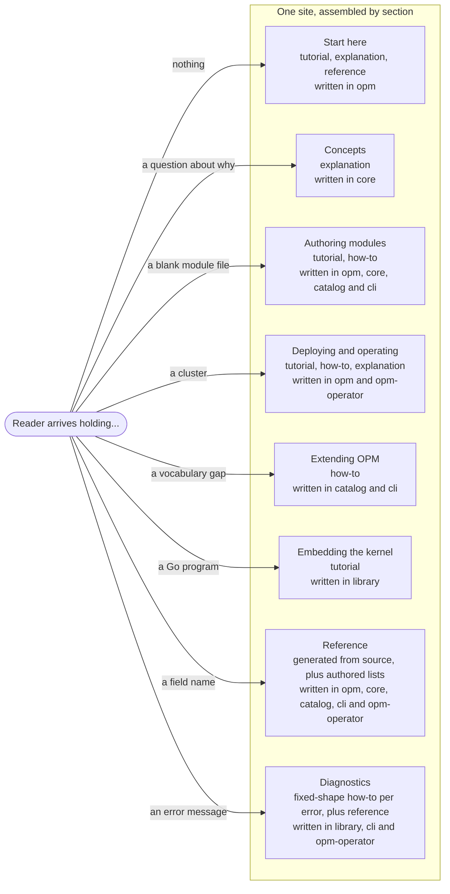

# Enhancement 0018: Documentation Architecture

OPM has no usable public documentation, and not for want of writing. The biggest body of prose describes a version of OPM that no longer exists. What is current sits where nobody looks: a command-line readme, a contributor spec, and examples buried in catalog code. This entry says what the docs are and what keeps them from drifting again.

All entries: [INDEX.md](../INDEX.md). How this one relates to others: [GRAPH.md](../GRAPH.md). Metadata: [config.yaml](config.yaml).

## Summary

**Eight sections, keyed to what a reader arrives holding:** nothing, a question about why, a blank module file, a cluster, a vocabulary gap, a Go program, a field name, an error message. OPM's audiences barely overlap, so a genre-first split would make each of them filter every section.

**Two placements are deliberate.** Diagnostics is top-level because readers arrive from an error string, not from the menu, and the kernel's error kinds map to different fixes the message text does not tell apart. Concepts is large because OPM has far more concepts than commands: seventeen were ranked subtle enough that a reader gets them wrong without prose.

**Every page is one of four types, written where the thing it describes lives (D7 to D10).** A page is a tutorial, a how-to guide, an explanation or reference, and each type has fixed parts in a fixed order. A page's source sits in the repository whose change would make it wrong, except that every concept page lives in `core`; prose with no single owner lives in `opm`. The site puts pages together by section, so the reader never sees which repository a page came from.

**Voice from KCP, page rules from Diátaxis, and every rule says what checks it (D11, D13).** Pages assume the reader runs Kubernetes and knows nothing about CUE or OPM. The voice is KCP's, captured in [research/kcp-voice.md](research/kcp-voice.md) with what OPM keeps, adapts and drops. Each writing rule names what enforces it, and the few machine checks run in the pull request of the repository that owns the page.

**Generate every fact a rename can break; write everything else by hand (D1).** Member names, keys, spec shapes, trait settings and worked examples come from evaluating the CUE, never from scraping text. Today's scraper reports an empty description for exactly the members readers need most. Which blueprint to start from, which traits are legal on it, and every Concepts page are written by hand. A gate refuses a new catalog member that ships without a doc comment.

**Reference splits the catalog in two (D6).** The abstraction family gets full per-member pages and leads every authoring path. The raw passthrough family gets one index page and a generated table, labelled as the last resort, each entry pointing at the abstraction that covers the same ground where one exists.

**Every normative statement says what enforces it:** CUE unification, the kernel at render, a publish gate, or nothing but convention. A reader otherwise cannot tell which claims actually bite.

**Three scoping decisions.** The contributor specification is not published (D2): the public reference takes its definitions, shapes and constraints and drops the rationale, which is mined for Concepts pages instead. A page lists what OPM does not have, and draft enhancements are never called forthcoming (D3). Today's deletion and prune behaviour, prune defaulting to false, a CLI-owned instance carrying no hold, and two diverged deletion paths, is documented now, independent of entry 0012 (D4); secrets wait for entry 0013 (D5).

## How it works

The reader picks a section by what they arrive holding, so each branch is a top-level section, not a type of page. Inside a section, every page is one of four types, tutorial, how-to guide, explanation or reference, and each type has a fixed shape. Each page is written in the repository whose change would make it wrong, and the site assembles pages by section, so the reader never sees which repository a page came from. Reference is generated from source wherever a rename could break it; everything else is written by hand.

## Documents

1. [01-problem.md](01-problem.md): documentation exists and describes a version of OPM that has not existed for months, and coverage is inverted against usage
1. [02-design.md](02-design.md): eight reader-state sections, one type and one shape per page, placement by owning repository, the initial page inventory, the writing rules and what checks them, generated facts versus authored guidance, enforcement badges
1. [03-decisions.md](03-decisions.md): the decision log, D1 to D13
1. [04-graduation.md](04-graduation.md): what must hold before this entry moves from draft to accepted
1. [05-risks.md](05-risks.md): risks, drawbacks, alternatives not taken
1. [06-operational.md](06-operational.md): rollout, versioning, rollback, and the cross-repo landing order with the reasons for it
1. [07-questions.md](07-questions.md): the open-questions register

Compilable CUE lives in [`contracts/contracts.cue`](contracts/contracts.cue), which states the section taxonomy, the page contract, the parts of each page type, the badge vocabulary, the per-field provenance of a reference entry, and the doc-comment obligation as shapes rather than prose. [`drafts/`](drafts/) holds first drafts of the page templates and the docs skill, which move to `opm` when implemented. The evidence behind the page decisions, a survey of the KCP docs and the Diátaxis and Write the Docs guidance, is in [`research/findings.md`](research/findings.md). Landings across the five repos are logged in `delivery.yaml` as they happen.

## Scope

### In scope

**Architecture.**

- The section taxonomy: eight top-level sections keyed to reader state, and what each one owns.
- The page contract: one declared type, a title and a one-line description per page, with generated section indexes.
- Placement by owning repository, assembly by section, and a fixed shape for each page type.
- The initial page inventory the design is sized against.
- The audience, the voice and register rules, and a named checker for every writing rule.
- The generated-versus-authored split, per field, and the generator changes it requires: evaluate CUE rather than scrape text, and fix the CLI generation step that fails on a clean tree.
- The enforcement badge vocabulary and its application to normative statements.

**New pages.**

- Concepts pages for the concepts ranked highest for reader harm, mined from the contributor specification's rationale and rewritten.
- A Diagnostics section mapping kernel errors to causes and fixes.
- A boundaries page stating what OPM does not do.
- A page documenting the current deletion and prune behaviour, including the orphaning defaults.

**Source repairs.**

- Doc-comment backfill in the first-party catalog and in core, plus a CI gate that keeps coverage from regressing.
- Splitting catalog reference by family, with the abstraction family as the documented default path.
- Rewriting the embedder's getting-started guide so that following it produces working code.

### Out of scope

**Deferred to another entry or open question.**

- **Secrets documentation.** Entry 0013 owns the model and its documentation. This entry leaves the gap visible and linked.
- **Versioned documentation.** Whether the site carries a v1 line alongside v2 is an open question, deferred while the v1 line has only internal consumers.
- **Retiring the meta repo's docs tree.** The tree is rewritten in place as the home of prose with no code owner; what may survive the rewrite is an open question.

**Explicit non-goals.**

- **Publishing the contributor specification.** It stays contributor-facing, and the public reference takes its normative content and leaves the rest.
- **Documenting draft systems.** Lifecycle, workflows, provider classes, export and rollback do not exist, and D3 makes their absence explicit rather than describing them as forthcoming.
- **Site presentation.** The site generator, theme, search and styling. The site is built with Astro and Starlight; how it looks is not this entry's to decide.
- **A migration guide off the retired line.** That fleet is frozen on its own branch with internal consumers only.

## Deviations from Design

None at this stage. Update when implementation lands.

## Cross-References

| Document | Purpose |
| -------- | ------- |
| `core/SPEC.md` | The normative schema contract: its definition, shape and constraint spine is the reference's source, and its rationale is the raw material for Concepts |
| `core/src/types.cue` | The identity type system, the densest doc-worthy file in the workspace and the one with no specification section |
| `catalog_opm/src/` | Catalog members and the transformers' embedded golden tests, the source of the generated reference and its examples |
| `library/opm/errors/` | The error taxonomy the Diagnostics section is keyed to |
| `library/docs/getting-started.md` | The embedder guide, currently missing a mandatory step and therefore not runnable as written |
| `cli/README.md`, `cli/QUICKSTART.md` | Current, well-written user prose, and the only written account of owner semantics and handoff |
| `cli/docs/STYLE.md` | The prose conventions to inherit, and the amendments they need because they cite commands that no longer exist |
| `opmodel.dev/site/content/reference/` | The two hand-written pages that already landed, and the shape the rest follows |
| `opmodel.dev/cmd/docgen/` | The generator this entry repairs and extends |
| `opm/docs/` | The stale tree this entry replaces: salvage its formats, not its content |
