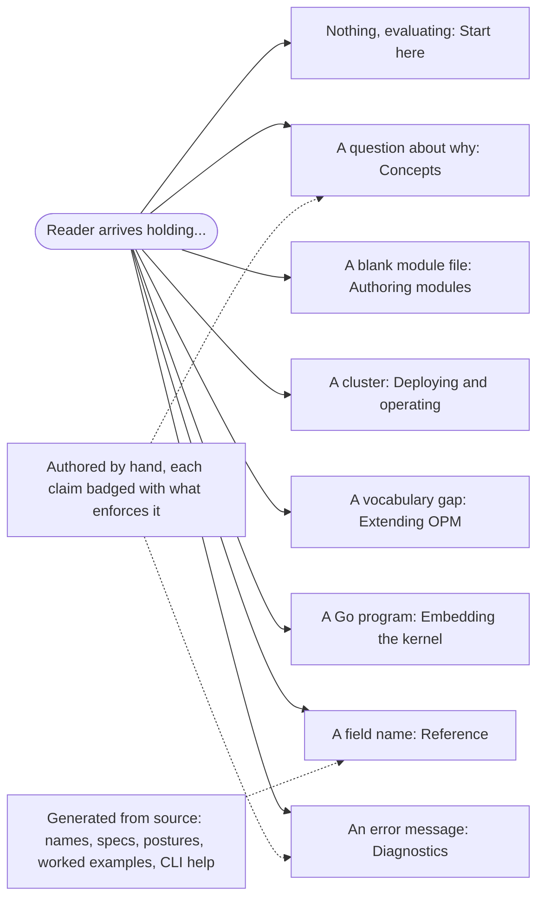

# Enhancement 0018: Documentation Architecture

OPM has no usable public documentation, and not for want of writing. The largest body of prose in the workspace describes a version of OPM that no longer exists, and still names an artifact that was renamed long ago. The material that is current sits where no reader looks: a command-line readme, a contributor specification, and worked examples buried inside catalog code. This entry defines what the documentation is, where each page's content comes from, and what keeps it from drifting again.

All entries: [INDEX.md](../INDEX.md). How this one relates to others: [GRAPH.md](../GRAPH.md). Metadata: [config.yaml](config.yaml).

## Summary

**Eight sections, keyed to what a reader is holding on arrival:** nothing, a question about why, a blank module file, a cluster, a vocabulary gap, a Go program, a field name, an error message. Genre still governs how a page is written, but not the navigation. OPM's audiences are close to disjoint, and a genre-first split makes every one of them filter every section.

**Two placements are deliberate.** Diagnostics is top-level because it is an entry point: readers arrive from an error string rather than from the navigation. The kernel's error taxonomy also maps to genuinely different fixes that the message text does not distinguish. Concepts is large in proportion to a concept surface that is unusually big next to the user surface, with seventeen concepts ranked subtle enough that a reader gets them actively wrong without prose.

**One rule decides where content comes from: generate every fact a rename can invalidate, author everything else** (D1). Member names, keys, spec shapes, trait postures, the transformers that serve a member and their worked examples are emitted by evaluating the CUE source, never by scraping text. That matters because the current text scraper reports an empty description for exactly the members readers need most. Which blueprint to start from, which traits are legal on it, and every Concepts page are written by hand, because none of it is expressible in the schema. A gate refuses a new catalog member that ships without a doc comment.

**Reference splits the catalog by family** (D6). The abstraction family, whose members hide Kubernetes detail, gets full per-member pages and leads every authoring path with blueprints first. The raw passthrough family gets one index page and a generated table, labelled as the last resort, with each entry pointing at the abstraction that covers the same ground where one exists.

**Every normative statement carries an enforcement badge** naming what actually stops you: CUE unification, the kernel at render, a publish gate, or nothing but convention. That convention exists because OPM enforces across four layers and a reader cannot otherwise tell which claim is load-bearing.

**Three scoping decisions keep the documentation honest.** The contributor specification is not published (D2): the public reference takes its definition, shape and constraint content as a source and drops the rationale. That rationale is instead mined for Concepts pages and rewritten. A page enumerates what OPM does not have, and draft enhancements are never described as forthcoming features (D3). Another page documents today's deletion and prune behaviour: prune defaults to false so the finalizer's default is to orphan, a CLI-owned instance carries no hold at all, and the two deletion paths have diverged. That page lands now, independent of entry 0012 (D4), and secrets material waits entirely for entry 0013, whose own documentation slice writes it (D5).

## How it works

The branches out of the reader are the navigation, and each one is a top-level section rather than a genre. The two dotted edges are the sourcing rule. Reference is generated by evaluating the source, so a rename cannot silently invalidate it, while Concepts and Diagnostics are written by hand and badge each normative claim. Diagnostics hangs off the reader like any other section because that is how it is reached, from a search box.

## Documents

1. [01-problem.md](01-problem.md): documentation exists and describes a version of OPM that has not existed for months, and coverage is inverted against usage
1. [02-design.md](02-design.md): eight reader-state sections, generated facts versus authored guidance, enforcement badges
1. [03-decisions.md](03-decisions.md): the decision log, D1 to D6
1. [04-graduation.md](04-graduation.md): what must hold before this entry moves from draft to accepted
1. [05-risks.md](05-risks.md): risks, drawbacks, alternatives not taken
1. [06-operational.md](06-operational.md): rollout, versioning, rollback, and the cross-repo landing order with the reasons for it
1. [07-questions.md](07-questions.md): the open-questions register

Compilable CUE lives in [`contracts/contracts.cue`](contracts/contracts.cue), which states the section taxonomy, the badge vocabulary, the per-field provenance of a reference entry, and the doc-comment obligation as shapes rather than prose. Landings across the five repos are logged in `delivery.yaml` as they happen.

## Scope

### In scope

**Architecture.**

- The section taxonomy: eight top-level sections keyed to reader state, and what each one owns.
- The generated-versus-authored split, per field, and the generator changes it requires: evaluate CUE rather than scrape text, and fix the CLI generation step that fails on a clean tree.
- The enforcement badge vocabulary and its application to normative statements.

**New pages.**

- Concepts pages for the concepts ranked highest for reader harm, mined from the contributor specification's rationale and rewritten.
- A Diagnostics section mapping kernel errors to causes and fixes.
- A boundaries page stating what OPM does not do.
- A page documenting the current deletion and prune behaviour, including the orphaning defaults.

**Source repairs.**

- Doc-comment backfill in the first-party catalog and in core, plus a CI gate that keeps coverage from regressing.
- Splitting catalog reference by family, with the abstraction family as the documented default path.
- Rewriting the embedder's getting-started guide so that following it produces working code.

### Out of scope

**Deferred to another entry or open question.**

- **Secrets documentation.** Entry 0013 owns the model and its documentation. This entry leaves the gap visible and linked.
- **Versioned documentation.** Whether the site carries a v1 line alongside v2 is an open question, deferred while the v1 line has only internal consumers.
- **Retiring the meta repo's docs tree.** That repo is not a member of the area vocabulary and cannot own a slice; its retirement path is an open question.

**Explicit non-goals.**

- **Publishing the contributor specification.** It stays contributor-facing, and the public reference is a projection of its normative spine.
- **Documenting draft systems.** Lifecycle, workflows, provider classes, export and rollback do not exist, and D3 makes their absence explicit rather than describing them as forthcoming.
- **Site presentation.** The theme, search and styling. The theme is currently disabled and no section renders to HTML, which blocks verification but is not this entry's to fix.
- **A migration guide off the retired line.** That fleet is frozen on its own branch with internal consumers only.

## Deviations from Design

None at this stage. Update when implementation lands.

## Cross-References

| Document | Purpose |
| -------- | ------- |
| `core/SPEC.md` | The normative schema contract: its definition, shape and constraint spine is the reference's source, and its rationale is the raw material for Concepts |
| `core/src/types.cue` | The identity type system, the densest doc-worthy file in the workspace and the one with no specification section |
| `catalog_opm/src/` | Catalog members and the transformers' embedded golden tests, the source of the generated reference and its examples |
| `library/opm/errors/` | The error taxonomy the Diagnostics section is keyed to |
| `library/docs/getting-started.md` | The embedder guide, currently missing a mandatory step and therefore not runnable as written |
| `cli/README.md`, `cli/QUICKSTART.md` | Current, well-written user prose, and the only written account of owner semantics and handoff |
| `cli/docs/STYLE.md` | The prose conventions to inherit, and the amendments they need because they cite commands that no longer exist |
| `opmodel.dev/site/content/reference/` | The two hand-written pages that already landed, and the shape the rest follows |
| `opmodel.dev/cmd/docgen/` | The generator this entry repairs and extends |
| `opm/docs/` | The stale tree this entry replaces: salvage its formats, not its content |
