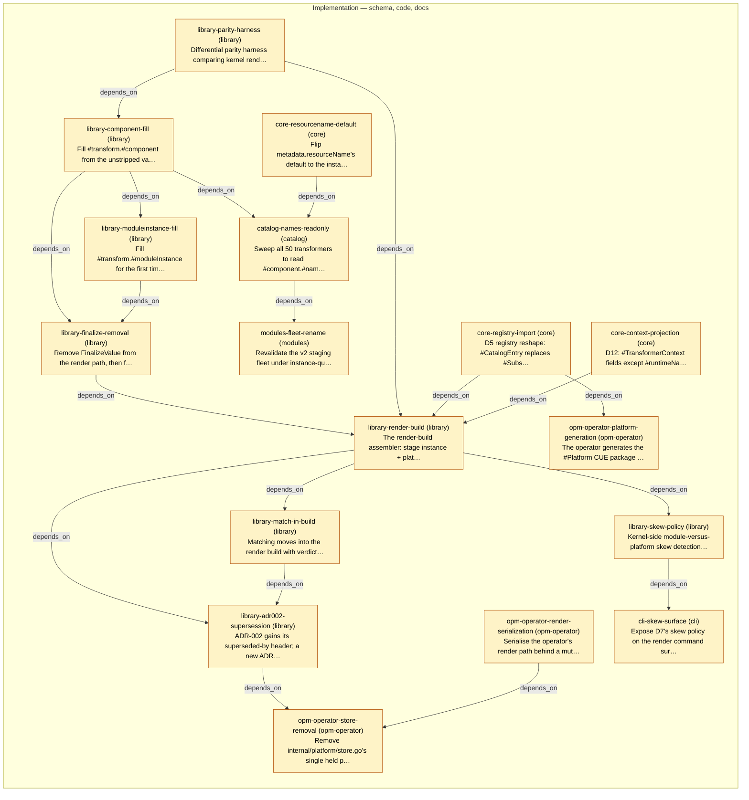

# Slice Plan — Kernel render path parity with pure CUE

<!-- Generated by `task plan:graph` — do not edit by hand. -->

| ID | Phase | Repo | Status | Depends on | Concern |
| -- | ----- | ---- | ------ | ---------- | ------- |
| library-parity-harness | implementation | library | planned | - | Differential parity harness comparing kernel render output against pure-CUE unification of the same three inputs; lands first, its first failure on the definition strip is D1's evidence.   |
| library-component-fill | implementation | library | planned | library-parity-harness | Fill #transform.#component from the unstripped value and repair TestFlow_WebApp_OnOpmPlatform's severed instance construction in the same slice; sweep cli and opm-operator for the same construction shape.   |
| library-moduleinstance-fill | implementation | library | planned | library-component-fill | Fill #transform.#moduleInstance for the first time, with plain-read and self-referential tests; closes open-platform-model/library#65.   |
| library-finalize-removal | implementation | library | planned | library-component-fill, library-moduleinstance-fill | Remove FinalizeValue from the render path, then from the public kernel surface (MAJOR, MIGRATIONS.md entry), shipping the OQ14 env-ordering migration note with it.   |
| core-resourcename-default | implementation | core | planned | - | Flip metadata.resourceName's default to the instance-qualified form with a hidden assertion for a legible overlong refusal; SPEC.md co-update under core-schema-edit. Output-neutral for rendered fleets; lands before the sweep.   |
| catalog-names-readonly | implementation | catalog | planned | library-component-fill, core-resourcename-default | Sweep all 50 transformers to read #component.#names for the primary object name under D15's carve-outs; delete #ResourceNameTrait and #WorkloadName; bump the core dep. Gate: byte-identical goldens. Absorbs catalog_opm#44 and core#49.   |
| modules-fleet-rename | implementation | modules | planned | catalog-names-readonly | Revalidate the v2 staging fleet under instance-qualified naming: set explicit metadata.resourceName where a name is an external contract, drop the deleted trait, record residual renames. Alpha stance: no deprecation cycle.   |
| opm-operator-render-serialization | implementation | opm-operator | planned | - | Serialise the operator's render path behind a mutex until the D8 slice lands: the shared-platform model races under concurrent render, and the measured 2.5x-5.5x throughput cost is the accepted interim price.   |
| core-registry-import | implementation | core | planned | - | D5 registry reshape: #CatalogEntry replaces #Subscription with {enable, #catalog}; version and #transformers derived, key bound to modulePath; #composedTransformers derived, #matchers removed (D17); SPEC.md co-update.   |
| core-context-projection | implementation | core | planned | - | D12: #TransformerContext fields except #runtimeName become projections of the other two inputs; SPEC.md co-update under core-schema-edit. Staged behind the parity harness; kernel then fills #runtimeName alone, context.go mirror deleted.   |
| library-render-build | implementation | library | planned | library-finalize-removal, library-parity-harness, core-registry-import, core-context-projection | The render-build assembler: stage instance + platform into a generated render module under D13's promotion invariant, build once, read rendered and diagnostics; parity-harness-proven before the old path is deleted.   |
| library-match-in-build | implementation | library | planned | library-render-build | Matching moves into the render build with verdicts as data per experiment 05's glue; gated on reproducing the kernel's exact pair set; deletes excludeProvenance and the D30 denylist; owns the reverse index now that core carries none (D17).   |
| library-skew-policy | implementation | library | planned | library-render-build | Kernel-side module-versus-platform skew detection with caller-supplied response (warn-and-render or refuse), returned as structured diagnostics, never library-emitted output.   |
| library-adr002-supersession | implementation | library | planned | library-render-build, library-match-in-build | ADR-002 gains its superseded-by header; a new ADR records the shares-nothing rule and the cue.Context lifetime rule; opm/materialize shrinks or is deleted, its composed map replaced by the platform's own imports.   |
| opm-operator-store-removal | implementation | opm-operator | planned | library-adr002-supersession, opm-operator-render-serialization | Remove internal/platform/store.go's single held platform slot and the render serialisation stopgap; renders become self-contained shares-nothing units sized by memory.   |
| opm-operator-platform-generation | implementation | opm-operator | planned | core-registry-import | The operator generates the #Platform CUE package its CR describes (typed fields stay on the CR), with a named extension point where enhancement 0015's effective transformer set folds in.   |
| cli-skew-surface | implementation | cli | planned | library-skew-policy | Expose D7's skew policy on the render command surface; cli and the operator may default opposite ways over one kernel implementation.   |
