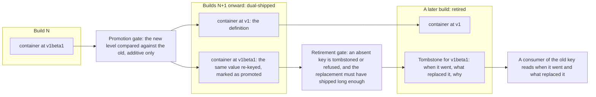

# Enhancement 0020: Contract Promotion and Retirement

A contract is what a catalog offers consumers to build on: the schema of a resource, a trait or a blueprint. Every contract is keyed by an API level, from `v1alpha1` up to `v1`, and a module matches on that exact key. Moving a contract from beta to stable therefore changes the key every consumer depends on, and removing one leaves a hole with no explanation. OPM has the ladder of levels but no rule for movement along it. This entry supplies the two missing rules, promotion and retirement, which turn out to be one mechanism seen from two ends.

All entries: [INDEX.md](../INDEX.md). How this one relates to others: [GRAPH.md](../GRAPH.md). Metadata: [config.yaml](config.yaml).

## Summary

**A contract is promoted by dual-shipping, and the promotion is declared (D1, D4).** One catalog build, meaning one published version of a catalog, carries both levels: the new level holds the definition and the old level is defined as the new one. Both keys stay matchable, so consumers move when they choose rather than on one coordinated cutover. Coexistence is not new. Entry 0010, the artifact-identity reshape, already permits two levels in one build for a break (0010:D27, additive-only inside a level) and files them separately (0010:D49). What is new is that the compatible case uses the same permission. The promoted member records the level it came from, permanently, so the artifact states its own lineage.

**A promotion is checked against the level it came from (D2, D3).** This closes a hole rather than adding a rule. The publish gate, the comparison a catalog passes on its way to the registry, finds a predecessor by name plus API level (0011:D9, publish refuses a build that breaks a contract it already published). A member at a brand-new level finds no predecessor and passes trivially. Measured against the shipped gate, a catalog may today publish a stable `container` that drops a field its beta predecessor had, and be told it succeeded. A build may promote a contract or change its shape, never both.

**A key that stops shipping leaves a tombstone (D6 to D9).** A tombstone is a published record saying that a key is gone, when it went and what replaced it. Entry 0011, the publishing pipeline, records that nothing refuses the removal of a beta or stable member (0011:OQ10). A publish gate cannot know who consumes a catalog, so removal is not blocked, only declared: a key is present, tombstoned, or refused. The record is cumulative across builds, sits on the catalog beside its contract members (0015:D1, a catalog publishes its contracts as members), and carries a required reason plus an optional replacement.

**A key cannot be withdrawn faster than its replacement has been available (D10).** This clock points at the producer. Entry 0010 rejected Kubernetes-style deprecation windows as arbitrary, since a platform moves only when someone edits a version in its own source (0010:D34, levels follow the Kubernetes alpha, beta and stable ladder). That argument is about rules forcing consumers to move, and nothing here expires a module, a pin or a subscription. Only the producer is constrained, and only on how fast it may withdraw a key after offering the successor.

**The tombstone's replacement field is the supersession edge the promotion needs**, which is why this is one entry and not two: promotion emits the record retirement consumes.

## How it works

Read it left to right as the life of one key. The promotion gate compares the new level against the old one, exactly as the existing gate compares two builds within a level, and refuses a promotion that breaks its origin. Both keys then ship from one build and every module keeps matching. The retirement gate later demands that the absent key be declared, and holds the withdrawal until the replacement has been published long enough.

## Documents

1. [01-problem.md](01-problem.md): the four gaps, measured 2026-08-22 against `catalog_opm/src`, `core/src/catalog.cue` and the matcher
1. [02-design.md](02-design.md): dual-shipping, the declared promotion, the tombstone, and the distinction entry 0010 did not draw
1. [03-decisions.md](03-decisions.md): the decision log, D1 to D12
1. [04-graduation.md](04-graduation.md): what must hold before `draft` becomes `accepted`
1. [05-risks.md](05-risks.md): risks, drawbacks, alternatives not taken
1. [06-operational.md](06-operational.md): rollout, versioning, rollback, cross-repo ordering
1. [07-questions.md](07-questions.md): the open-questions register, OQ1 to OQ8

Compilable CUE lives in [`schemas/`](schemas/): the core delta, example instances whose unification is the test, and the specification delta. [`experiments/`](experiments/) holds the cross-level promotion measurement, a graduation gate rather than an optional check.

## Scope

### In scope

**Promotion (D1 to D5).**

- A promotion field on resource, trait and blueprint metadata, naming the level promoted from (D1).
- The cross-level comparison at publish, closing the trivially-passes hole (D2).
- One intent per build: promote a contract or change its shape, never both (D3).
- Dual-shipping, with the outgoing level aliased to the incoming one (D4).
- Skipping a level: permitted, and discouraged in documentation rather than in a check (D5).

**Retirement (D6 to D11).**

- A tombstone definition, required when a published beta or stable member stops shipping (D6).
- The cumulative, append-only tombstone record (D7), kept on the catalog (D8).
- A required reason and an optional replacement (D9).
- The seasoning floor: how long a replacement must have been published first (D10). Its unit and value stay open questions.
- The alpha and transformer carve-outs, inherited from 0010:D34 and 0010:D44 (D11).

**Enforcement.**

- Promotion and tombstone gates in `core`, written as schema and checked by CUE, as 0011:D21 and 0011:D22 do.

### Out of scope

**Rejected by a prior decision.**

- A consumer-facing support window, rejected by 0010:D34. That rejection stands; D10 constrains the producer instead.
- Forcing any consumer to migrate, at any point, by any mechanism.

**Owned by another entry.**

- A read-side compatibility check. The settled posture is publish-side plus the match step, with a check command as an aid (0010:D35).
- Contract enumeration, owned by 0015:D1, and needed here only for the consumer-readable inventory of OQ8.
- Cross-catalog relocation (0015:OQ5). Catalog consolidation shrank this entry's case to a level bump inside one catalog (0010:D47, 0010:D49).

**Deferred within this entry.**

- Blocking a withdrawal that would strand live instances (D12). That needs cluster-side knowledge of dependents, so it belongs to the operator, beside 0015:D3 and 0015:D16.
- A matcher-following supersession edge, held in reserve by D4 rather than rejected. The tombstone records the edge as data, so adopting it later is additive.

## Deviations from Design

None at this stage. Update when implementation lands.

## Cross-References

| Document | Purpose |
| -------- | ------- |
| [0010](../archive/0010/) | The identity reshape this entry extends: contracts keyed by API version (D4), additive-only inside a level (D27), the ladder and the rejected deprecation window (D34), publish-side enforcement (D35), transformers without an API version (D44), catalog consolidation and version-segment filing (D47, D49) |
| [0011](../archive/0011/) | The publishing pipeline these gates join: the compatibility gate (D9), predecessor selection by backward scan (D23), immutable published artifacts (D10), gates written as schema (D21, D22), and the open removal question this entry closes (OQ10) |
| [0015](../0015/) | Catalog contract members (D1), the prerequisite for iterating contracts; the removal-with-dependents refusal (D16), whose cluster-side half this entry defers; the deferred aliasing question (OQ5) |
| `core/SPEC.md` §2.1, §2.2, §3.3, §5.2, §5.3 | The sections the delta in [`schemas/spec.md`](schemas/spec.md) changes |
| `core/openspec/config.yaml` | The constitution governing `core` schema changes |
