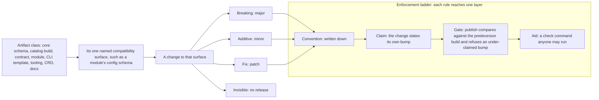

# Enhancement 0021: OPM Versioning Policy

OPM publishes many versioned artifacts: the core schema, catalogs and the contracts inside them, modules, the kernel library, the CLI and the operator. Each carries a SemVer, but only one of them has a written rule for what a version promises. Everything else runs on convention that nobody checks. This entry writes the policy down for all of them.

All entries: [INDEX.md](../INDEX.md). How this one relates to others: [GRAPH.md](../GRAPH.md). Metadata: [config.yaml](config.yaml).

## Summary

**One policy, nine artifact classes, one file each (D1, D4).** An artifact class is one kind of thing a consumer can pin, such as a module or a catalog build. The rules are collected into [`policy/`](policy/), one file per class plus an index for the rules that apply to every class. Rules already settled elsewhere are copied verbatim under a line naming their source (D3): the contract ladder and its additive-only promise (0010:D27, 0010:D34), authored versions (0011:D15), the commit-type tables of `core` and `catalog_opm`, and the tag scheme.

**A module's version is bound to its config schema (D2).** That schema is already OpenAPIv3-shaped, so two releases compare mechanically. Accepting fewer values is a major, more is a minor, the same is a patch. Whether rendered output's stateful identity is a second surface is OQ1.

**The tooling releases as one train, if OQ14 holds.** That means the kernel library, the CLI and the operator on one version number instead of three. They have only each other as consumers, so one number removes the kernel's external Go API contract and CLI-to-operator skew (OQ15).

**Enforcement is layered, and each rule names its layer.** Convention states the rule in writing. A claim is a change stating its own bump. A gate refuses an under-claimed bump at publish. An aid is a check anyone may run. Catalogs reach all four; modules reach the first two plus a gate that compares nothing; core and the Go artifacts reach the first two only. The module gate is scaffolded as design intent with its questions attached (OQ5, OQ6), not decided.

**Two rulings the policy adds rather than collects (D5, D6).** Alpha promises nothing: an author who breaks an alpha contract is encouraged, not required, to bump its alpha number rather than reshape the key in place, and that reaches the convention layer only. A transformer serving several levels of a resource declares one registration per level, sharing one transform body.

## How it works

Every class runs the same path. It names one compatibility surface, meaning the thing a consumer is allowed to rely on, and a change to that surface is classified once into a bump. The bump rule is ordinary SemVer stated once, so what differs between classes is only what the surface is. The last step is how far a rule reaches: written convention, a self-stated claim, a publish gate, or an optional check command.

## Documents

1. [01-problem.md](01-problem.md): what each artifact class promises today, measured per repo, and the four gaps between them
1. [02-design.md](02-design.md): the policy as a matrix of classes against questions, plus the enforcement ladder
1. [03-decisions.md](03-decisions.md): the decision log, D1 to D6
1. [04-graduation.md](04-graduation.md): what must hold before `draft` becomes `accepted`
1. [05-risks.md](05-risks.md): risks, drawbacks, alternatives not taken
1. [06-operational.md](06-operational.md): rollout, versioning, rollback, cross-repo ordering
1. [07-questions.md](07-questions.md): the open-questions register, OQ1 to OQ17

[`policy/`](policy/) holds the policy text itself, one file per class plus the index of universal rules. Compilable CUE lives in [`contracts/`](contracts/): the artifact-class taxonomy and the policy matrix as data, so a per-class rule that is missing or contradictory fails `cue vet` rather than a reader. [`experiments/`](experiments/) holds the two measurements behind the design, on the policy as CUE and on a configuration compatibility gate.

## Scope

### In scope

**The nine artifact classes (D4).** Each states the same five things: what carries its version, what its compatibility surface is, which change moves which number, what pre-stable means for it, and which enforcement layer its rules reach.

| Class | What carries its version |
| ----- | ------------------------ |
| Core schema | the CUE module's SemVer |
| Catalog build | the CUE module's SemVer |
| Catalog contract | the API level on the contract's own key |
| Transformer | its catalog build's version |
| Module | the CUE module's SemVer |
| CLI template | the CUE module's SemVer |
| Tooling train: kernel library, CLI, operator | Go module SemVer, one version or three (OQ14) |
| CRDs | the Kubernetes group and version |
| Documentation | the tooling train's version (OQ15) |

**The rest of the boundary.**

- Verbatim carriage of every already-settled versioning rule, under its source (D3).
- The tooling train as one release (OQ14), what replaces the kernel's record of breaking changes under it (OQ16), and documentation versioned against it (OQ15).
- The universal rules that hold across classes: SemVer, authored versions, a major as an import rewrite, the enforcement rule, the deprecation rule.
- The module compatibility surface (D2) and the questions that complete it (OQ1 to OQ4).
- The compatibility gate as a pattern, generalized from the catalog gate to any class whose surface is mechanically comparable, scaffolded with its open questions (OQ5, OQ6, OQ8 to OQ10).
- Where the policy is published, so a third-party author can read it.

### Out of scope

- Not a change to any version format, release tool or tag scheme already in use: SemVer 2.0, release-please, the `-alpha.N` release lines, the `-0.dev.` branch tags and the `<kind>/<apiVersion>/` filing all stay as they are.
- Not a consumer-facing support window. Entry 0010 rejected one (0010:D34) and entry 0020 constrains the producer instead (0020:D10, a key may not be withdrawn until its replacement has seasoned); both stand.
- Not a maturity ladder for modules, unless OQ2 decides one.
- Not the promotion and retirement mechanics of catalog contracts. Entry 0020 owns them and is cited, not copied, while it is a draft.
- Not the `testing.opmodel.dev` fixture fleets, the CLI's importable Go packages, or the operator install manifest as classes of their own (D4).
- Not the version-set and publish command surfaces. Entry 0011 owns them, and this entry only adds refusals they may raise.

## Deviations from Design

None at this stage.

## Cross-References

| Document | Purpose |
| -------- | ------- |
| `core/docs/publishing.md` | The tag scheme and the branch-build ranking rule this policy inherits |
| Enhancement 0010 (D4, D27, D34, D35, D41, D45) | Contract keys (D4), additive-only levels (D27), the ladder (D34), publish-side enforcement (D35), instance identity surviving a major (D41, D45) |
| Enhancement 0011 (D9, D15, D23) | The catalog compatibility gate (D9), authored not predicted versions (D15), predecessor selection by backward scan (D23) |
| Enhancement 0020 | Contract promotion and retirement on the ladder, cited while it is a draft rather than copied |
| [Semantic Versioning 2.0.0](https://semver.org/spec/v2.0.0.html) | The precedence and prerelease rules every version carrier follows |
| [Go modules: v2 and beyond](https://go.dev/blog/v2-go-modules) | Prior art for major-in-path, which CUE modules adopt |
| [Kubernetes API versioning](https://kubernetes.io/docs/reference/using-api/#api-versioning) | Prior art for the contract ladder and for CRD versioning |
