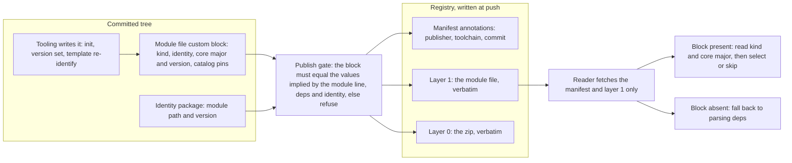

# Enhancement 0022: Machine-Readable Artifact Metadata in cue.mod/module.cue

A CUE module published to a registry is one manifest and two blobs: the zipped source tree, and the module file that declares the module's path and its dependencies, stored again on its own. A consumer that wants the artifact's kind, or the major version of the OPM core schema it was built against, must download the whole zip and parse its dependency list. CUE's module file already reserves a block for third-party tooling data, and the CUE toolchain carries that block through tidy, publish and fetch untouched. This entry defines what OPM writes there, and makes publish refuse a block that disagrees with the rest of the artifact.

All entries: [INDEX.md](../INDEX.md). How this one relates to others: [GRAPH.md](../GRAPH.md). Metadata: [config.yaml](config.yaml).

## Summary

**One block, four facts (D1, D2, D3).** OPM claims one key in the module file's reserved `custom` field, and the key's suffix is the block's own schema major. The block carries four facts: the artifact's kind, its identity, the core line it targets, and the catalogs it was built against. Nothing about toolchains goes in. Modules, catalogs and templates carry the block; `core` and the kernel library do not, because nothing selects them by kind or compatibility. The saving is real: for one shipped module the module file is 226 bytes against a 230 268-byte zip, and CUE's client already reads the small one without touching the large one.

**The block cannot lie (D4).** The identity package is the small committed CUE package that declares an artifact's path and version. Every value in the block that repeats the module line, the dependency list or that package is asserted equal by a publish gate. The gate is a definition `core` ships: publish unifies the artifact against it and reports CUE's own error, exactly as the identity gate of entry 0011 already works (0011:D21). A stale block refuses rather than lies.

**Tooling writes it in the tree, publish never does (D5).** The block is authored in the committed source, the way the version writer authors the identity version. The rule that published bytes are committed bytes therefore stays intact (0011:D2, publish derives coordinates from the artifact and never rewrites it). This needs one amendment inside [entry 0011](../archive/0011/), whose decisions name the identity file as the writer's only target (0011:D3, 0011:D8). The wording of that amendment is OQ4, and 0011 gains that new decision when this entry is accepted.

**Push-time facts stay out of the tree (D6).** Which `opm` and `cue` published the artifact, and from which commit, are unknown until the push. They go into OCI manifest annotations, the key-value pairs attached to a published manifest, beside the ones CUE writes itself.

**The first reader is [entry 0016](../0016/) (D7, D8).** Its initializer walks a module's published majors to pick the newest one compatible with the platform's core (0016:D5). With the block it reads the core major and the artifact kind straight from the small blob. Without one it falls back to today's dependency parse, and a missing block is a warning first and a refusal only from a later dated release (D8), so the published fleet is never invalidated.

## How it works

Two channels, split by when a fact is known. Facts an author commits go in the block and are checked against the rest of the tree before anything is pushed. Facts that exist only at push time go into annotations. A reader then answers its question from the manifest and the module-file layer alone, and falls back to today's parse when the block is absent.

## Documents

1. [01-problem.md](01-problem.md): an artifact says nothing machine-readable about its kind or compatibility short of fetching and evaluating its zip
1. [02-design.md](02-design.md): a gate-checked block for facts consumers want before the zip, and annotations for facts that exist only at push
1. [03-decisions.md](03-decisions.md): the decision log, D1 to D8
1. [04-graduation.md](04-graduation.md): what must hold before `draft` becomes `accepted`
1. [05-risks.md](05-risks.md): risks, drawbacks, alternatives not taken
1. [06-operational.md](06-operational.md): rollout, versioning, rollback, cross-repo ordering
1. [07-questions.md](07-questions.md): the open-questions register, OQ1 to OQ5

Compilable CUE lives in [`schemas/target.cue`](schemas/target.cue), the block shape and its publish gate as a core delta, and in [`contracts/contracts.cue`](contracts/contracts.cue), the annotation key set and the reader's fallback order. [`experiments/`](experiments/) holds five measurements: the tidy round trip, publish and fetch staying verbatim, the gate's error text, annotations surviving a round trip, and the cost of probing.

## Scope

### In scope

- The block under `custom`, carrying the artifact kind, identity, core line and catalogs (D1, D2), on module, catalog and template artifacts (D3).
- A `core`-shipped publish gate asserting the block's duplicated values against the module line, the identity package and the dependencies, refusing on mismatch with CUE's own diagnostic (D4). It is applied the way 0011:D21 applies the identity gate.
- Authoring by tooling: init seeds the block, the version writer keeps its version in step, template re-identification rewrites its module path (D5). The amendment this needs inside entry 0011 is OQ4.
- OCI manifest annotations for push-time provenance, written beside CUE's own keys (D6).
- The first reader: entry 0016's major walk reads the core major and kind from the blob, with a dependency-parse fallback for older artifacts (D7).
- A grace window before a missing block becomes a publish refusal (D8).

### Out of scope

- Not an OPM OCI artifact format, not publish-generated content, not a provenance or SBOM record, and not a replacement for the identity package.
- Anything inside the zip. Facts that need the module evaluated, such as component contracts, are not projected into the block here; a later entry may add such fields under the same key.
- A second blob or OCI referrer. CUE's manifest admits exactly two layers, so a companion artifact is a separate design if one is ever needed.
- `core` and the kernel library as carriers. Nothing selects them by kind or compatibility.
- Core lines before v2. Only the `opmodel.dev/core@v2` line is in scope, and older artifacts are what the D7 fallback exists for.

## Deviations from Design

None at this stage. Update this section when implementation lands and any deliberate divergences from the design need to be documented.

## Cross-References

| Document | Purpose |
| -------- | ------- |
| [0010](../archive/0010/) | Fixed identity, so the module line is byte-identical to the identity package's module path; the gate leans on that equality rather than restating it |
| `core/src/identity_package.cue` | The existing publish gates, whose pattern of declared-against-implied unification the new gate follows |
| `core/SPEC.md` §5 | Publish Gates: where the new gate's specification section lands |
| `cli/internal/publish/identity.go` | How publish unifies a loaded value against a core gate and surfaces CUE's error; the new gate is applied the same way |
| `cli/internal/publish/load.go` | Where publish already reads the module line, the source kind and the dependency versions: the implied side of the gate |
| `cli/internal/publish/registry.go` | The push that zips the tree and uploads it; annotations (D6) land beside it |
| `cli/internal/cueedit/cueedit.go` | The surgical module-file and identity editors the writer (D5) extends |
| `cli/internal/scaffold/scaffold.go` | Template re-identification, which must rewrite the block's module path (D5) |
| `opmodel.dev/site/content/reference/registry-namespaces.md` | Documents that artifact kind is inferred from the path only inside OPM-owned domains |
| `enhancements/0016/experiments/02-core-major-probe/` | Measured cost of reading the module-file blob without the zip |
| `modules/cert_manager/cue.mod/module.cue` | The concrete module file used as the example throughout |
