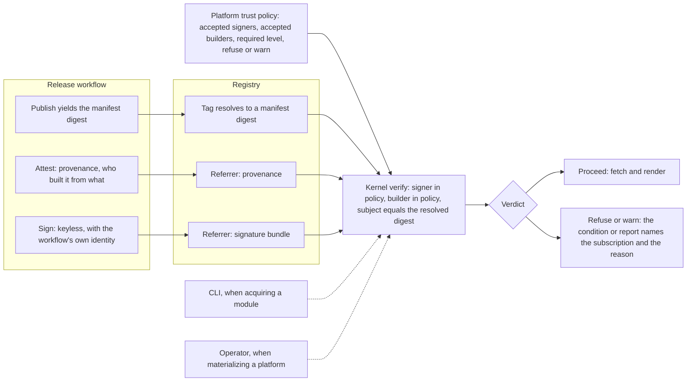

# Enhancement 0023: Artifact Provenance, Signatures and Platform Trust Policy

> **Note: this entry is deliberately open.** Its committed scope, meaning provenance, signatures and a trust policy, is settled as intent; its design is not. The research and the five scaffolded experiments come before any decision beyond D1 and D2 is written. Two optional extensions, a capability manifest and advisories, are held by OQ1 and OQ2 and may become separate entries.

A published OPM artifact is an OCI manifest with two blobs and nothing else: no annotations, no signature, no record of who built it from what, and no attachments of any kind. A consumer that resolves a version tag is trusting the registry's word, and CUE keeps no digest lock, so the pin names whatever the tag points at when it is fetched. This entry attaches two signed claims to every first-party release and gives a platform, the cluster-side declaration of what OPM consumes, a place to say whose signatures it accepts. Verification then runs once, in the kernel, before either the CLI or the operator uses the artifact.

All entries: [INDEX.md](../INDEX.md). How this one relates to others: [GRAPH.md](../GRAPH.md). Metadata: [config.yaml](config.yaml).

## Summary

**Two signed claims, attached as referrers (D1).** Provenance is a signed statement of who built the artifact, from which source, in SLSA's format, produced by the release platform rather than by the author. A signature says who vouches for the artifact. Both attach as OCI referrers, meaning separate artifacts whose subject is the manifest digest that the version tag resolves to. Nothing is added to the module manifest itself, so CUE's client never sees them, and a claim pinned to a digest survives a re-pointed tag. Measured on a shipped module in 2026-08-25, no OPM artifact carries any of this today.

**The trust policy belongs to the platform (D2).** A platform states which signer identities and which builders it accepts, platform-wide or per subscription, and every artifact it materializes is verified against that statement before the content is used. The kernel performs the verification, so the CLI and the operator reach the same verdict: the operator enforces it, the CLI reports it. Policy on the artifact was rejected because an artifact cannot vouch for itself, and policy in the CLI's own configuration was rejected because a laptop setting never travels to the operator.

**Everything else is open, on purpose.** The research and experiments settle which SLSA level OPM's release workflows can actually reach (OQ4), and how referrers behave on the registry OPM publishes to. They also settle whether verification must consult a public transparency log and what it does offline (OQ5), and the shape of the policy surface itself (OQ3). Two candidate extensions wait on their own questions: a capability manifest describing what a module needs from a cluster (OQ1), and signed advisories saying a version is withdrawn or vulnerable (OQ2).

**It fits between two neighbours.** Entry [0011](../archive/0011/) produces the artifacts and already verifies a published catalog out of band (0011:D7), so attestation happens in that same release workflow and verification extends that command. Entry [0022](../0022/) carries unsigned metadata in the committed tree; nothing there is evidence, and a verifier may reuse its catalog list to decide what to verify recursively (OQ6). The subscription the trust policy attaches to is the one entry [0019](../archive/0019/) reshaped (0019:D5, a platform imports its catalog whole). The advisory scope held by OQ2 is the artifact-level counterpart of the contract retirement in entry [0020](../0020/).

## How it works

Read the left column as publish time and the right as use time. Keyless signing means the release workflow signs with its own short-lived identity instead of a stored key, so what a consumer checks is who signed rather than which key was used. The platform states its policy once, and one kernel function checks the referrers against it before an artifact's content is used. The CLI runs it when acquiring a module and the operator when materializing a platform subscription, so the two never disagree.

## Documents

1. [01-problem.md](01-problem.md): nothing signed travels with an artifact, and nothing on the consumer side asks for it
1. [02-design.md](02-design.md): referrers carry provenance and signatures, the platform states whom it trusts, the kernel verifies before use
1. [03-decisions.md](03-decisions.md): the decision log, D1 and D2; the rest wait on research
1. [04-graduation.md](04-graduation.md): what must hold before `draft` becomes `accepted`
1. [05-risks.md](05-risks.md): risks, drawbacks, alternatives not taken
1. [06-operational.md](06-operational.md): rollout, versioning, rollback, cross-repo ordering
1. [07-questions.md](07-questions.md): the open-questions register, which is this entry's working surface

Compilable CUE lives in [`schemas/target.cue`](schemas/target.cue), a sketch of the trust-policy surface with every field marked by its open question, and in [`contracts/contracts.cue`](contracts/contracts.cue), the attestation kinds, the referrer attachment contract and the verification verdict. [`research/findings.md`](research/findings.md) holds the measured state of a published artifact and of CUE's registry client, and [`experiments/`](experiments/) holds five measurements, from pushing referrers to comparing a rebuild against the attested digest.

## Scope

### In scope

**Core (D1, D2).**

- Provenance: every first-party catalog and module release carries SLSA build provenance, generated by the release platform, signed, and attached as a referrer to the artifact's manifest digest (D1). The reachable level is OQ4.
- Signatures: every first-party release is signed, keyless and identity-based, and the signature attaches the same way (D1).
- A platform trust policy: which signer identities and which builders a platform accepts, platform-wide or per subscription (D2; its shape is OQ3). The kernel verifies, the operator enforces, the CLI reports.
- A verification command that checks one artifact against a policy on demand.

**Optional, held by OQ1 and OQ2.**

- A capability manifest (OQ1): render-derived facts about what a module needs, such as cluster-scoped kinds, RBAC, custom resource definitions and webhooks, attestable and policy-checkable.
- Advisories and retirement signals (OQ2): signed, artifact-attached statements that a version is withdrawn or vulnerable, surfaced when it is resolved.

### Out of scope

- Not an OPM artifact format, not key infrastructure OPM operates, not content validation, which the publish gates own, and not a dependency digest lock, which belongs to entry 0022.
- Image-level SBOM and VEX documents. The images a module deploys carry their own; this entry may point at them, never produce them.
- Source-track SLSA, such as branch protection and signed commits. That is repository policy, not artifact design.
- Signing third-party artifacts. They bring their own identities, and the platform policy decides whether to accept them.

## Deviations from Design

None at this stage.

## Cross-References

| Document | Purpose |
| -------- | ------- |
| `cli/internal/publish/registry.go` | The push, where the manifest digest becomes known and where attestation and signing follow |
| `cli/internal/publish/check.go` | The existing out-of-band verification command that a policy check extends |
| `library/opm/materialize/` | Where a platform's subscriptions are resolved and fetched; verification precedes the fetch being trusted |
| `library/opm/kernel/kernel.go` | The CLI-side acquire of a module from a registry, guarded by the same hook |
| `core/src/platform.cue` | The platform and its subscriptions, where the trust policy is declared (OQ3) |
| `opm-operator/` | Platform reconciliation, where enforcement lands |
| `research/findings.md` | Measured state of a published artifact, the registry's referrers answer, and CUE client behaviour |
| `enhancements/0022/` | The unsigned metadata channel these signed claims complement |
