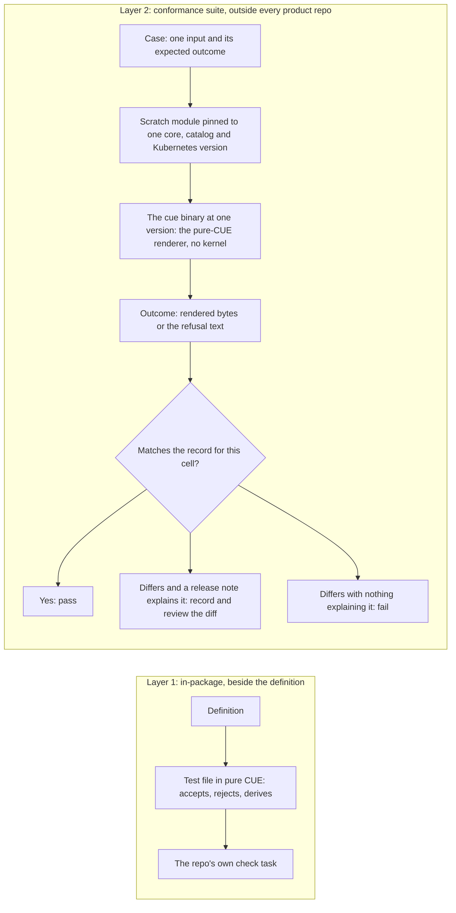

# 0024: CUE Testing and Conformance

OPM's behaviour is mostly CUE evaluation: definitions state what they accept, and rendering turns an input into Kubernetes objects. That behaviour is verified unevenly today, by hand and by rendering the fleet and looking at the result. One catalog family carries 163 hidden assertions and types every object it renders against the upstream Kubernetes definitions. The other family carries none and types against nothing, and the core schema has no committed test at all. Nobody can say whether a new CUE toolchain or a new core release changed what an unchanged input produces. This entry adds two layers of verification: executable assertions beside each definition, and an external suite that replays a corpus of inputs across every version combination and fails on drift that no release explains.

All entries: [INDEX.md](../INDEX.md). How this one relates to others: [GRAPH.md](../GRAPH.md). Metadata: [config.yaml](config.yaml).

## Summary

**Two layers, one question each (D1).** The in-package layer answers whether a definition accepts, rejects and derives what it claims. It lives beside the definition in the owning repo and runs in that repo's own check. The conformance layer answers whether an unchanged input still produces the same bytes and the same refusal text across versions. It lives outside every product repo and consumes only published artifacts and `cue` binaries. Neither layer replaces the other, and neither replaces the kernel's Go tests.

**Rejection is asserted, not just acceptance (D6), and a refusal's text is part of the behaviour (D2).** An assertion beside a definition states what the definition refuses as well as what it takes, in pure CUE with no Go. In the external suite a refused case records the diagnostic's message lines verbatim, so a changed diagnostic is drift in the same way changed output is. Diagnostics are what an author reads, and the same input has been measured producing two different refusals under two spellings on one toolchain.

**Outcomes are recorded per version cell, and unexplained drift fails (D3).** A version cell is one combination of the CUE toolchain, core, catalog and upstream Kubernetes definition versions. The suite replays each case in each cell and compares the outcome with the recorded one. A difference that a release note explains is re-recorded and the diff is reviewed; a difference with nothing explaining it fails. A version bump therefore becomes a diff a reviewer reads rather than a surprise a cluster finds.

**The renderer is the pure-CUE oracle, and upstream conformance is checked from outside (D4, D5).** The suite renders through the pure-CUE renderer rather than the Go kernel, so what it measures is the CUE behaviour itself. Rendered objects from both catalog families are checked against the upstream Kubernetes CUE definitions for their declared API version and kind. That check runs in the suite rather than in the catalog, so the raw passthrough family never takes the dependency its own rules forbid.

**It gives an existing gate an owner.** The transformer sweep of entry [0019](../archive/0019/) leaned on a gate saying that no default-named golden output may change by a byte (0019:D15, transformers read the component's names instead of deriving them). This suite is where that gate and the default-name flip beside it (0019:D16) get a home.

## How it works

The two layers never share a run. Layer 1 runs at the single toolchain and the single set of pins a repo commits to, which is why it cannot answer a cross-version question. Layer 2 builds a scratch module per cell, so it can, and it needs no checkout of any product repo. What the suite guards is not that behaviour never changes, but that no change passes unexplained.

## Documents

1. [01-problem.md](01-problem.md): CUE behaviour is verified by hand, unevenly, and never across versions
1. [02-design.md](02-design.md): the two layers, with diagrams of today's coverage and of the matrix-replayed suite
1. [03-decisions.md](03-decisions.md): the decision log, D1 to D6
1. [04-graduation.md](04-graduation.md): what must hold before `draft` becomes `accepted`
1. [05-risks.md](05-risks.md): risks, drawbacks, alternatives not taken
1. [06-operational.md](06-operational.md): rollout, versioning, rollback, cross-repo ordering
1. [07-questions.md](07-questions.md): the open-questions register, OQ1 to OQ9

This entry changes no `opmodel.dev/core` definition, so it carries no `schemas/` directory.

## Scope

### In scope

- The verification of CUE-evaluated artifacts: the core schema, both catalog families, and the module fleet's CUE, as observed through `cue` evaluation and the pure-CUE render oracle.
- In-package assertions for definitions: what a definition accepts, what it rejects, and what it derives.
- An external conformance suite whose recorded outcome per case, the rendered output or the diagnostic of a refusal, is the contract, replayed across a version matrix.
- Conformance of rendered Kubernetes objects to the upstream definitions, for both catalog families, plus a mechanical account of which upstream API versions the raw family represents.
- The byte-identity gate that 0019:D15 relies on, given an owner.

### Out of scope

- A testing strategy for the Go repos. Each has its own constitution and Go test suite; this entry consumes the kernel's pure-CUE oracle and does not restructure its tests.
- Cluster admission and runtime behaviour. A well-typed object can still be rejected by an admission webhook or fail at reconcile, which is the demo repo's territory.
- Replacing the parity harness in the kernel. That harness compares the kernel against the oracle; this suite compares versions of the oracle's inputs and outputs against each other.
- Go-level assertions on CUE evaluator internals. The regression canary stays in the kernel repo.

## Deviations from Design

None at this stage.

## Cross-References

| Document | Purpose |
| -------- | ------- |
| `enhancements/0019` | Pure-CUE unification is the render oracle (D1); the sweep's byte-identity gate (D15) and the default-name flip (D16) are the first consumers of this suite |
| `enhancements/0021` | The versioning policy, which says what a release may change; this entry is how a release's actual change is observed |
| `core/CLAUDE.md`, `core/openspec/config.yaml` | The schema repo's rules: pure CUE, no Go, and a specification co-update |
| `catalog_opm/CLAUDE.md` | Two families, the raw one depending on `core` alone, with its contract version mirroring upstream at adoption (0010:D48) |
| `library/testdata/parity/oracle/render.cue` | The pure-CUE renderer the suite's render cases use |
| `library/opm/internal/cueregression/closedness_test.go` | A hand-built instance of cross-version drift detection, the shape this entry generalises |
| https://registry.cue.works/source/cue.dev/x/k8s.io@v0.7.0 | The upstream Kubernetes CUE definitions that catalog output is checked against |
