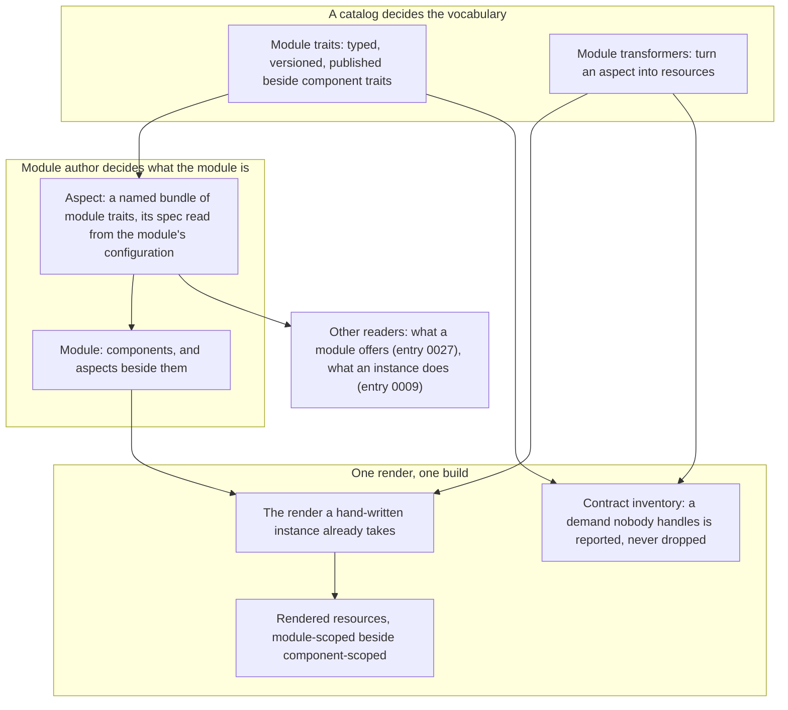

# Enhancement 0025: Self-Describing Modules

A module today describes its workloads and nothing about itself. It is limiting, not allowing a module to describe something else. For example, instead of the module being installed, it could declare an input schema and a way to transform that input into a new output (Abstraction). This entry gives a module one place to say what it is.

All entries: [INDEX.md](../INDEX.md). How this one relates to others: [GRAPH.md](../GRAPH.md). Metadata: [config.yaml](config.yaml).

## Summary

**A module describes itself through aspects (D11).** An aspect is a named bundle of module-level traits. It attaches to the module the way a component does, and is published by a catalog, versioned and rendered by the same machinery.

**Module traits and module transformers are siblings, not modes (D12, D13).** A module trait is what a catalog publishes for a module to say something about itself: the same identity block a component trait carries, without `appliesTo`, because it attaches to no workload. A module transformer matches an aspect the way a component transformer matches a component and renders resources into the same output, in the same build, once per matched pair.

**An unhandled demand is never silent (D14).** Aspects join the platform's matching and its contract inventory, so a module that asks for something no enabled transformer implements is reported before anything renders. That is what separates an aspect from an annotation with a schema.

**This entry ships the extension point and no vocabulary (D15).** No catalog publishes a module trait here. Network isolation and a resource budget appear throughout as worked examples of what the slot is for, and the delta's own fixtures stand them up and run a transformer end to end. A module trait ships in the catalog change that publishes it, with the entry that consumes it: the offering declaration with entry 0027, lifecycle and workflow traits with entry 0009.

## How it works

## Documents

1. [01-problem.md](01-problem.md): a module cannot describe itself, a module-scoped concern has no renderer, and what a module says cannot be a contract
1. [02-design.md](02-design.md): aspects on the module, module traits and module transformers as siblings of their component counterparts, and the matching pass that carries them
1. [03-decisions.md](03-decisions.md): the decision log; D11 to D15 are live, D1 to D10 are tombstones pointing at entry 0027
1. [04-graduation.md](04-graduation.md): what must hold before `draft` becomes `accepted`
1. [05-risks.md](05-risks.md): risks, drawbacks, and the shapes not taken
1. [06-operational.md](06-operational.md): rollout, versioning, rollback, cross-repo ordering
1. [07-questions.md](07-questions.md): the open-questions register; OQ13 to OQ15 are live, the rest are deferred to entry 0027

Compilable CUE lives in [`schemas/`](schemas/): the core-schema delta carrying the aspect, module trait and module transformer shapes, with a worked module that attaches three aspects, two instances of it, and a transformer run whose rendered object is pinned.

## Scope

### In scope

**Aspects (D11 to D14).**

- A named `#aspects` map on the module, each entry a bundle of module traits with a derived matching identity and a closed spec the author fills.
- Module traits as a core definition beside component traits, published, keyed and gated the same way.
- Module transformers as a core definition beside component transformers, folded by the platform and covered by its contract inventory.
- The matching pass that carries aspects through the one render build, and the inventory coverage that makes an unhandled demand visible.

### Out of scope

- Any module trait or module transformer in a catalog. This entry publishes none (D15); the traits it shows are examples and fixtures.
- Binding a module as something consumers instantiate, and serving it as a Kubernetes kind. That is entry 0027, which rests on this one.
- A third interpreter of a module. The render half renders aspects and the execution half of entry 0009 reads them; nothing else does.
- Aspects on a ModuleInstance (OQ15). What an instance does is 0009's, attached at the instance's transitions.
- A second build. An aspect joins the render OPM already has; nothing post-processes rendered output.

## Deviations from Design

None at this stage. Update when implementation lands.

## Cross-References

| Document | Purpose |
| -------- | ------- |
| `enhancements/0027/` | The first consumer of the aspect map: a module declares what it offers on an aspect, and a platform binds it as a kind |
| `enhancements/0009/` | The execution half, whose lifecycle and workflow constructs attach as module traits on an aspect, and which already rests on D11 and D12 |
| `enhancements/0015/` | The contract inventory aspects join (0015:D1) and the report-never-refuse posture for an unhandled demand (0015:D18) |
| `enhancements/0019/` | One CUE build per render (0019:D9) and once-per-pair execution (0019:D2), which module transformers keep |
| `enhancements/0010/` | The additive promise a published trait carries (0010:D28) and the contract key shape a module trait reuses (0010:D4, 0010:D36) |
| `enhancements/0016/` | Seed values: one of the needs that reached for its own field on `#Module`, and a candidate consumer of the slot instead |
| `core/src/module.cue` | The `#components` pattern constraint `#aspects` transposes |
| `core/src/component.cue` | The derived matching labels, name cascade and closed spec that `#Aspect` transposes to module scope |
| `core/src/trait.cue` | The identity block and optionality gate `#ModuleTrait` shares |
| `core/src/transformer.cue` | The matching buckets and transform signature `#ModuleTransformer` transposes |
| https://kubevela.io/ | Application-level policies: prior art for a fact attached above the component, to compare against D11 and D13 |
| `CONSTITUTION.md` (per target repo) | Core design principles governing changes in each touched repo |
