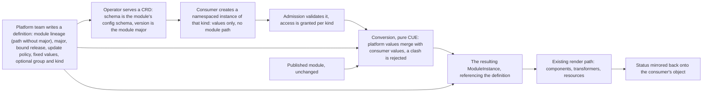

# Enhancement 0025: Self-Service Kinds from Published Modules

Deploying a module in OPM today means naming its registry path and version yourself. So every app team has to know which module and which release sits behind the thing they want. This entry lets the platform team pick the module once. Consumers then supply values and nothing else.

All entries: [INDEX.md](../INDEX.md). How this one relates to others: [GRAPH.md](../GRAPH.md). Metadata: [config.yaml](config.yaml).

## Summary

**The platform binds the module; the consumer supplies values (D1, D5).** The platform team writes one cluster-wide definition: a module lineage (its path without the major), a major, the bound release, an update policy, and optionally values the platform fixes. The module never ships its own definition (D5), because it would have to be deployed before anyone could use it.

**An instance becomes an ordinary ModuleInstance (D3, D6).** The conversion is a pure CUE function in `core`, so the kernel, the CLI and the operator all compute the same result. Platform and consumer values merge, and a clash is rejected rather than silently resolved.

**The consumer-facing schema is the module's own config schema (D2, D7).** The definition also names an API group and kind, and the operator serves a CRD whose schema is that config schema in structural form. A module whose config schema cannot be encoded that way is refused. The served version is the module's major (D7).

**Two layers, the second built on the first (D4).** Binding alone gives platform-owned versioning and a tenant guardrail, with no new controller. Kinds add typed API objects, `kubectl explain` and per-kind access control, at the cost of one data-driven controller.

**What this does not replace (D8, D9).** Crossplane-style providers stay external and render as leaf resources (D8). OPM's typed CUE replaces the composition layer above them, with one namespaced object instead of a composite-and-claim pair (D9).

**The kind name is undecided (OQ1).** Five candidates are recorded; the draft uses "offering" as a placeholder.

## How it works

One definition is the whole platform-side job: rolling a patch to every instance is one edit to it. The published module is untouched and does not know it is being offered. Everything to the right of the conversion is the path OPM already has, which is why the render never learns that served kinds exist.

## Documents

1. [01-problem.md](01-problem.md): the consumer binds the module coordinate, the configuration schema has no presence at the API server, and tenancy is all-or-nothing
1. [02-design.md](02-design.md): a platform-owned binding object, a pure conversion to a ModuleInstance, and a second layer serving the binding as a typed kind
1. [03-decisions.md](03-decisions.md): the decision log, D1 to D10
1. [04-graduation.md](04-graduation.md): what must hold before `draft` becomes `accepted`
1. [05-risks.md](05-risks.md): risks, drawbacks, and the composition-layer alternatives not taken
1. [06-operational.md](06-operational.md): rollout, versioning, rollback, cross-repo ordering
1. [07-questions.md](07-questions.md): the open-questions register, OQ1 to OQ12

Compilable CUE lives in [`schemas/`](schemas/): the core-schema delta, carrying the definition shape, the instance shape and the conversion.

## Scope

### In scope

**Binding layer (D1, D3, D5, D6).**

- A cluster-scoped, platform-owned definition binding a module lineage (its major-free path), a major, a release and an update policy, which may also carry platform-bound values.
- A way for a ModuleInstance to reference a definition instead of naming a module, with the coordinate resolved from the definition.
- The conversion from definition plus instance to a ModuleInstance, as a core CUE function the kernel reads and the CLI can compute offline.
- The self-hosting authoring shape: a definition rendered from a resource contract by a transformer, on the same pattern as transformer registration, beside hand-authored definitions.

**Kind layer (D2, D4, D7, D9).**

- The definition naming an API group and kind, with the operator serving a custom resource definition whose schema is the bound module's configuration schema in structural form, versioned by the module's major.
- The refusal of a definition whose module configuration schema does not encode to a structural schema.
- One data-driven controller that converts instances of every served kind to a ModuleInstance and mirrors status back.
- Refusing to delete a definition while instances exist, naming the count.

### Out of scope

- Not a replacement for managed-resource providers, not a second render path, and not a change to what a module author writes.
- Managed-resource controllers. Crossplane providers, ACK and ASO stay external, and OPM renders their objects as leaf resources (D8). Rebuilding them on the execution half of the kernel is neither this entry nor a successor of it.
- A general meta-controller toolkit. The conversion controller is one bounded instance of the idea entry 0009 leaves open; extracting a toolkit waits for a second dynamic-kind controller to exist.
- The composite-and-claim shape. There is no cluster-scoped composite object behind a namespaced claim (D9).
- Routing between several definitions of one kind, or several modules behind one kind. One definition binds one module lineage; classes, channels and capability routing are successor material, as they are in entry 0015.
- Changing the module schema. No authored field is added, and the offered module does not know it is offered (D5). A module-declared status schema is OQ5 and may add one later.

## Deviations from Design

None at this stage. Update when implementation lands.

## Cross-References

| Document | Purpose |
| -------- | ------- |
| `enhancements/0015/` | The cluster-scoped registration pattern this entry's authoring shape reuses (D3, D9) and what regeneration does on rebinding (D13) |
| `enhancements/0008/` | The CUE-to-CRD encoder in structural mode (D3) that the kind layer's schema generation relies on |
| `enhancements/0010/` | Identity: majors are the only artifact distinction (D1), and instance identity survives a major bump (D41), which is what makes rebinding safe |
| `enhancements/0021/` | The module's configuration schema as what a version promises (D2), the premise under a served version equal to the module major |
| `enhancements/0009/` | The execution half, whose open question on a meta-controller toolkit names the idea this controller is the first instance of |
| `enhancements/0016/` | Instance package scaffolding: the consumer-side experience this entry's binding layer removes the module coordinate from |
| `enhancements/0014/` | GitOps export of a live instance; how it interacts with projected instances is OQ7 |
| `core/src/module.cue` | The configuration schema and the comment declaring it OpenAPIv3-compatible, the constraint the kind layer depends on |
| `core/src/module_instance.cue` | The ModuleInstance shape the conversion produces |
| `opm-operator/api/v1alpha1/moduleinstance_types.go` | The operator resource whose module reference the binding layer makes optional |
| https://docs.kratix.io/ | Closest prior art: a Promise installs a CRD from an API schema and fulfils requests through pipelines |
| https://kro.run/ | ResourceGraphDefinition: schema-to-CRD plus a CEL resource graph, whose CEL half OPM's typed CUE replaces |
| `CONSTITUTION.md` (per target repo) | Core design principles governing changes in each touched repo |
