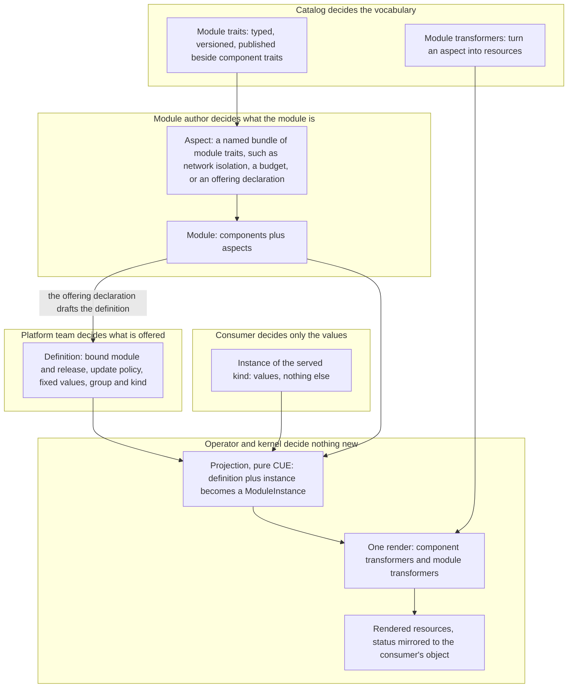

# Enhancement 0025: Self-Describing Modules and Self-Service Kinds

A module today describes its workloads and nothing about itself. And deploying one means naming its registry path and version yourself, so every app team has to know which module and which release sits behind the thing they want. This entry gives a module one place to say what it is, and lets the platform team pick a module once. Consumers then supply values and nothing else.

All entries: [INDEX.md](../INDEX.md). How this one relates to others: [GRAPH.md](../GRAPH.md). Metadata: [config.yaml](config.yaml).

## Summary

**A module describes itself through aspects (D11 to D14).** An aspect is a named bundle of module-level traits, a sibling of a component, published by a catalog and versioned like any trait. Module transformers render aspects through the same matching path components use, and an aspect nobody handles is reported, never silent. The first two are network isolation and a resource budget (D15).

**The module may declare what it offers; the platform decides to offer it (D5, D1).** The offering declaration is one such aspect: the intended kind, a suggested update policy, later a status schema. The platform reads it when it writes the binding. The module never emits the binding itself, because it would have to be deployed before anyone could use it.

**The platform binds the module; the consumer supplies values (D1, D6).** One cluster-wide definition names a module lineage, a major, the bound release, an update policy and optionally values the platform fixes. Platform and consumer values merge, and a clash is rejected rather than silently resolved.

**An instance becomes an ordinary ModuleInstance (D3).** The conversion is a pure CUE function in `core`, so the kernel, the CLI and the operator compute the same result. There is no second render path.

**The consumer-facing schema is the module's own config schema (D2, D7).** The definition names an API group and kind, and the operator serves a CRD whose schema is that config schema in structural form. A module whose config schema cannot be encoded that way is refused. The served version is the module's major.

**Two layers on top of aspects, and what they do not replace (D4, D8, D9).** Binding alone gives platform-owned versioning and a tenant guardrail. Kinds add typed API objects, `kubectl explain` and per-kind access control, at the cost of one data-driven controller. Crossplane-style providers stay external and render as leaf resources, with one namespaced object instead of a composite-and-claim pair.

The kind name of the definition is undecided (OQ1); the draft uses "offering" as a placeholder.

## How it works

Read it top to bottom as "who decides". The module author decides what the module is, the catalog decides which words exist for saying so, the platform team decides what to offer and at which release, and the consumer decides values. Everything below the projection is the path OPM already has: aspects join the same render beside components, and the render never learns that served kinds exist.

## Documents

1. [01-problem.md](01-problem.md): a module cannot describe itself, the consumer binds the module coordinate, the configuration schema has no presence at the API server, and tenancy is all-or-nothing
1. [02-design.md](02-design.md): aspects on the module, a platform-owned binding object, a pure conversion to a ModuleInstance, and a layer serving the binding as a typed kind
1. [03-decisions.md](03-decisions.md): the decision log, D1 to D15
1. [04-graduation.md](04-graduation.md): what must hold before `draft` becomes `accepted`
1. [05-risks.md](05-risks.md): risks, drawbacks, and the composition-layer alternatives not taken
1. [06-operational.md](06-operational.md): rollout, versioning, rollback, cross-repo ordering
1. [07-questions.md](07-questions.md): the open-questions register, OQ1 to OQ16

Compilable CUE lives in [`schemas/`](schemas/): the core-schema delta, carrying the aspect, module trait and module transformer shapes, the definition shape, the instance shape and the conversion, with a worked module that attaches three aspects and a transformer that renders one.

## Scope

### In scope

**Aspects (D5, D11 to D15).**

- A named `#aspects` map on the module, each entry a bundle of module traits with a derived matching identity and a closed spec the author fills.
- Module traits as a core definition beside component traits, published, keyed and gated the same way.
- Module transformers as a core definition beside component transformers, folded by the platform and covered by its contract inventory.
- Three module traits in catalog_opm: network isolation and a resource budget, rendered on Kubernetes, and the offering declaration a module makes about itself.

**Binding layer (D1, D3, D5, D6).**

- A cluster-scoped, platform-owned definition binding a module lineage (its major-free path), a major, a release and an update policy, which may also carry platform-bound values.
- A way for a ModuleInstance to reference a definition instead of naming a module, with the coordinate resolved from the definition.
- The conversion from definition plus instance to a ModuleInstance, as a core CUE function the kernel reads and the CLI can compute offline.
- The self-hosting authoring shape: a definition rendered from a resource contract by a transformer, on the same pattern as transformer registration, beside hand-authored definitions.

**Kind layer (D2, D4, D7, D9).**

- The definition naming an API group and kind, with the operator serving a custom resource definition whose schema is the bound module's configuration schema in structural form, versioned by the module's major.
- The refusal of a definition whose module configuration schema does not encode to a structural schema.
- One data-driven controller that converts instances of every served kind to a ModuleInstance and mirrors status back.
- Refusing to delete a definition while instances exist, naming the count.

### Out of scope

- Not a replacement for managed-resource providers, not a second render path, and not a change to what a module author writes.
- Managed-resource controllers. Crossplane providers, ACK and ASO stay external, and OPM renders their objects as leaf resources (D8). Rebuilding them on the execution half of the kernel is neither this entry nor a successor of it.
- A general meta-controller toolkit. The conversion controller is one bounded instance of the idea entry 0009 leaves open; extracting a toolkit waits for a second dynamic-kind controller to exist.
- The composite-and-claim shape. There is no cluster-scoped composite object behind a namespaced claim (D9).
- Routing between several definitions of one kind, or several modules behind one kind. One definition binds one module lineage; classes, channels and capability routing are successor material, as they are in entry 0015.
- A third interpreter of a module. The render half renders aspects and the execution half of entry 0009 reads them; nothing else does.
- Aspects on a ModuleInstance (OQ15). What an instance does is 0009's, attached at its transitions (D10).
- Emitting the definition from the offered module. The module may declare; only the platform binds (D5).

## Deviations from Design

None at this stage. Update when implementation lands.

## Cross-References

| Document | Purpose |
| -------- | ------- |
| `enhancements/0015/` | The cluster-scoped registration pattern this entry's authoring shape reuses (0015:D3, 0015:D9) and what regeneration does on rebinding (0015:D13) |
| `enhancements/0008/` | The CUE-to-CRD encoder in structural mode (0008:D3) that the kind layer's schema generation relies on |
| `enhancements/0010/` | Identity: majors are the only artifact distinction (0010:D1), and instance identity survives a major bump (0010:D41), which is what makes rebinding safe |
| `enhancements/0021/` | The module's configuration schema as what a version promises (0021:D2), the premise under a served version equal to the module major |
| `enhancements/0009/` | The execution half, whose open question on a meta-controller toolkit names the idea this controller is the first instance of, and whose lifecycle and workflow constructs attach as module traits on an aspect |
| `enhancements/0016/` | Instance package scaffolding: the consumer-side experience this entry's binding layer removes the module coordinate from |
| `enhancements/0014/` | GitOps export of a live instance; how it interacts with projected instances is OQ7 |
| `enhancements/0019/` | One CUE build per render (0019:D9) and once-per-pair execution (0019:D2), which module transformers keep |
| `core/src/module.cue` | The configuration schema and the comment declaring it OpenAPIv3-compatible, the constraint the kind layer depends on; the `#components` pattern constraint `#aspects` transposes |
| `core/src/component.cue` | The derived matching labels, name cascade and closed spec that `#Aspect` transposes to module scope |
| `core/src/trait.cue` | The identity block and optionality gate `#ModuleTrait` shares |
| `core/src/transformer.cue` | The matching buckets and transform signature `#ModuleTransformer` transposes |
| `core/src/module_instance.cue` | The ModuleInstance shape the conversion produces |
| `opm-operator/api/v1alpha1/moduleinstance_types.go` | The operator resource whose module reference the binding layer makes optional |
| https://docs.kratix.io/ | Closest prior art: a Promise installs a CRD from an API schema and fulfils requests through pipelines |
| https://kro.run/ | ResourceGraphDefinition: schema-to-CRD plus a CEL resource graph, whose CEL half OPM's typed CUE replaces |
| `CONSTITUTION.md` (per target repo) | Core design principles governing changes in each touched repo |
