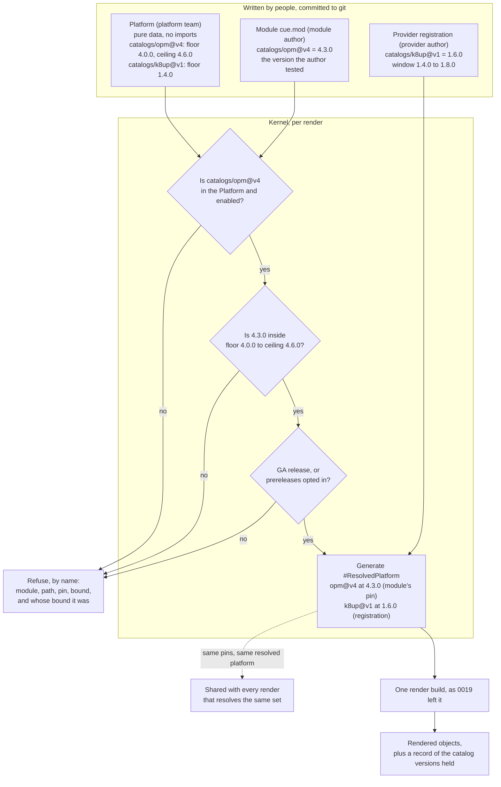

# Enhancement 0026: Module-Dictated Catalog Versions and the Generated Platform

A platform declares which catalogs a render may use, and today it pins one exact version of each. Every module renders against that pin, even if the author tested another, and needing a newer definition means waiting for a platform edit. This entry splits that number into two jobs: the platform sets a range, the module picks inside it.

All entries: [INDEX.md](../INDEX.md). How this one relates to others: [GRAPH.md](../GRAPH.md). Metadata: [config.yaml](config.yaml).

## Summary

**The platform admits, the module selects (D1, D2).** The platform is a pure-data `#Platform`: one `#CatalogAdmission` per catalog lineage it admits (a catalog path at one major), with a required lowest version, an optional highest one, and GA releases only unless the entry opts into prereleases. A module's committed catalog dependency is the version its render uses, as long as it sits inside that range. Outside it, the render is refused, naming the module, the path, the pin, the bound and whose bound it was.

**Raising the floor is a loud lever.** It stops the instances below it rather than moving them.

**An admission entry admits and bounds, and never loads a catalog (D4).** The platform has no dependencies and imports nothing, so the same fields serve as a cluster resource's spec and as an offline file for the CLI.

**The render-time value is generated, and its shape does not change (D3).** For each render the kernel builds a platform module from the authored platform plus the module's pins. That value is the registry today's core ships as `#Platform`, unchanged in shape and renamed `#ResolvedPlatform`; the authored value takes the name `#Platform`.

**Provider catalogs follow the same rule (D5, D6).** A provider's own catalog pin already fixes the version its registration carries. That version is the pick for any render that does not pin the provider's catalog itself. The registration gains a window defaulting to that version; an admission entry for that path is optional and, when present, replaces it, and the registration's status reports which window is in effect and where it came from.

**The shared-path check runs twice (D7), and nothing else moves (D8).** It runs per render against the consumer's pins, and at acceptance against the platform's floors. Matching, how the transformer set is derived, who holds admission authority, and provider routing are all unchanged.

## How it works

Three inputs, all written by people and committed to git. The kernel reads them, checks them, and writes the one thing nobody authors: the resolved platform the render builds against.

Reading the diagram:

- **Platform** says which catalogs may be used and within what version range. It never picks a version and never loads a catalog.
- **Module cue.mod** picks the version. It is the ordinary CUE dependency list every module already commits; nothing new is authored here.
- **Provider registration** brings in a catalog the module never imports (the k8up transformer for a `backup` trait). Its version is used when no module pins that path.
- **`#ResolvedPlatform`** is the render-time value: one import per catalog at the version chosen above, with the transformers folded from those bytes. It is generated, cached by its resolved set, and never edited by hand.

The tidied closure is the module's full committed dependency list, the one the render already promotes into its build. Nothing is resolved at render time: no tidy runs, no registry is consulted, and no highest-version selection happens. What changes is only which file supplies the version on a catalog path, and what the kernel does when that version falls outside what the platform admits.

## Documents

1. [01-problem.md](01-problem.md): one platform pin both admits a catalog lineage and picks every instance's version at once, and the two jobs conflict as soon as two modules want different releases
1. [02-design.md](02-design.md): a pure-data authored platform with ranges, module pins as the held version, a generated resolved platform, the same rule for provider catalogs, and a worked example
1. [03-decisions.md](03-decisions.md): the decision log, D1 to D8
1. [04-graduation.md](04-graduation.md): what must hold before `draft` becomes `accepted`
1. [05-risks.md](05-risks.md): risks, drawbacks, alternatives not taken
1. [06-operational.md](06-operational.md): rollout, versioning, rollback, cross-repo ordering
1. [07-questions.md](07-questions.md): the open-questions register, OQ1 to OQ6

Compilable CUE lives in [`schemas/`](schemas/): the core-schema delta, the example instances whose unification is the test, and the specification delta.

## Scope

### In scope

- The authored `#Platform` and its `#CatalogAdmission` entries in `core`: a catalog lineage (path with its major), an enable flag, an optional registry override, a prerelease opt-in, a required floor and an optional ceiling (D2). The shipped render-time value keeps its shape under the name `#ResolvedPlatform` (D3).
- The source of a catalog version in the render list: the module's committed pin, admitted by the platform and refused by name outside the range (D1, D2). The build records the catalog versions it held.
- Per-resolution generation of the resolved platform from the authored platform plus pins, and the convergence of the offline and cluster authored forms on one value (D3).
- The registration window: a floor and a ceiling on the registration contract, defaulting to its exact version, plus the optional admission entry that overrides it. The effective window and its source are reported in the registration's status (D5, D6).
- The shared-path requirement check, per render against the consumer's pins and at acceptance against the floors (D7).

### Out of scope

- A change to matching, to the transformer set, or to which catalogs a platform admits. Admission stays with the authored platform and the access-gated registration.
- Provider routing, classes and capability-based selection: successor material to the one-provider-per-contract rule of entry 0015 (0015:D2).
- Floating an instance forward within a range without an owner's act. That waits on entry 0021's compatibility answers and belongs to a later entry.
- Module-hosted transformers. The ruling that transformers never ship inside a module artifact stands (0015:D10).
- Generating the Platform custom resource definition from the authored platform, which is entry 0008's route. This entry states the authored shape, not how that definition is produced.
- Self-service kinds over published modules, which is entry 0025 and reuses this entry's range vocabulary.

## Deviations from Design

None at this stage. Update this section when implementation lands and any
deliberate divergences from the design need to be documented.

## Cross-References

| Document | Purpose |
| -------- | ------- |
| `enhancements/0019/` | The single-build render pipeline this entry is baselined on: embedded catalogs (D5), the operator-generated platform package (D6), and the promotion rule whose catalog-path source this entry changes (D13) |
| `enhancements/0015/` | The provider half this entry extends with a window and an optional platform override: the registration resource (D3), its derived claim (D11), the shared-path comparison (D8) and the contract inventory (D1) |
| `enhancements/0010/` | Identity is the module path with its major (D1); the committed platform module is the resolution (D14); evolution inside a major is additive (D27) |
| `enhancements/0021/` | The module compatibility surface, and the concrete case of a patch release orphaning a claim; it gates any future in-range floating |
| `enhancements/0008/` | CUE-native CRD schemas: the route from the authored platform to the Platform custom resource definition |
| `enhancements/0025/` | Self-service kinds, the consumer of this entry's range vocabulary for an offering's update policy |
| `core/src/platform.cue` | The shipped platform and catalog-entry definitions this entry renames to `#ResolvedPlatform`, shape unchanged, and generates |
| `core/src/module_instance.cue` | Why core injects nothing tied to a catalog contract, the reason the registration window is not injected into a module's configuration schema |
| `CONSTITUTION.md` (per target repo) | Core design principles governing changes in each touched repo |
