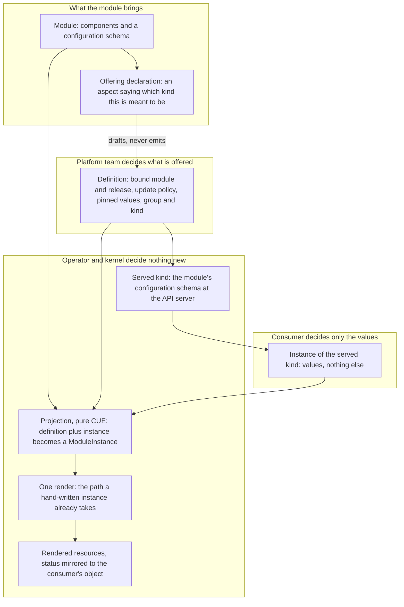

# Enhancement 0027: Self-Service Kinds from Published Modules

A team that just wants a database has to name the module that provides it and the exact release to run, then write both into their own deployment. This entry lets the platform team make that choice once, in one object, and serve it as a Kubernetes kind. Consumers then supply values and nothing else.

All entries: [INDEX.md](../INDEX.md). How this one relates to others: [GRAPH.md](../GRAPH.md). Metadata: [config.yaml](config.yaml).

## Summary

**The platform binds the module; the consumer supplies values (D1, D6).** One cluster-wide object, owned by the platform team, records which module, which major version, which exact release, how it updates, and optionally values the platform pins so consumers cannot change them. Platform and consumer values merge, and a clash is rejected rather than silently resolved.

**An instance becomes an ordinary ModuleInstance (D3).** The conversion is a pure CUE function in `core`, so the kernel, the CLI and the operator compute the same result. There is no second render path.

**The consumer-facing schema is the module's own config schema (D2, D7).** The definition names an API group and kind, and the operator serves a CRD whose schema is that config schema in structural form. A module whose config schema cannot be encoded that way is refused. The CRD is served at the module's major, so `v1` of the kind is `v1` of the module.

**The module may declare what it offers; the platform decides to offer it (D5, D11).** The declaration is a module trait this entry publishes, attached on an aspect. The platform reads it when it writes the binding. The module never emits the binding itself. That would be a circular dependency: the binding is what makes the module deployable, so producing it from the module means deploying the module before anything is allowed to deploy it.

**Two layers, and what they do not replace (D4, D8, D9).** Binding alone gives platform-owned versioning and a tenant guardrail. Kinds add typed API objects, `kubectl explain` and per-kind access control, at the cost of one data-driven controller. Crossplane-style providers stay external and render as leaf resources, with one namespaced object instead of a composite-and-claim pair.

This entry rests on entry 0025, which gives a module one named place to state facts about itself as a whole: aspects, bundles of catalog-published module traits (0025:D11), published and versioned the way component traits are (0025:D12). The offering declaration is one such trait on one such aspect, and nothing here changes the aspect map.

The kind name of the definition is undecided (OQ1); the draft uses "offering" as a placeholder.

## How it works

Read it top to bottom as "who decides". The module author may say what the module is meant to be, the platform team decides whether to offer it and at which release, and the consumer decides values. Everything below the projection is the path OPM already has: the render never learns that served kinds exist.

## Documents

1. [01-problem.md](01-problem.md): the consumer binds the module coordinate, the configuration schema has no presence at the API server, and tenancy is all-or-nothing
1. [02-design.md](02-design.md): a platform-owned binding object, a pure conversion to a ModuleInstance, and a layer serving the binding as a typed kind
1. [03-decisions.md](03-decisions.md): the decision log, D1 to D11
1. [04-graduation.md](04-graduation.md): what must hold before `draft` becomes `accepted`
1. [05-risks.md](05-risks.md): risks, drawbacks, and the composition-layer alternatives not taken
1. [06-operational.md](06-operational.md): rollout, versioning, rollback, cross-repo ordering
1. [07-questions.md](07-questions.md): the open-questions register, OQ1 to OQ12 and OQ16

Compilable CUE lives in [`schemas/`](schemas/): the core-schema delta carrying the definition shape, the instance shape and the conversion, with entry 0025's module and aspect shapes mirrored so the delta vets on its own.

## Scope

### In scope

**Binding layer (D1, D3, D5, D6).**

- A cluster-scoped, platform-owned definition binding a module lineage (its major-free path), a major, a release and an update policy, which may also carry platform-bound values.
- A way for a ModuleInstance to reference a definition instead of naming a module, with the coordinate resolved from the definition.
- The conversion from definition plus instance to a ModuleInstance, as a core CUE function the kernel reads and the CLI can compute offline.
- A second way for the platform team to author a definition, beside writing the object by hand: a separate platform-owned module carries a definition resource contract on a component, and a catalog_opm transformer renders the definition objects. The emitting module is never the module being offered (D5). The reason for this shape is the permission gate: the objects arrive as ordinary rendered output under the tenant ServiceAccount, so only a platform-team identity can create one. Same shape as transformer registration in entry 0015 (0015:D9).

**Kind layer (D2, D4, D7, D9).**

- The definition naming an API group and kind, with the operator serving a custom resource definition whose schema is the bound module's configuration schema in structural form, versioned by the module's major.
- The refusal of a definition whose module configuration schema does not encode to a structural schema.
- One data-driven controller that converts instances of every served kind to a ModuleInstance and mirrors status back.
- Refusing to delete a definition while instances exist, naming the count.

**The declaration (D11).**

- One module trait in catalog_opm, `offering`, published against entry 0025's module-trait vocabulary and handled by no transformer: the declaration a module makes about what it is when offered.

### Out of scope

- Not the module-scoped extension point itself: what a module may say about itself is entry 0025, which this entry rests on.
- Not a replacement for managed-resource providers, not a second render path, and not a change to what a module author writes.
- Managed-resource controllers. Crossplane providers, ACK and ASO stay external, and OPM renders their objects as leaf resources (D8). Rebuilding them on the execution half of the kernel is neither this entry nor a successor of it.
- A general meta-controller toolkit. The conversion controller is one bounded instance of the idea entry 0009 leaves open; extracting a toolkit waits for a second dynamic-kind controller to exist.
- The composite-and-claim shape. There is no cluster-scoped composite object behind a namespaced claim (D9).
- Routing between several definitions of one kind, or several modules behind one kind. One definition binds one module lineage; classes, channels and capability routing are successor material, as they are in entry 0015.
- Emitting the definition from the offered module. The module may declare; only the platform binds (D5).

## Deviations from Design

None at this stage. Update when implementation lands.

## Cross-References

| Document | Purpose |
| -------- | ------- |
| `enhancements/0025/` | The aspect map this entry's offering declaration attaches to (0025:D11), the module-trait shape it is published as (0025:D12), and the fulfilment answer it waits on (0025 OQ13) |
| `enhancements/0015/` | The cluster-scoped registration pattern this entry's authoring shape reuses (0015:D3, 0015:D9) and what regeneration does on rebinding (0015:D13) |
| `enhancements/0008/` | The CUE-to-CRD encoder in structural mode (0008:D3) that the kind layer's schema generation relies on |
| `enhancements/0010/` | Identity: majors are the only artifact distinction (0010:D1), and instance identity survives a major bump (0010:D41), which is what makes rebinding safe |
| `enhancements/0021/` | The module's configuration schema as what a version promises (0021:D2), the premise under a served version equal to the module major |
| `enhancements/0009/` | The execution half, whose open question on a meta-controller toolkit names the idea this controller is the first instance of |
| `enhancements/0016/` | Instance package scaffolding: the consumer-side experience this entry's binding layer removes the module coordinate from |
| `enhancements/0014/` | GitOps export of a live instance; how it interacts with projected instances is OQ7 |
| `core/src/module.cue` | The configuration schema and the comment declaring it OpenAPIv3-compatible, the constraint the kind layer depends on |
| `core/src/module_instance.cue` | The ModuleInstance shape the conversion produces |
| `opm-operator/api/v1alpha1/moduleinstance_types.go` | The operator resource whose module reference the binding layer makes optional |
| https://docs.kratix.io/ | Closest prior art: a Promise installs a CRD from an API schema and fulfils requests through pipelines |
| https://kro.run/ | ResourceGraphDefinition: schema-to-CRD plus a CEL resource graph, whose CEL half OPM's typed CUE replaces |
| `CONSTITUTION.md` (per target repo) | Core design principles governing changes in each touched repo |
