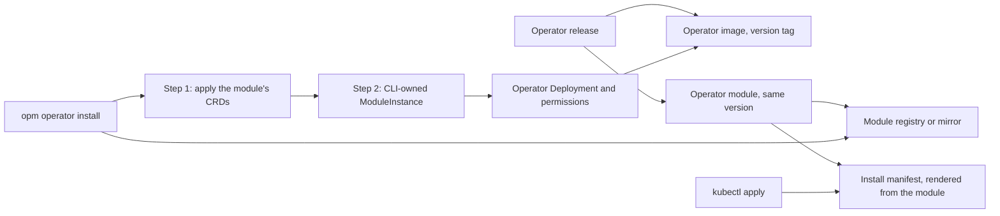

# Enhancement 0028: The Operator Ships as an OPM Module

The OPM operator is installed from a Kubernetes manifest built into the CLI, so its settings vanish on every upgrade. This entry publishes the operator as a module, an OPM package of resources with typed settings, and makes `opm operator install` deploy it as a ModuleInstance (the record of one deployed module) owned by the CLI.

All entries: [INDEX.md](../INDEX.md). How this one relates to others: [GRAPH.md](../GRAPH.md). Metadata: [config.yaml](config.yaml).

## Summary

**Each operator release publishes the operator as a module (D1).** The module has the release's version and points at the release's image by its version tag. One release produces one number for the CLI to pin, and both install paths check content digests, since a registry tag can be overwritten.

**The module is the one source of the install shape (D2).** Its CRDs and permissions are generated from the controller's own code, and a mismatch stops the release. It keeps the names, Deployment selector and pod security of today's manifest. The kubectl install manifest is rendered from the module, so the two cannot differ.

**Install applies the module in two steps (D3).** The CLI pulls the module from its registry, applies the CRDs first, then records a CLI-owned instance. An install that refuses changes nothing, and success means the new operator is reconciling. Air-gapped clusters use a registry mirror.

**The operator never manages itself (D4).** Its instance stays CLI-owned, and re-running install is the upgrade and the repair. Entry 0029's ownership transfer refuses this instance.

**Settings are instance values and survive upgrades (D5).** Image repository, registry mapping, applier account, resources, replicas and extra arguments are recorded on the instance and reused by every reinstall.

**Existing clusters migrate in place (D8, D9).** The first module install adopts the running operator without recreating it. Uninstall deletes what the instance recorded, never the CRDs or the Namespace, and no CLI command deletes the operator's instance while instances still wait on its cleanup (0006:D34).

<!--
Do NOT add an implementation-status block here. Whether this design has been
delivered is DERIVED from this entry's `delivery.yaml` log: run `task delivery ID=NNNN`. A
status block written here is a snapshot that goes stale the moment another change
lands, which is exactly the drift the implementation axis was removed to stop.
-->

## How it works

The operator release is the only producer: it builds the image and publishes the module, and the kubectl manifest is a render of that module. The CLI pulls the module, installs its CRDs first because the instance record needs them, then records everything else as one CLI-owned instance. The operator skips CLI-owned instances, so it never changes the objects that run it.

## Documents

1. [01-problem.md](01-problem.md): how the operator is installed and tuned, and why its settings vanish on upgrade
1. [02-design.md](02-design.md): one artifact per release, install as a module apply, and what each repo changes
1. [03-decisions.md](03-decisions.md): the decision log, D1 to D9
1. [04-graduation.md](04-graduation.md): what must hold before `draft` becomes `accepted`
1. [05-risks.md](05-risks.md): risks, drawbacks, alternatives not taken
1. [06-operational.md](06-operational.md): rollout, versioning, rollback, cross-repo ordering
1. [07-questions.md](07-questions.md): the open-questions register, OQ1 to OQ13

[`experiments/`](experiments/) holds the two concluded experiments the design rests on: the catalog renders the whole install shape, but only manifest-shaped workload and RBAC objects keep its names, selector and pod security (01); the two-step install, reinstall and upgrade work on a real cluster, and a self-owned operator wedges on its own deletion (02).

## Scope

### In scope

- Publishing the operator module from the operator's release, at the release's version (D1).
- The module as the source of the install shape, with the kubectl manifest rendered from it (D2).
- `opm operator install`, its CRDs-only form, upgrade and uninstall as operations on a CLI-owned instance (D3, D9).
- The operator's settings as typed instance values that survive reinstall (D5).
- Migrating a cluster whose operator came from a manifest (D8).
- The operator's place in the release cascade (D7).

### Out of scope

- Not an operator that manages its own installation: the operator never reconciles the instance that deploys it.
- Not the ownership transfer of other instances, which entry 0029 designs.
- Not the cluster Platform or the CLI user role inside the module; both stay install steps (D6).
- Not a fully offline install: a registry or mirror is required.
- Not changes to the operator's CRDs or controller behaviour.
- Not registry credentials for the operator.

## Deviations from Design

None at this stage. Update this section when implementation lands and any deliberate divergences from the design need to be documented.

## Cross-References

| Document | Purpose |
| -------- | ------- |
| [Enhancement 0006](../archive/0006/README.md) (D3, D5, D12, D19, D22, D23, D32, D34, D35) | The owner marker, the install command and its embedded manifest, Platform seeding, the user role and uninstall, which this entry amends or keeps |
| [Enhancement 0012](../0012/README.md) (D1, D8) | The apply guard and its adopt annotation the migration passes through, and the rule that no frontend deletes a CRD or Namespace |
| [Enhancement 0011](../archive/0011/README.md) (D10) | Registry tag immutability, which GHCR does not provide, hence the digest anchor of D1 |
| [Enhancement 0021](../0021/README.md) (D2, D4, D9, D10) | The module compatibility surface, the artifact classes and the version ceiling this entry amends, and immutable release tags |
| [Enhancement 0029](../0029/README.md) | The gated ownership transfer that refuses the operator's own instance |
| `opm-operator/docs/site/start/install-the-operator.md` | The install guide, including the warning that reinstall drops added flags |
| `opm-operator/.github/workflows/release.yml` | The release jobs the module publish joins |
| `cli/internal/operator/` | The embedded manifest and install, readiness and uninstall code this entry replaces |
