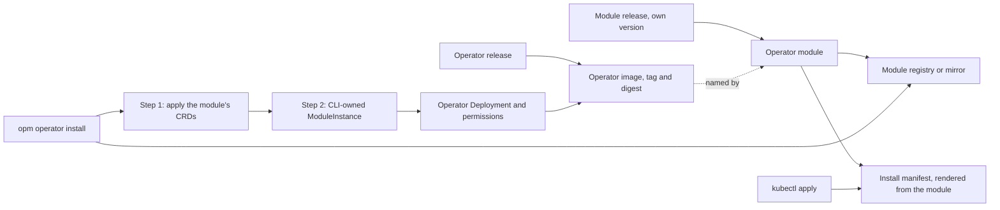

# Enhancement 0028: The Operator Ships as an OPM Module

The OPM operator is installed from a Kubernetes manifest built into the CLI, so its settings vanish on every upgrade. This entry publishes the operator as a module, an OPM package of resources with typed settings, and makes `opm operator install` deploy it as a ModuleInstance (the record of one deployed module) owned by the CLI.

All entries: [INDEX.md](../INDEX.md). How this one relates to others: [GRAPH.md](../GRAPH.md). Metadata: [config.yaml](config.yaml).

## Summary

**The operator module is its own release unit (D1).** It is released from the operator's repository on a version train of its own, starting at `v0`, with tags no operator release can take. Each module version names one operator image by tag and digest, and the CLI pins a module version with the content digests of the module and its dependencies, and records the operator version that module deploys beside it.

**The module is the one source of the install shape, rendered through the catalog (D2, D12).** Its CRDs and permissions are generated from the controller's own code, and a mismatch stops the release. The controller's workload, service account and RBAC come from the first-party catalog, which first gains a seccomp profile and roles with no subjects. Every name the CLI reads stays the same; the bindings take catalog names and the Deployment's selector changes once. The kubectl install manifest is rendered from the module, so the two cannot differ.

**Install applies the module in two steps (D3, D10, D11).** The CLI pulls the module from its registry, applies the CRDs first, then records a CLI-owned instance. It renders against the module's own pins, never the cluster Platform, and refuses an operator newer than the CLI, an unasked downgrade, or CRDs that stop serving a version the cluster serves. An install that refuses changes nothing, and success means the new operator is reconciling. Air-gapped clusters use a registry mirror.

**The operator never manages itself (D4).** Its instance stays CLI-owned whatever its owner field says, no CLI command hands it to the operator, and re-running install is the upgrade and the repair.

**Settings are instance values and survive upgrades (D5).** Image repository, registry mapping, applier account, resources, replicas and extra arguments are recorded on the instance and reused by every reinstall.

**Existing clusters migrate in place (D8, D9).** The first module install adopts what it can prove came from an earlier operator release, recreates the operator's Deployment once and deletes the three superseded bindings; the CRDs, custom resources, Namespace and managed workloads are untouched. Uninstall deletes what the instance recorded, never the CRDs or the Namespace, and no CLI command deletes the operator's instance while instances still wait on its cleanup (0006:D34).

<!--
Do NOT add an implementation-status block here. Whether this design has been
delivered is DERIVED from this entry's `delivery.yaml` log: run `task delivery ID=NNNN`. A
status block written here is a snapshot that goes stale the moment another change
lands, which is exactly the drift the implementation axis was removed to stop.
-->

## How it works

The operator release builds the image; a module release that follows it names that image by digest and publishes the module, and the kubectl manifest is a render of that module. The CLI pins a module version and the operator version it deploys, pulls the module, installs its CRDs first because the instance record needs them, then records everything else as one CLI-owned instance. The operator skips CLI-owned instances, so it never changes the objects that run it.

## Documents

1. [01-problem.md](01-problem.md): how the operator is installed and tuned, and why its settings vanish on upgrade
1. [02-design.md](02-design.md): the module as its own release unit, install as a module apply, and what each repo changes
1. [03-decisions.md](03-decisions.md): the decision log, D1 to D12
1. [04-graduation.md](04-graduation.md): what must hold before `draft` becomes `accepted`
1. [05-risks.md](05-risks.md): risks, drawbacks, alternatives not taken
1. [06-operational.md](06-operational.md): rollout, versioning, rollback, cross-repo ordering
1. [07-questions.md](07-questions.md): the open-questions register, OQ1 to OQ13

[`experiments/`](experiments/) holds the two concluded experiments the design rests on: the catalog renders the whole install shape, with three renamed bindings, a new selector and no seccomp profile, which the owner accepted with the catalog fixes of D12 (01); the two-step install, reinstall, upgrade and a catalog-path migration work on a real cluster, and a self-owned operator wedges on its own deletion (02).

## Scope

### In scope

- Publishing the operator module from the operator's repository as its own release unit, naming the operator image by digest (D1).
- The module as the source of the install shape, rendered through the catalog, with the kubectl manifest rendered from it (D2).
- The two catalog changes the module needs first: a seccomp profile and roles with no subjects (D12).
- `opm operator install`, its CRDs-only form, upgrade and uninstall as operations on a CLI-owned instance (D3, D9), with its version refusals and its render platform (D10, D11).
- The operator's settings as typed instance values that survive reinstall (D5).
- Migrating a cluster whose operator came from a manifest (D8).
- The module's place in the release cascade (D7).

### Out of scope

- Not an operator that manages its own installation: the operator never reconciles the instance that deploys it.
- Not ownership transfer between the CLI and the operator for any instance; it is designed elsewhere, and this entry only requires that the operator's own instance is never transferred (D4).
- Not the cluster Platform or the CLI user role inside the module; both stay install steps (D6).
- Not a fully offline install: a registry or mirror is required.
- Not changes to the operator's CRDs or controller behaviour.
- Not the four catalog rough edges experiment 01 hit; they are catalog follow-ups (D12).
- Not registry credentials for the operator.

## Deviations from Design

None at this stage. Update this section when implementation lands and any deliberate divergences from the design need to be documented.

## Cross-References

| Document | Purpose |
| -------- | ------- |
| [Enhancement 0006](../archive/0006/README.md) (D3, D5, D11, D12, D19, D22, D23, D32, D34, D35) | The owner marker, the install command and its embedded manifest, the CLI's platform precedence, Platform seeding, the user role and uninstall, which this entry amends or keeps |
| [Enhancement 0012](../0012/README.md) (D1, D8) | The apply guard and its adopt annotation the migration passes through, and the rule that no frontend deletes a CRD or Namespace |
| [Enhancement 0011](../archive/0011/README.md) (D10) | Registry tag immutability, which GHCR does not provide, hence the digest anchor of D1 |
| [Enhancement 0021](../0021/README.md) (D2, D4, D7, D9, D10, OQ4) | The module compatibility surface the module's train follows, the artifact classes and the version ceiling this entry amends, the beta line, immutable release tags, and the pre-stable module form |
| `opm-operator/docs/site/start/install-the-operator.md` | The install guide, including the warning that reinstall drops added flags |
| `opm-operator/.github/workflows/release.yml` | The release jobs the module's own release sits beside |
| `catalog_opm/src/resources/v1beta1/role.cue` | The role resource D12 extends to roles with no subjects |
| `cli/internal/operator/` | The embedded manifest and install, readiness and uninstall code this entry replaces |
