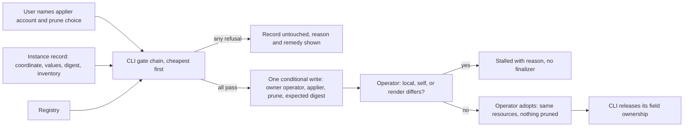

# Enhancement 0029: Gated Ownership Transfer from CLI to Operator

An instance deployed by the OPM command-line tool (the CLI) cannot safely be handed to the OPM operator today. The old command stranded instances under an identity that could not apply them. This entry brings the command back with gates that prove the operator can fetch, render and apply exactly what runs, and makes the operator refuse unsafe adoptions itself.

All entries: [INDEX.md](../INDEX.md). How this one relates to others: [GRAPH.md](../GRAPH.md). Metadata: [config.yaml](config.yaml).

## Summary

**The transfer command returns, forward only (D1).** `opm instance handoff` moves a CLI-owned instance to the operator, never back, as entry 0006 decided (0006:D16).

**Twelve gates must pass before anything is written (D2).** They include a named applier, a re-render from the registry that reproduces the recorded fingerprint of what was applied, and a write that fails if the record changed. Success means the operator reconciled with the same resources, pruned nothing, and recorded the same render fingerprint.

**The user names who applies (D3).** The transfer requires a service account and a prune choice. It asks the cluster whether that account can apply every resource, including the extra rights Kubernetes demands for roles and bindings.

**The operator proves it can fetch the module (D4).** Before adopting, it renders the instance itself and refuses unless the result matches what the CLI verified. The CLI cannot check this from its side, so the refusal comes after the owner field changed (OQ8 asks the owner about that).

**The operator refuses unsafe adoptions (D5, D6).** It will not adopt a locally rendered instance or the instance that runs the operator. Every render not wholly from a registry is marked local.

**The operator ends up the only manager (D8).** After success the CLI gives up its ownership of every field, so later module versions can remove fields.

**Export reuses these gates (D7).** Entry 0014 depends on them.

<!--
Do NOT add an implementation-status block here. Whether this design has been
delivered is DERIVED from this entry's `delivery.yaml` log: run `task delivery ID=NNNN`. A
status block written here is a snapshot that goes stale the moment another change
lands, which is exactly the drift the implementation axis was removed to stop.
-->

## How it works

The CLI proves what it can from its side: it reads the record, asks the cluster about the named account, and re-renders the module from the registry. Only when every gate passes does it write once. The operator then proves what only it can: that its own fetch and render reproduce the verified result. Its checks run on every adoption, including one a person made by editing the owner field by hand.

## Documents

1. [01-problem.md](01-problem.md): why the old transfer was removed, and what a hand flip of the owner field does today
1. [02-design.md](02-design.md): the gate chain, the operator backstop, and the before/after for one locally developed module
1. [03-decisions.md](03-decisions.md): the decision log, D1 to D8
1. [04-graduation.md](04-graduation.md): what must hold before `draft` becomes `accepted`
1. [05-risks.md](05-risks.md): risks, drawbacks, alternatives not taken
1. [06-operational.md](06-operational.md): rollout, versioning, rollback, cross-repo ordering
1. [07-questions.md](07-questions.md): the open-questions register, OQ1 to OQ11

[`experiments/`](experiments/) holds two concluded runnable checks. Experiment 01 found which local renders go unmarked, that a warm cache passes a republished tag, and that the CLI cannot predict the operator's fetch but can predict its render fingerprint. Experiment 02 found that an access review predicts the operator's apply once role escalation is modelled, and that the CLI keeps owning every field after a flip.

## Scope

### In scope

- A forward-only CLI command that transfers a CLI-owned instance to the operator.
- The gate set every transfer runs, including applier identity and operator-side reachability.
- Recording the applier account and prune choice on the instance at transfer.
- The operator checking its own render against the verified one before it adopts.
- The operator refusing to adopt a locally rendered instance or its own instance.
- The CLI giving up its field ownership after a successful transfer.
- Marking every non-registry render as local.

### Out of scope

- Not a reverse transfer from operator to CLI, and not the GitOps export of entry 0014.
- Transferring the operator's own instance, which entry 0028 keeps CLI-owned forever.
- Registry credentials for the operator; transfers verify what an anonymous fetch reaches.
- Pinning module content after the transfer (an open question, not a decision).
- Creating the applier account or its RBAC (an open question, not a decision).

## Deviations from Design

None at this stage. Update this section when implementation lands and any deliberate divergences from the design need to be documented.

## Cross-References

| Document | Purpose |
| -------- | ------- |
| [`../archive/0006/03-decisions.md`](../archive/0006/03-decisions.md) | The original transfer (D7), forward-only rule (D16), local provenance (D38) and success criterion (D40) this entry amends or rests on |
| [`../0028/`](../0028/) | The operator as an OPM module; defines the operator's own instance this entry refuses to transfer |
| [`../0014/`](../0014/) | Export to GitOps, which reuses this entry's gate set |
| [`../0012/03-decisions.md`](../0012/03-decisions.md) | D6, the runtime-neutral render digest that OQ5 waits on |
| `cli/openspec/changes/archive/2026-08-31-remove-instance-handoff/` | Why the first transfer command was removed |
| `cli/openspec/changes/archive/2026-07-20-cli-instance-handoff/` | The first transfer command's design and gate chain |

<!--
## Agent Instructions

To create a new enhancement, run `task new` rather than copying this directory by
hand; it picks the next id, fills `config.yaml`, substitutes the title and seeds
the out-of-scope boundary from your `NOT=` answer.

Then:

1. Overwrite every `{Capitalised}` placeholder across this README and the seven
   split documents. `task vet` fails while one remains.
2. Keep the README in plain English. Say "where it came from" not "provenance",
   "the fields a user sees" not "the surface", "turned into" not "projected".
   Keep the OPM nouns (Module, Component, Resource, Trait, Blueprint, Platform,
   Transformer, Catalog) and define each on first use.
3. Write `01-problem.md` and `02-design.md` first, in full prose. Decisions
   accrete in `03-decisions.md` as choices get settled; `05-risks.md` and
   `06-operational.md` mature alongside them.
4. Replace the `## How it works` diagram with this entry's own mechanism. Load
   the `enhancement-diagrams` skill before drawing it.
5. If the enhancement adds or changes `opmodel.dev/core` definitions
   (`config.yaml.core_schema: true`), sketch the delta in `schemas/target.cue`;
   `examples.cue` and `spec.md` are required before `draft → accepted`.
   Otherwise there is no `schemas/`, and non-core compilable CUE goes in
   `contracts/` via `task new:contracts ID=NNNN`.
6. Do not strip these HTML-comment Agent Instructions when copying. They are the
   in-template guidance for the next author.

The workflow protocol lives in the `enhancements` skill, not here: status
lifecycle, decision-body mutability, compaction, experiments, research and the
delivery log are all documented there and in `CLAUDE.md`. This template holds
only the shape of an entry README.
-->
