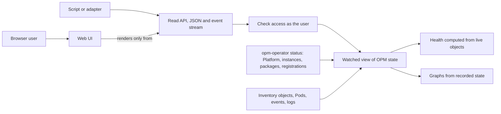

# Enhancement 0030: OPM Portal V1

OPM records what it runs in Kubernetes status, but nobody can see it in one place, and the operator's "Ready" means "applied", not "working". This entry adds a read-only web portal and a versioned read API. They show a Platform, its catalogs and providers, and each deployed module down to its Pods, with applied state and workload health kept apart.

All entries: [INDEX.md](../INDEX.md). How this one relates to others: [GRAPH.md](../GRAPH.md). Metadata: [config.yaml](config.yaml).

## Summary

**V1 only reads (D1).** It creates, edits and deletes no stored object; the only requests it creates are access reviews the API server never stores. Writes arrive with a separate marketplace entry.

**The read API is the product (D2).** A versioned JSON and event-stream API at `/api/v1alpha1` serves portal-shaped documents. The web UI renders only from that API, so adapters see what the UI sees.

**Applied and healthy are two values (D3).** The operator's `Ready=True` shows as "Applied". Health is computed from live objects, plus a Pod rule: a measured image-pull failure stayed Ready and Available for ten minutes.

**Graphs come only from recorded state (D4).** No module is re-rendered. V1 draws no "requires" edges, because the recorded contracts are everything a render used, not what it demands.

**Your access is the boundary (D5, D6, D7).** Locally, the portal reads with your kubeconfig. In-cluster, every read is checked for the signed-in user first, empty identity is refused, and a missing object looks like a forbidden one.

**Nothing secret is read (D8, D10, D11).** No Secret data, no instance values, a read-only role, logs only for OPM Pods. Events are an expiring feed, never state (D9).

## How it works

Everything the portal knows enters at the watched view, from what the operator and Kubernetes already record. The portal adds two things of its own: an access check before every read, and a health value computed from live objects. Both the UI and outside tools see the result only through the same read API.

## Documents

1. [01-problem.md](01-problem.md): OPM state is spread over four kinds, Ready hides broken rollouts, and generic dashboards cannot draw the inventory
1. [02-design.md](02-design.md): a read API with a UI as its first consumer, local first then in-cluster, two status axes, graphs from status
1. [03-decisions.md](03-decisions.md): the decision log, D1 to D11
1. [04-graduation.md](04-graduation.md): what must hold before `draft` becomes `accepted`, and the evidence delivery must show
1. [05-risks.md](05-risks.md): risks, drawbacks, alternatives not taken
1. [06-operational.md](06-operational.md): rollout, versioning, rollback, cross-repo ordering
1. [07-questions.md](07-questions.md): the open-questions register, OQ1 to OQ20

[`experiments/`](experiments/) holds a live cluster capture (trimmed, secret-free samples of every OPM kind in healthy, failed and broken states) and a prototype graph run against the same cluster. [`research/`](research/) holds the prior-art and access-model findings.

## Scope

### In scope

- A read-only view of the Platform, its catalogs, transformer registrations, contracts, ModuleInstances and ModulePackages, down to inventory objects, ReplicaSets and Pods.
- A versioned JSON and server-sent-events read API, with the web UI as its first consumer.
- Applied state and portal-computed workload health, shown apart.
- Conditions, status history, an expiring events feed, and bounded Pod logs for OPM Pods.
- Local mode on the user's kubeconfig, then in-cluster mode with OIDC and per-user authorization.
- Viewer roles in opm-operator so non-admins can read Platforms, ModulePackages and registrations.
- The portal's documentation on opmodel.dev.

### Out of scope

- Not a write path, not the module marketplace, and not a general-purpose Kubernetes dashboard.
- Showing instance values, and redacting them.
- Provider-contract demand edges and transformer provenance, until the operator records them.
- Reading provider-defined kinds such as cert-manager's Certificates.
- Persisted events, multi-cluster, and packaging the portal as an OPM module.

## Deviations from Design

None at this stage. Update this section when implementation lands and any deliberate divergences from the design need to be documented.

## Cross-References

| Document | Purpose |
| -------- | ------- |
| [../archive/0015/README.md](../archive/0015/README.md) | Catalog contracts and transformer registration: the registration resource and its verdicts the Platform view reads, and the readiness rule behind "Applied" |
| [../0027/README.md](../0027/README.md) | Self-service kinds, which the later marketplace builds its writes on |
| [../0013/README.md](../0013/README.md) | Secrets and the diagnostics redaction rule behind OQ8 |
| [experiments/01-live-cluster-capture/README.md](experiments/01-live-cluster-capture/README.md) | The live capture that corrected the design in fourteen places |
