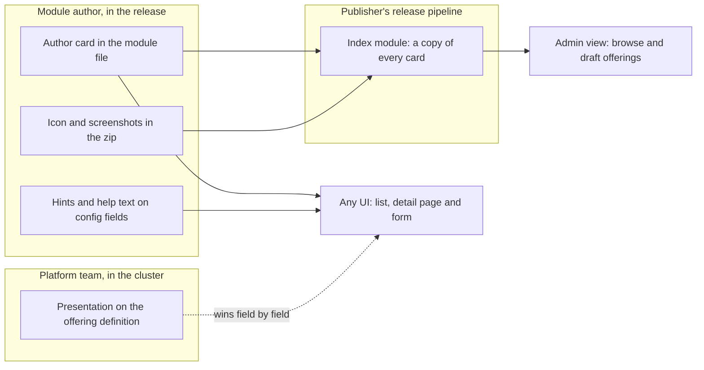

# Enhancement 0031: Module Presentation Contract

A UI that lists OPM modules can show a module path and one line of text, and lays out every configuration field flat. This entry gives authors a place to describe a module and its form, gives platform teams a place to override that for their users, and gives publishers a cheap list of everything they offer.

All entries: [INDEX.md](../INDEX.md). How this one relates to others: [GRAPH.md](../GRAPH.md). Metadata: [config.yaml](config.yaml).

## Summary

**Three authored layers and one derived list (D1).** The module author, the platform team and the publisher's release pipeline each own one layer. `#Module` gains no field.

**The author card lives in the module file (D2, D3).** It is a small struct in the OPM metadata block of `cue.mod/module.cue` that entry 0022 adds (0022:D1). It holds a title, summary, category, icon path and links, at most 8 KiB. Images are files inside the module zip, and scripted SVG is refused at publish.

**Form hints and help text sit on the configuration fields (D4, D5).** A hint is an `@opm(ui, ...)` attribute from a closed vocabulary, beside the secret marker of entry 0013 (0013:D2). Help text is the author's doc comment, never core's.

**The platform overrides presentation on its offering (D6).** Entry 0027's platform-owned definition (0027:D1) carries `presentation`: name, icon, presets, hidden fields. It overrides field by field and never re-renders anything.

**An index module lists a publisher's modules (D7).** It copies every member's card, and the first-party one has a reserved path.

## How it works

Each layer has one owner and one reader that can afford it: the card is in the smallest fetch, the hints sit on the fields they describe, and the platform's override is the one layer that changes without a module release. The index is derived and never edited; a reader treats it as a hint and checks each module for newer releases.

## Documents

1. [01-problem.md](01-problem.md): what a UI can and cannot show about a module today, and why the workarounds fail
1. [02-design.md](02-design.md): the four layers, the schema surface and what each repo changes
1. [03-decisions.md](03-decisions.md): the decision log
1. [04-graduation.md](04-graduation.md): what must hold before `draft` becomes `accepted`
1. [05-risks.md](05-risks.md): risks, drawbacks, alternatives not taken
1. [06-operational.md](06-operational.md): rollout, versioning, rollback, cross-repo ordering
1. [07-questions.md](07-questions.md): the open-questions register

`schemas/` holds the core delta (the card, its gate, the index and the platform's presentation block) with examples that pin a card at every cap under 8 KiB; `contracts/` holds the hint vocabulary as data; `experiments/` records the measurements on the 20-module fleet behind D2 to D7.

## Scope

### In scope

- **Author card:** its fields, caps, size line, version, and the publish check.
- **Assets:** where images live, their caps, the SVG refusal and inert rendering.
- **Field hints:** the `@opm(ui, ...)` vocabulary, its versioning and the gate's refusal scope.
- **Help text:** which doc comment a reader shows, and how a catalog type's hints reach a field.
- **Platform presentation:** the block on the 0027 definition and its merge and inertness rules.
- **Index:** its data shape, the reserved first-party path, and how readers use it.

### Out of scope

- A portal implementation, the order flow, the served kind's schema, a package format, or a central registry or marketplace service.
- The served schema's encoding of secrets, unions and defaulted fields, and the order questions: entry 0027 owns them (0027:OQ18 to 0027:OQ29).
- Localisation and badges, reserved or open here (OQ5, OQ6).

## Deviations from Design

None at this stage. Update this section when implementation lands and any
deliberate divergences from the design need to be documented.

## Cross-References

| Document | Purpose |
| -------- | ------- |
| [../0022/](../0022/) | The module-file block the card lives in (0022:D1), and the gate it rides beside |
| [../0027/](../0027/) | The platform-owned definition that carries `presentation` (0027:D1) and the projection presets are checked through (0027:D6) |
| [../0013/](../0013/) | The `@opm` attribute namespace (0013:D2), which D4 amends, and the tagged `#Secret` type no hint may replace |
| [../archive/0011/](../archive/0011/) | The namespace decisions D7 amends (0011:D13, 0011:D14) and the `index` reservation precedent (0011:D25) |
| [../0021/](../0021/) | The change classes OQ4 cites for presentation-only releases (0021:D2) |
| [../0023/](../0023/) | The referrer and signing work a signature badge (OQ6) and a listing referrer would wait on |
| [../0025/](../0025/) | The aspect mechanism D1 deliberately does not use, and 0025:OQ13 under 0027 |
| [schemas/spec.md](schemas/spec.md) | The four new core constructs in SPEC.md format |
| [contracts/hints.cue](contracts/hints.cue) | Hint vocabulary version 1 |
