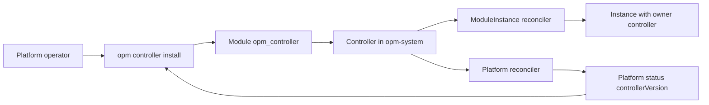

# Enhancement 0032: The Operator Becomes the Controller

OPM runs one component in the cluster that reconciles every module instance. It was called the operator, a word Kubernetes uses for a controller that knows one application, such as a Postgres operator. OPM's component knows no application; it delivers any module. This entry renames it the controller in every name a user meets, with no alias and no migration.

All entries: [INDEX.md](../INDEX.md). How this one relates to others: [GRAPH.md](../GRAPH.md). Metadata: [config.yaml](config.yaml).

## Summary

**Every published name moves (D1).** The owner value of a ModuleInstance becomes `controller`, the version on the Platform's status becomes `controllerVersion`, and the CLI command group becomes `opm controller`. The repository, image and deploying module follow. The default install lands in namespace `opm-system`, with workload `opm-controller-manager`.

**Behaviour does not move.** The decision amends seven delivered decisions of entry 0006, among them the owner marker (0006:D3), the version ceiling (0006:D24) and the command group (0006:D32). Each keeps what it does and changes only the name it publishes.

**The former names stop working.** Nothing accepts, reads or translates them, and no command keeps the old noun as an alias (0032:D1:R6).

**The words are fixed.** "Controller" is the product and "reconciler" is one of its per-kind loops. "Operator" is left to the human platform operator and to upstream application operators (0032:D1:R7).

## How it works

The CLI installs the controller from its module and later reads the controller's version from the Platform's status. The controller runs one reconciler per resource kind. The person at the start is still a platform operator: only the product's name changes.

## Documents

1. [01-problem.md](01-problem.md): why "operator" misnames a generic delivery engine
1. [02-design.md](02-design.md): the names that move and the ones that stay
1. [03-decisions.md](03-decisions.md): the decision log, D1
1. [04-graduation.md](04-graduation.md): what must hold before `draft` becomes `accepted`
1. [05-risks.md](05-risks.md): risks, drawbacks, alternatives not taken
1. [06-operational.md](06-operational.md): rollout, versioning, rollback, cross-repo ordering
1. [07-questions.md](07-questions.md): the open-questions register

## Scope

### In scope

- The owner value, the Platform status version field, and the CLI command group.
- The repository, image, namespace, workload, selector, instance and deploying-module names.
- The documentation addresses and the vocabulary of controller and reconciler.

### Out of scope

- Not a change to what the controller does, and not a migration path for clusters running the old names.
- The human role "platform operator", the selector field `operator`, and upstream application operators.

## Deviations from Design

None at this stage. Update this section when implementation lands and any
deliberate divergences from the design need to be documented.

## Cross-References

| Document | Purpose |
| -------- | ------- |
| [archive/0006/03-decisions.md](../archive/0006/03-decisions.md) | The seven decisions this entry amends |
| [0021/03-decisions.md](../0021/03-decisions.md) | The module install this entry rests on (0021:D11), and the version ceiling |
