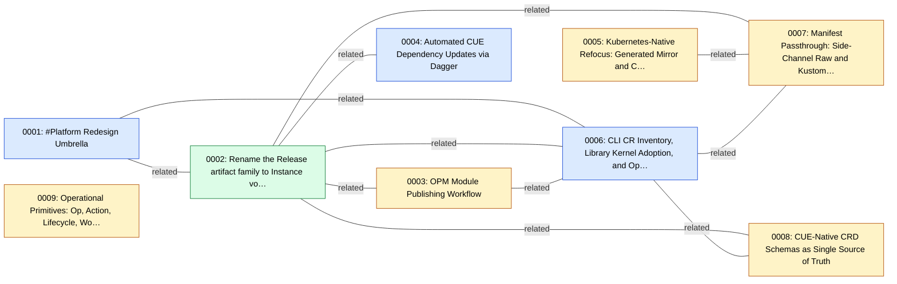
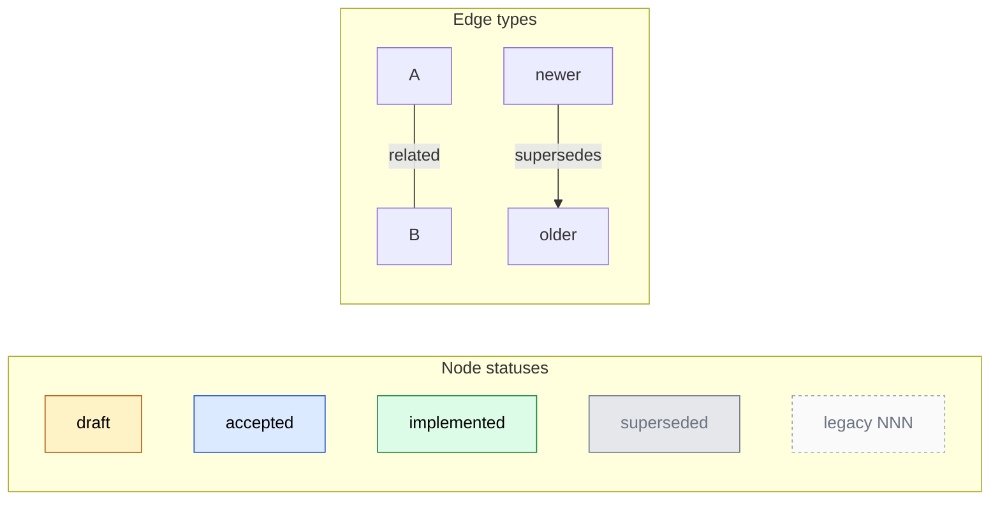

# Enhancement Relationship Graph

<!-- Generated by `task graph` — do not edit by hand. -->

```mermaid
graph LR
  classDef draft       fill:#fef3c7,stroke:#b45309,color:#000
  classDef accepted    fill:#dbeafe,stroke:#1d4ed8,color:#000
  classDef implemented fill:#dcfce7,stroke:#15803d,color:#000
  classDef superseded  fill:#e5e7eb,stroke:#6b7280,color:#6b7280
  classDef legacy      fill:#fafafa,stroke:#9ca3af,color:#6b7280,stroke-dasharray:3 3

  N0001["0001: #Platform Redesign Umbrella"]:::accepted
  N0002["0002: Rename the Release artifact family to Instance vo…"]:::implemented
  N0003["0003: OPM Module Publishing Workflow"]:::draft
  N0004["0004: Automated CUE Dependency Updates via Dagger"]:::accepted
  N0005["0005: Kubernetes-Native Refocus: Generated Mirror and C…"]:::draft
  N0006["0006: CLI CR Inventory, Library Kernel Adoption, and Op…"]:::accepted
  N0007["0007: Manifest Passthrough: Side-Channel Raw and Kustom…"]:::draft
  N0008["0008: CUE-Native CRD Schemas as Single Source of Truth"]:::draft
  N0009["0009: Operational Primitives: Op, Action, Lifecycle, Wo…"]:::draft

  N0001 ---|related| N0002
  N0001 ---|related| N0006
  N0002 ---|related| N0003
  N0002 ---|related| N0004
  N0002 ---|related| N0006
  N0002 ---|related| N0007
  N0002 ---|related| N0008
  N0003 ---|related| N0006
  N0005 ---|related| N0007
  N0006 ---|related| N0007
  N0006 ---|related| N0008
```

## Legend

```mermaid
graph LR
  classDef draft       fill:#fef3c7,stroke:#b45309,color:#000
  classDef accepted    fill:#dbeafe,stroke:#1d4ed8,color:#000
  classDef implemented fill:#dcfce7,stroke:#15803d,color:#000
  classDef superseded  fill:#e5e7eb,stroke:#6b7280,color:#6b7280
  classDef legacy      fill:#fafafa,stroke:#9ca3af,color:#6b7280,stroke-dasharray:3 3

  subgraph statuses ["Node statuses"]
    Ldraft["draft"]:::draft
    Laccepted["accepted"]:::accepted
    Limplemented["implemented"]:::implemented
    Lsuperseded["superseded"]:::superseded
    Llegacy["legacy NNN"]:::legacy
  end

  subgraph edges ["Edge types"]
    Erel_a["A"] ---|related| Erel_b["B"]
    Esup_new["newer"] -->|supersedes| Esup_old["older"]
  end
```
