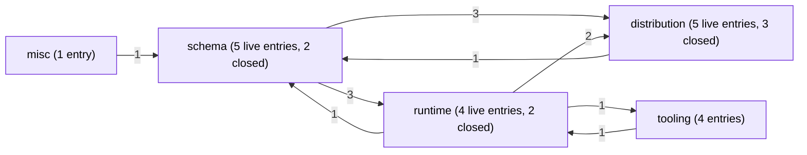
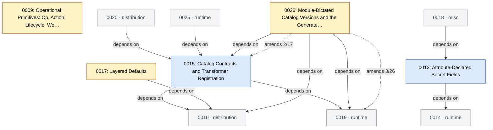
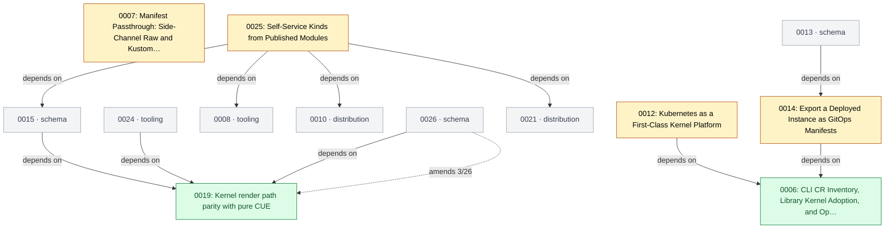
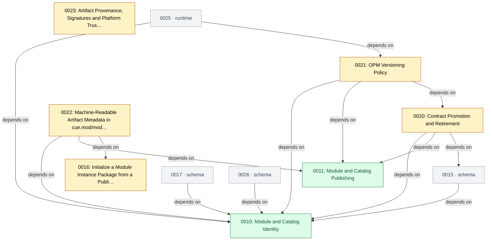
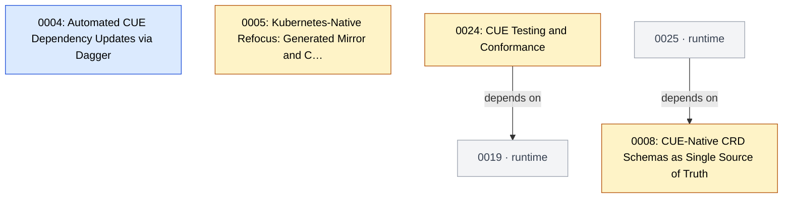
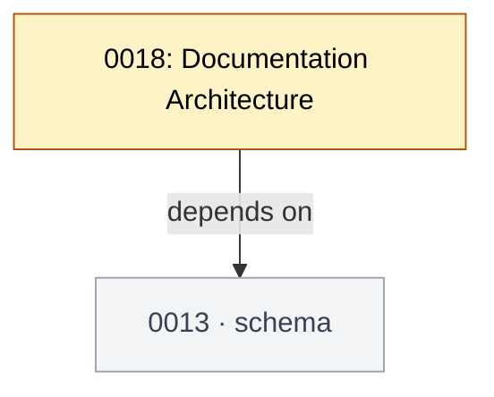
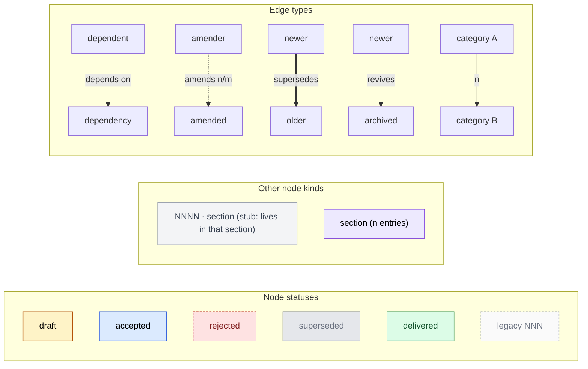

# Enhancement Relationship Graph

<!-- Generated by `task graph` — do not edit by hand. -->

Entries are partitioned by `config.yaml.category`, the type of work. The Overview
shows how the categories lean on each other; each section shows one category
with its foreign dependencies and dependents drawn as grey stubs. Closed entries
(delivered, superseded, rejected) appear only where a live entry reaches them.

## Overview

One node per category, live and closed entry counts in the label. An edge label
counts the `depends_on` edges that cross from one category into another; edges
inside a category are not shown here, and `amends` / `supersedes` / `revives`
are change and lifecycle relations rather than layering, so they are left to
the sections.

Mutually dependent categories (informational; the entry-level `depends_on` graph stays acyclic, `task vet` enforces it): schema ↔ runtime, schema ↔ distribution, schema ↔ tooling, runtime ↔ distribution, runtime ↔ tooling, distribution ↔ tooling.

## schema

## runtime

## distribution

## tooling

## misc

## Legend

A stub is an entry that lives in another section; its label names the section to jump to. In the Overview, an edge label `n` counts the `depends_on` edges crossing from A into B. An `amends n/m` label says the amender changes n of the amended entry's m live decisions, read from the decision logs. Closed entries (delivered, superseded, rejected) appear only where a live entry's edge reaches them.
