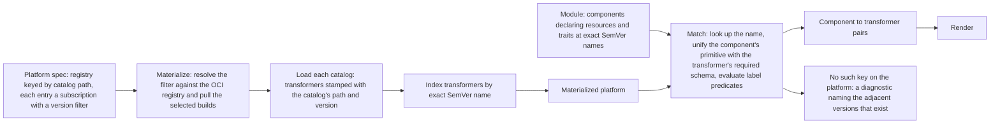

# Enhancement 0001: `#Platform` Redesign Umbrella

> **Delivered (2026-07-24).** Every live decision is carried by this entry's delivery log or excused in it (1 landings; `task delivery ID=0001`). The design is closed: a correction is a new enhancement that amends it, and `task show ID=0001` lists any.

A platform is the OPM value saying which catalogs a cluster renders against. A catalog is a published CUE package of transformers, which turn a component's resources and traits into Kubernetes objects. Before this entry a platform imported catalogs under keys an author invented, and two builds of one member collided on one key. This entry fixed both.

All entries: [INDEX.md](../../INDEX.md). How this one relates to others: [GRAPH.md](../../GRAPH.md). Metadata: [config.yaml](config.yaml).

## Summary

**The registry holds subscriptions, keyed by catalog path (D13).** Each is an on/off switch plus an optional version filter, so CUE's map semantics allow one subscription per catalog. The kernel turns that spec into something renderable in an explicit materialize step the caller drives (D14). CUE cannot evaluate SemVer ranges, so a range is parsed on the Go side (D11) and applied as range, then allow, then deny (D10).

**A catalog becomes a plain CUE package with one declared export (D19).** Its root value names its transformers, so the kernel reads a map instead of walking the package tree. Path and version live in a sibling identity package, and a schema constraint stamps that version onto every transformer, so lockstep is built in rather than left to author discipline (D18). Publishing stamps a temporary build directory, never the source tree (D9).

**Names carry an exact release version, and matching always unifies.** A fully-qualified name gains a full SemVer suffix in place of a major-only one (D5), so adjacent builds get distinct keys. Unification runs before predicates (D6), so a same-named pair with different shapes fails at match with a CUE conflict citing both files. A demanded name the platform lacks gives one diagnostic per component and name, listing the versions that do exist (D20).

**A module gains one home for deployment identity.** An inline context channel carries the instance identity and every component's computed names (D1). Each component owns its own name and DNS variants (D2), and the parent module injects the identity through a pattern constraint (D3).

## How it works

Read the diagram as two inputs meeting at match. The platform side resolves each subscription against the registry, pulls the selected builds, and indexes their transformers by exact SemVer name. The module side demands names. Matching looks each demanded name up, unifies the component's value with the transformer's required schema, then evaluates label predicates, so a same-name pair with divergent schemas fails here rather than at render. Two later entries changed this picture: 0010 replaced version filters with a single scalar version, and 0019 replaced materialize-and-index with the platform importing its catalogs directly.

## Documents

1. [01-problem.md](01-problem.md): why a module-valued registry, major-only names and a missing context channel close doors multi-tenant platforms need open
1. [02-design.md](02-design.md): the path-keyed registry, the materialize step, SemVer names, plain-CUE catalogs, always-unify matching, the context channel
1. [03-decisions.md](03-decisions.md): the decision log, D1 to D25
1. [04-graduation.md](04-graduation.md): what had to hold before draft became accepted
1. [05-risks.md](05-risks.md): risks, drawbacks, alternatives not taken
1. [06-operational.md](06-operational.md): observability, versioning impact, deprecation, rollback, cross-repo ordering
1. [07-questions.md](07-questions.md): the open-questions register, OQ1 to OQ26

[`schemas/`](schemas/) holds the pure-CUE sketch of the target shape, and [`experiments/`](experiments/) holds eleven concluded fixtures measuring the name regex, catalog stamping, cross-catalog imports and the context channel's freedom from cycles.

## Scope

### In scope

**Platform registry and member identity**

- A registry keyed by catalog module path, each entry a subscription with an enable flag and an optional SemVer filter (D13). Two channels on one path stay inexpressible.
- Removal of the module definition's dual role: a module is the consumer artifact only, carrying components, config, debug values and the context channel.
- Removal of the platform's known-resources and known-traits lists. Members appear only through a materialized transformer's required and optional maps.
- A name regex whose suffix is a full SemVer, and a member version field typed as a full version rather than a major.

**Catalog packaging, materialize and match**

- A catalog root value embedding the catalog type, with identity in a sibling package readable without a circular import (D19, superseding D7 and D15). The kernel reads only that value's metadata and transformer map: no package walk, no auto-discovery. A pattern constraint stamps each transformer's path and version. A development default keeps plain validation cheap; publishing stamps a temporary build directory, and published artifacts ship fully concrete.
- A kernel materialize step that resolves each subscription, pulls the selected builds, loads each package, and indexes its transformers into a composed map plus a reverse index. Matching consumes the materialized platform.
- A rewritten match algorithm: name lookup, always-on unification, then predicate evaluation. A missing name yields one structured error per component and name; a failed unification yields one per pair.

**Context channel and component identity**

- An inline context channel on the module with two fields and an open top, carrying instance identity and a projection of every component's names, leaving room for platform and environment siblings.
- An instance identity carrying name, namespace, UUID and the cluster-domain default, set once by the deployed-instance value. No builder, no helper.
- A hidden per-component slot for that identity, wired by the parent module's pattern constraint.
- A per-component names block computing the resource name and its short, local and fully-qualified DNS variants. The context projection is a pure CUE projection of those blocks.
- A metadata cascade where an explicit resource-name override wins and the component name is the fallback.

### Out of scope

- Claims, module transformers and the module extension surface: a future enhancement.
- Platform capabilities and a typed platform extension channel: a future enhancement.
- The renderer and transform execution model: unchanged.
- Replacing CUE's own module client with a custom OCI client. CUE's module proxy stays the substrate; the kernel wires into it through a registry setting.
- Signing and verification of catalog artifacts: whatever the registry configuration already provides.
- Self-service catalog discovery, whether a list command or a web interface.
- Migration of third-party catalog modules. Only the first-party OPM catalog is in scope.
- Bundle-level context, meaning cross-module references through a future bundle construct: deferred.
- Content hashes for immutable ConfigMaps and Secrets surfaced through the context channel: revisit when a module-readable use case appears.

## Deviations from Design

The library and modules slice diverged from the graduation text in four deliberate ways. The intent, a guarded version-stamped catalog publish that leaves the Go module's release flow alone, is preserved; only the mechanics differ.

- **The publish task moved**, from the modules repo to beside the catalog source, because a publish belongs with the source it stamps.
- **A CI workflow drives it**, not a task alone, so the publish is automatic and gated rather than manual.
- **The trigger is registry presence**, a stateless version-gated check that publishes only when the registry lacks the declared version. Folding the catalog into release-please would prefix every tag and break the Go module's bare-version contract.
- **The CLI rewrite was carved out.** The graduation criteria scoped it as a slice here. It landed as enhancement [0006](../0006/)'s kernel-adoption strand instead, under the rule that remaining work becomes a new enhancement. Design intent is unchanged; only the tracking home moved.

## Cross-References

| Document | Purpose |
| -------- | ------- |
| `/CLAUDE.md` (workspace root) | The workspace map the affects field is validated against. |
| `core/CLAUDE.md` | The schema-editing protocol governing every CUE change here. |
| `core/SPEC.md` | Normative spec; every construct touched here has a section that moves with the CUE. |
| `core/src/platform.cue` | Where the registry becomes subscriptions and the kernel-filled slots appear. |
| `core/src/module.cue` | Where the dual role goes and the context channel arrives. |
| `core/src/transformer.cue` | Where a transformer's name gains its SemVer suffix. |
| `core/src/types.cue` | Where the name regex changes and the major-only version type retires. |
| `core/src/resource.cue`, `core/src/trait.cue`, `core/src/blueprint.cue` | Each carries a major-only version today and moves to a full one. |
| `core/src/component.cue` | Where the name cascade, the identity slot and the names block land. |
| `core/src/module_release.cue` | Sets the instance identity once; CUE derives the rest. |
| `core/src/module_context.cue` *(new)* | Home of the instance identity and component-names types. |
| `core/src/catalog.cue` *(new)* | Home of the catalog type and its name type (D19). |
| `core/INDEX.md` | Generated definition index, regenerated once the schema lands. |
| `library/opm/kernel/` | Where the materialize step and the registry setting land. |
| `library/opm/compile/match.go` | Where the matcher becomes lookup, unify, predicate. |
| `library/modules/opm_platform/platform.cue` | The module-valued fixture, rewritten onto subscriptions. |
| `library/modules/opm/` (CUE module `opmodel.dev/catalogs/opm@v0`) | Catalog source, repackaged and republished once under a new identity (D23). |
| `library/modules/opm/catalog.cue` *(new)* | The only file the kernel reads to discover transformers. |
| `library/modules/opm/identity/` *(new subpackage)* | The identity package every member reads, and the stamping target. |
| `library/modules/opm/cue.mod/module.cue` | The catalog's identifier, held pre-1.0 until core is signalled stable (D12). |
| `modules/Taskfile.yml` | The publish flow that gains the temporary-build-directory stamping step. |
