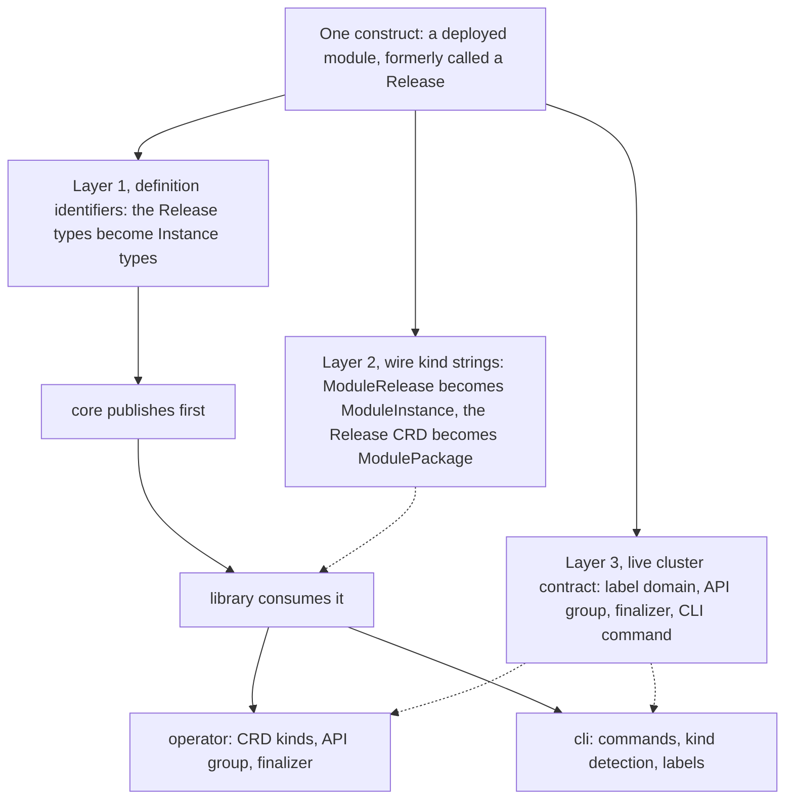

# Enhancement 0002: Rename the Release artifact family to Instance vocabulary (cross-cutting)

> **Delivered (2026-06-30).** Every live decision is carried by this entry's delivery log or excused in it (1 landings; `task delivery ID=0002`). The design is closed: a correction is a new enhancement that amends it, and `task show ID=0002` lists any.

OPM's deployable artifact is one module materialized as a concrete deployment, possibly many times over. It was called a Release: Helm's word for the same thing, and one that foregrounds a shipping event rather than the multiplicity that actually defines the construct. The word recurred inconsistently down the whole stack, in schema definitions, Go identifiers, two custom resource kinds and a command group. This entry renames the family to Instance vocabulary with no behaviour change, and renames the separate GitOps custom resource to ModulePackage so the two stop competing for one word.

All entries: [INDEX.md](../../INDEX.md). How this one relates to others: [GRAPH.md](../../GRAPH.md). Metadata: [config.yaml](config.yaml).

## Summary

**The rename is cross-cutting, and the GitOps custom resource moves with it (D2).** An earlier scope kept the change inside the schema repo and preserved the operator's `Release` custom resource (D1). D2 reversed that, and D1 stays in the log as the original, overturned conclusion.

**Three layers move together.** Layer one is identifiers, the CUE definitions and the Go types that mirror them, resolved within each module at compile time. Layer two is the wire kind strings, the literal `"ModuleRelease"` and friends that the kernel, the reconcilers and the CLI's kind detection all match on (D3). Layer three is the live cluster contract: the label domain stamped on every deployed object (D4), the Kubernetes API group and the finalizer key that go with it (D5). Layers two and three govern objects already running, which is why the rollout was sequenced rather than landed per repo.

**There is no alias window (D8).** The rename is hard, and every `release`-named file and directory is renamed on disk with it (D10), including the CLI's per-instance file convention (D9). Each renamed identifier and each renamed document section carries a short breadcrumb naming the old spelling, first for exported Go symbols (D11) and then for every surface, code, docs and specs alike (D12). The user-facing command group becomes `opm instance` with a short alias (D6).

**Two post-acceptance decisions changed what shipped.** The catalogs were folded in (D14) because they consume the renamed transformer context and break on the new pin. Every artifact also moved from a pre-1.0 minor to a v1 prerelease line (D13), which advanced the core import path. The bundle stub was deleted rather than renamed (D15, overturning D7) once it proved to be unreachable dead code.

## How it works

The deployable artifact was called a Release in the schema, a ModuleRelease custom resource in the operator, a release command in the CLI and a release label on every object. None of those said what it is: one deployment of a module among possibly many. This entry renamed the whole family to Instance vocabulary with zero behaviour change, across the three layers the diagram separates. Because the wire strings and labels govern objects already in clusters, the rollout was sequenced: the schema published first, the library consumed it, then the operator and CLI moved together. The GitOps Release custom resource became ModulePackage in the same pass.

## Documents

1. [01-problem.md](01-problem.md): why Release mis-teaches the model, and the four inconsistent spellings across the stack
1. [02-design.md](02-design.md): the rename mapping, and the identifier, wire and cluster layers it splits into
1. [03-decisions.md](03-decisions.md): the decision log, D1 to D15
1. [04-graduation.md](04-graduation.md): what had to hold before draft became accepted
1. [05-risks.md](05-risks.md): the orphaned API group, lockstep sequencing, the cost of a breaking rename, alternatives
1. [06-operational.md](06-operational.md): versioning impact, reinstall-based rollback, cross-repo sequencing
1. [07-questions.md](07-questions.md): the open-questions register, OQ1 to OQ4

[`schemas/`](schemas/) holds the pure-CUE target shape of the renamed definitions.

## Scope

### In scope

- **Schema**: the deployable-artifact construct and its identity types, the per-component injection slot, and the transformer-context fields, plus the normative spec co-update and a regenerated definition index.
- **Library**: the Go surface mirroring the schema, meaning the instance type and its methods, the metadata and view types, the synthesis and kernel entry points, the compiled and resource accessors, and the kind and label literals.
- **Operator**: the `ModuleRelease` custom resource becomes `ModuleInstance`, the GitOps `Release` custom resource becomes `ModulePackage` (D2), the API group and finalizer key move (D5), and reconcilers, render and label constants, generated manifests, role bindings, project metadata, samples and fixtures follow.
- **CLI**: the `release` command group becomes `instance` with a short alias (D6), the bundle type is renamed (D7), and kind detection, label constants, examples and docs move with them.
- **Catalogs** (D14): the three catalog CUE modules pin the new schema major and consume the renamed transformer context, each bumping its own major on a forward prerelease line, with a full sweep of catalog-local release vocabulary.
- **Wire**: the kind strings (D3) and the instance label domain (D4) move in lockstep.
- **Conventions, every slice**: every `release`-named file and directory is renamed on disk (D10), and the CLI's per-instance file convention moves with it (D9). Every renamed site across code, docs and specs carries a breadcrumb naming the old spelling (D11, generalised by D12).

### Out of scope

- Any behavioural, evaluation-semantic or field-shape change.
- Renaming the module, platform, component, trait, resource or blueprint constructs. The Platform custom resource keeps its kind and only moves to the new API group with its siblings.
- A compatibility alias or deprecation window in any repo (D8: the rename is hard).
- A follow-up sweep of the module and instance fixture repos naming the old identifiers. Required, but tracked outside the four repos this entry affects.

## Deviations from Design

Divergences between the design frozen at acceptance and what shipped. Most are recorded as post-acceptance decisions (D9 to D15) in [`03-decisions.md`](03-decisions.md); they are listed here for traceability.

- **Scope grew to the catalog family (D14).** Acceptance covered four repos and nine slices; the three catalog CUE modules were folded in because they consume the transformer context and break on the new pin. Five repos, twelve slices.
- **Release mechanics changed (D13, revising D8).** The accepted design shipped each artifact as a pre-1.0 breaking minor. D13 moved everything to a v1 prerelease line and advanced the core import path, an extra break D8 had avoided. D8's no-alias conclusion stands.
- **The bundle stub was removed, not renamed (D15, overturning D7).** The bundle path proved to be unreachable dead code with no live bundle kind anywhere. A bundle instance type returns only if bundle support is actually built.
- **Published tag forms differ from D13's**: no numeric suffix for the operator, the CLI and the first catalog; forward prerelease lines for the other two catalogs; three library prereleases, with the operator pinned to the third.
- **The library slice shipped six capability deltas, not four**, adding schema dispatch and config validation, both naming renamed symbols. The CUE language floor was bumped, and one obsolete negative-control test was retired.
- **The operator's main-spec sync was deferred.** Roughly seventeen of thirty-six spec files carry malformed delta-style headers that block the validator, so its changes were archived without syncing specs. That is a pre-existing condition, not a rename defect.
- **One CLI carryover remains**: a single loader wrapper still applies the old definition name, deliberately deferred to enhancement [0006](../0006/)'s kernel adoption.
- **The closing wording cleanup went beyond identifiers**, updating command references in the affected drafts while leaving bare-noun prose and legacy Secret descriptions intact. It also found that 0006 already carried its cross-link and that 0003's prose was stale.

## Cross-References

Per-repo touch points, grouped by subsystem, rebuilt from an exhaustive re-scan of all four repos. It is representative rather than line-complete for the large test-fixture and generated-manifest sets, which are named by directory instead. Every path below exists.

### Protocol and design

| Document | Purpose |
| -------- | ------- |
| `core/.claude/skills/core-schema-edit/SKILL.md` | The binding spec co-update protocol; load it before the schema slice. |
| [`../0001/`](../0001/) | Source of the context-channel wiring this rename renames. Left intact as a historical record. |

### Schema, published first

| Path | Change |
| ---- | ------ |
| `core/src/module_release.cue` | Renamed on disk; the deployable-artifact definitions, kind, context wiring and label keys. |
| `core/src/module_context.cue` | The identity type is renamed. |
| `core/src/module.cue` | The context channel's field and the component projection are renamed. |
| `core/src/component.cue` | The injection slot is renamed; the DNS references follow. |
| `core/src/transformer.cue` | The transformer-context fields and the label key are renamed. |
| `core/SPEC.md`, `core/src/INDEX.md` | The gated spec co-update and the regenerated definition index. |
| `core/README.md`, `core/docs/constructs.md`, `core/docs/adapters.md`, `core/docs/definition-types.md` | Prose, diagram and table references. |
| `core/CHANGELOG.md` | Two artifact references only; the version entries are incidental. |

### Library, pins the new schema

| Path | Change |
| ---- | ------ |
| `library/opm/module/release.go` | Renamed on disk; the instance type and its accessors. |
| `library/opm/schema/{metadata,decode,context,paths,loader,consts}.go` | Metadata and view types, decode helpers, kind dispatch. |
| `library/opm/helper/synth/release.go` | Renamed on disk; the synthesis input, its error sentinels, the definition lookup and the label literals. |
| `library/opm/helper/loader/file/release.go` | Renamed on disk; the package loader and its expected kind. |
| `library/opm/kernel/{process,synth,compile,wrappers,validate_typed,phases,inputs,doc}.go` | Kernel entry points, kind detection and package docs. |
| `library/opm/core/{resource,compiled}.go` | The interface accessor and the compiled field. |
| `library/opm/{compile,errors,materialize}/*.go` | Context references through compile, match and error paths. |
| `library/**/*_test.go`, test fixtures (~24 kind fixtures), `release_integration_test.go` | Kind literals and label assertions; test files renamed alongside their sources. |
| `library/README.md`, `library/CLAUDE.md`, `library/MIGRATIONS.md`, `library/docs/**`, `library/openspec/specs/**` (esp. `release-synthesis/spec.md`) | Doc and spec references; the migration notes are mostly historical software releases, so only artifact references change. |

### Operator, pins the new schema and library; the heaviest slice

| Path | Change |
| ---- | ------ |
| `opm-operator/api/v1alpha1/modulerelease_types.go` | Renamed on disk; the custom resource types and the status UUID field. |
| `opm-operator/api/v1alpha1/release_types.go` | Renamed on disk; the GitOps types become ModulePackage (D2). |
| `opm-operator/api/v1alpha1/{groupversion_info,common_types,conditions}.go` | The API group (D5), the group-version variable, the finalizer constant and condition strings. |
| `opm-operator/internal/controller/{modulerelease,release,platform}_controller.go` | Renamed on disk where applicable; reconciler types and access-rule markers. |
| `opm-operator/internal/reconcile/{modulerelease,release}.go` | Renamed on disk; constants, functions, finalizer and label use. |
| `opm-operator/internal/render/{kernel_release_renderer,release,module,renderer}.go` | Kind constants, render constants, import aliases. |
| `opm-operator/internal/{status,inventory,source,apply,moduleacquire}/*.go` | Kind, label and finalizer references across status, inventory, source resolution and prune. |
| `opm-operator/pkg/core/{labels,resource,compiled_adapter}.go` | Label constants move to the instance domain; kind strings follow. |
| `opm-operator/cmd/main.go` | Type registration and reconciler wiring. |
| `opm-operator/config/{crd/bases,rbac,samples}/**`, `PROJECT`, `dist/**` | Role files and samples renamed on disk; project metadata hand-edited; manifests, deepcopy and the installer regenerated. |
| `opm-operator/test/**` (incl. `fixtures/releases/` becoming `modulepackages/`), `.tasks/*.yaml`, `docs/design/release-vs-modulerelease-render-divergence.md` | Roughly nineteen test files, a fixture directory move, task references and a design-doc retitle. Architecture records and archived changes stay as historical record. |

### CLI, pins the new schema and library; parallel with the operator

| Path | Change |
| ---- | ------ |
| `cli/internal/cmd/release/**` | Renamed on disk; the command group, its alias and all nine subcommands. |
| `cli/pkg/bundle/release.go` | Renamed on disk; the bundle type family (D7, later deleted by D15). |
| `cli/pkg/render/{process_bundlerelease,process_modulerelease}.go` | Renamed on disk; the process entry points. |
| `cli/pkg/loader/{release_kind,release_file,*}.go`, `cli/internal/releasefile/` | Renamed on disk; kind detection, file lookup and the per-instance file convention (D9). |
| `cli/pkg/module/release.go` | Renamed on disk; the instance and metadata types. |
| `cli/internal/cmdutil/{release_arg,release_target}.go` | Renamed on disk. |
| `cli/internal/workflow/**` (render, apply, query) | Import-path and type renames, over a hundred references. |
| `cli/internal/{inventory,kubernetes}/*.go`, `cli/pkg/ownership/ownership.go`, `cli/pkg/core/labels.go` | Label constants move to the instance domain, mirroring the operator, with their dependent selectors. |
| `cli/examples/releases/**/release.cue`, `cli/tests/**` (`integration/rel-*` to `inst-*`, `e2e/testdata/vet-errors/release/`), `cli/openspec/specs/**` (25+ dirs), ADRs/RFCs/docs | Renamed on disk (D9, D10). The binary-release tooling is not a target. |

### Catalogs, pin the new schema only; parallel with the library (D14)

Three independent CUE-module repos with no cross-catalog imports. Each bumps its own major and pins the new schema major. The only compile-required change is the renamed transformer-context field; the rest is the consistency sweep and the import bump.

| Path | Change |
| ---- | ------ |
| `catalog_opm/src/cue.mod/module.cue` | Module major and schema dependency bumped. |
| `catalog_opm/src/transformers/*.cue` (11 files) | The transformer-context field, the catalog-local prefix helper and one fixture string. |
| `catalog_opm/src/**/*.cue` (~50 files) | Schema import bumped. |
| `catalog_opm/src/resources/{configmap,secret}.cue`, `src/transformers/{configmap,secret}_transformer.cue` | Six prose comments. |
| `catalog_opm/release-please-config.json`, `.release-please-manifest.json` | Prerelease block and target tag. |
| `catalog_kubernetes/src/cue.mod/module.cue` | Module major and schema dependency bumped. |
| `catalog_kubernetes/src/transformers/*.cue` (26 files) | The transformer-context field. |
| `catalog_kubernetes/src/**/*.cue` (~56 files), `src/CLAUDE.md` | Schema import bumped; consistency prose. |
| `catalog_kubernetes/release-please-config.json`, `.release-please-manifest.json` | Prerelease block; a forward prerelease target tag. |
| `catalog_opm_experimental/src/cue.mod/module.cue`, `src/catalog.cue` | Module major, schema dependency and import bumped. |
| `catalog_opm_experimental/src/identity/identity.cue` | Checked for the old identity spelling; renamed if present. |
| `catalog_opm_experimental/{README.md,CLAUDE.md,Taskfile.yml}`, `src/INDEX.md` | Doc references bumped; index regenerated. |
| `catalog_opm_experimental/release-please-config.json`, `.release-please-manifest.json` | Prerelease block; a forward prerelease target tag. |
| `modules/**`, `releases/**` (`catalog_opm@v0` consumers) | Out of scope: the old catalog tags stay published and re-pinning is tracked separately. |
