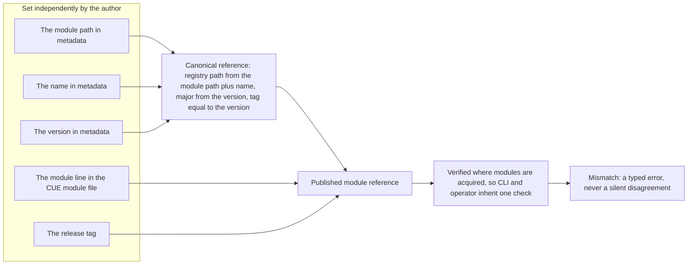

# Enhancement 0003 — OPM Module Publishing Workflow

> **Superseded by 0010 (2026-07-26), together with 0011.** This entry accumulated four problems on one id — a naming convention, version agreement, whether a version belongs in identity at all, and how identity reaches an artifact — and its narrative documents stopped tracking its decision log along the way, so `02-design.md` still describes a design that later decisions retired. The work continues, split along the boundary that was always there: **[0010 — Module and Catalog Identity](../0010/)** owns what an artifact's identity *is* and how it gets into the artifact's own bytes (a breaking `core` change), and **[0011 — Module and Catalog Publishing](../0011/)** owns the commands that write it and the registry it goes to (a `cli` feature that depends on 0010). Both successors start fresh decision logs at D1 carrying only current answers, and they restate this entry's measurements inline rather than referencing them — so neither requires reading this one. What stays here is the record of how the design arrived where it did, plus `experiments/` and `research/`, which are the expensive part and the reason this entry was superseded rather than deleted. Read it as history, not as a live design.

> **Compacted 2026-07-29.** The narrative documents (`01`, `02`, `04`, `05`, `06`) were collapsed to stubs describing what each covered and where it went, and the Open Questions block was reduced to one line per question naming the successor that inherited it. The decision log keeps every number, decision, and *Alternatives considered*, with supersessions now marked in place so it is safe to read linearly. Two things were deliberately kept in full: `05-risks.md`'s per-site **Blast Radius** audit, which was measured against real code and is reproduced nowhere else, and everything under `experiments/` and `research/`. The prior text of every collapsed document is in git history.

An OPM module states its identity in several places an author fills in independently: a module path and name in its metadata, a declared version, the module line in its CUE module file, and the release tag it is published under. Nothing binds them, and the published fleet already showed them drifting apart, so code holding a loaded module could not reconstruct the reference needed to import it again. This entry proposed one canonical registry reference derived from that metadata, plus the commands that produce it and the check that enforces it. It was superseded before anything shipped, and the work continues in its two successors.

All entries: [INDEX.md](../../INDEX.md). How this one relates to others: [GRAPH.md](../../GRAPH.md). Metadata: [config.yaml](config.yaml).

## Summary

The canonical mapping composed a registry reference out of what the module already declared (D1, D3). The module path and a snake-case projection of the name give the path, the version's major gives the suffix, and the release tag equals the declared version. Publishing would derive those coordinates rather than stamp them into the artifact (D4). Version authoring was split into its own command, so publish took no version input at all (D12), and a local dependency override refused the push unless explicitly allowed (D8). The same pipeline covered catalogs, the degenerate case on addressing and the acute one on versioning (D7).

The enforcement point was deliberately the read side: the library refuses a module whose declared identity disagrees with the coordinates it was fetched by (D6), so the CLI and the operator inherit one check no publisher can route around. Later decisions moved the ground under the design: D13 removed the declared version from module identity entirely, and D9 settled that published artifacts live in a central hosting registry under owner-scoped paths.

Read the decision log as the live record. The narrative documents were collapsed to stubs at compaction, because the design they describe was retired by decisions further down the same log. Entry [0010](../0010/) took over what identity is, and entry [0011](../0011/) took over the commands that write it.

## How it works

An OPM module stated its identity in four places an author set independently, the module path, the name, the version, and the CUE module line plus the release tag, and the published fleet already showed them drifting. This design bound them to one canonical registry reference and verified it where modules are consumed, so the CLI and the operator inherit one check that a publisher cannot route around. It was superseded before delivery: the identity entry later made the module path itself the whole identity, with the major inside it and the version outside every key, and the publishing entry built the commands. Read this diagram as the shape the successors replaced.

## Documents

1. [01-problem.md](01-problem.md): *Stub.* Identity and registry coordinates drift; the measurements are restated in both successors
1. [02-design.md](02-design.md): *Stub.* The canonical mapping, and why it stopped being accurate before supersession
1. [03-decisions.md](03-decisions.md): **Kept in full.** The decision log, D1 to D27, with alternatives and supersessions marked in place
1. [04-graduation.md](04-graduation.md): *Stub.* What would have had to hold before draft became accepted
1. [05-risks.md](05-risks.md): *Partly kept.* The risk narrative is stubbed; the per-site blast-radius audit is retained in full
1. [06-operational.md](06-operational.md): *Stub.* Operational answers against the retired design
1. [07-questions.md](07-questions.md): the open-questions register, collapsed to one successor pointer per question

[`contracts/`](contracts/) holds the compilable CUE shapes; [`experiments/`](experiments/) holds six concluded fixtures on version authoring, identity supply and local-module chains; [`research/`](research/) holds a prior-art survey of version agreement elsewhere.

## Scope

### In scope

- The canonical mapping from a module's metadata to its CUE registry reference: path leaf, package name, version and major, anchored on a snake-case name projection.
- **Removing the module's declared version (D13):** module source declares no version; the full version exists only as the artifact coordinate, with the major carried in the CUE module path as CUE and Go both do. The fully-qualified name is redesigned around its absence, which supersedes the version-agreement machinery below for modules.
- ~~**The version-agreement invariant (D3):** a module's declared version and the release tag of the artifact carrying it are the same value.~~ Retired for modules by D13; still live for catalogs.
- **Verification at acquire (D6):** the read path refuses a module whose metadata disagrees with the coordinates it was fetched by. This is the primary enforcement point, because it is the one no publisher can bypass.
- The module publish workflow: derive the module line, the CUE package name and the release tag from metadata before pushing (D4: derive, never stamp).
- **A separate version-authoring command (D12):** the only writer of the declared version. Publish takes no version input at all, so source and tag have no surface on which to disagree.
- **Catalog publishing (D7):** the same pipeline for catalogs, extending D3 and D6 to them. One implementation, two artifact types.
- **The local-override gate at publish (D8):** local dependency replacements are never honoured, and their presence blocks the push unless explicitly allowed.
- A library helper that computes the canonical import reference from a loaded module, so the render path resolves imported modules from metadata.
- **Where published artifacts live (D9):** a central registry that hosts rather than indexes, with owner-scoped module paths under reserved namespace segments that keep module, catalog and schema space distinguishable by path alone.
- The migration story for in-repo modules whose published path or version does not yet follow the convention, now universal rather than exceptional since D9 moves every currently-published module.

### Out of scope

- Changing what the identity fields mean. D3 binds the declared version to the artifact it ships in; it does not redefine the field.
- **Version selection**, meaning how a consumer pins or ranges a module version. Agreement is "the module is what it says it is"; selection is "which one do I want".
- The single-build render mechanism itself. This entry supplies the addressing contract that work depends on, not the render rewrite.
- Signing, provenance and attestation. Registry authentication was also excluded while this entry was only a naming convention, but D9 makes the central registry the write target and the CLI has no credential surface, so the tension stayed an open question blocking promotion.
- Artifact **discovery**, meaning search, listing and any index over what is published. It rests on this entry's addressing guarantees but is its own concern.
- The CLI's platform-resolution modes: synthesizing a platform from a module's catalog dependencies, and honouring local overrides during development. Adjacent to D8 through the same file, but a rendering concern.
- The catalog **repackage** itself, meaning composition, subscription filters and materialization. Enhancement [0001](../0001/) owns that. Catalog **publishing** moved in scope here per D7, because it is the module pipeline with a different artifact type and carries the same version-agreement exposure.

## Deviations from Design

None at this stage. This entry is `draft`; deviations are recorded here when implementation lands.

## Cross-References

| Document | Purpose |
| -------- | ------- |
| `/CLAUDE.md` (workspace root) | Cross-repo routing and the vocabulary governing this multi-repo entry |
| `core/src/module.cue` | The snake-case name field this convention is anchored on |
| `core/src/types.cue` | The snake-case type and the kebab-to-snake projection helper |
| `core/SPEC.md` | The normative module spec carrying the name constraint and its rationale |
| `core/src/catalog.cue` | Catalog metadata: no name field, and the development version default D7 brings under the invariant |
| `core/src/resource.cue`, `core/src/trait.cue` | Member names whose path is unrelated to the owning catalog's: the reverse-lookup gap |
| `library/opm/materialize/enumerate.go` | Subscription version enumeration: the catalog-side D6 enforcement point |
| `cli/pkg/loader/provenance.go` | The local-override detector D8's publish gate reuses |
| `cli/` (catalog publish command) | The catalog publish command (D7); it does not exist today |
| `library/opm/helper/synth/render.go` | Consumes the canonical import reference when synthesizing an instance package, deriving the import's major from the declared version |
| `library/opm/helper/loader/registry/module.go` | The registry module loader, and the D6 enforcement point |
| `library/opm/kernel/wrappers.go` | The single call both the CLI and the operator reach the registry through |
| `library/opm/module/module.go` | The loaded-module value, where a recorded registry reference would live |
| `cli/pkg/module/module.go` | The D1 mapping, already shipped via enhancement 0006, to be reconciled with the library helper |
| `cli/` (publish command) | The module publish command, deriving coordinates and tag before the push; it does not exist today |
| `modules/Taskfile.yml` | The external version-record path D4 replaces as a source of truth |
| `opm-operator/internal/moduleacquire/acquire.go` | Wraps the registry call and inherits D6's refusal without its own implementation |
